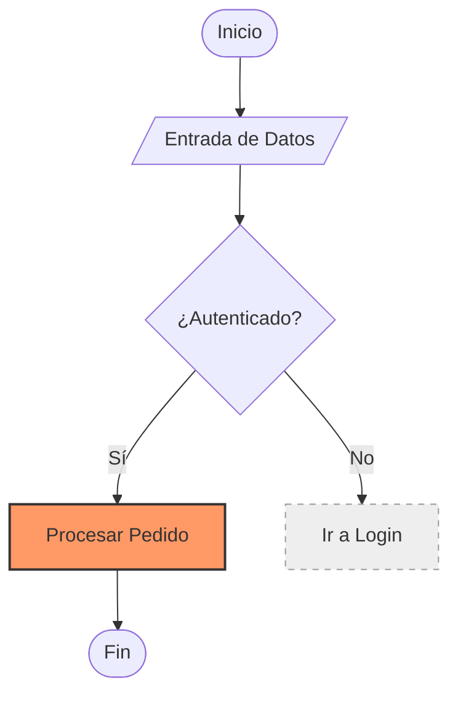
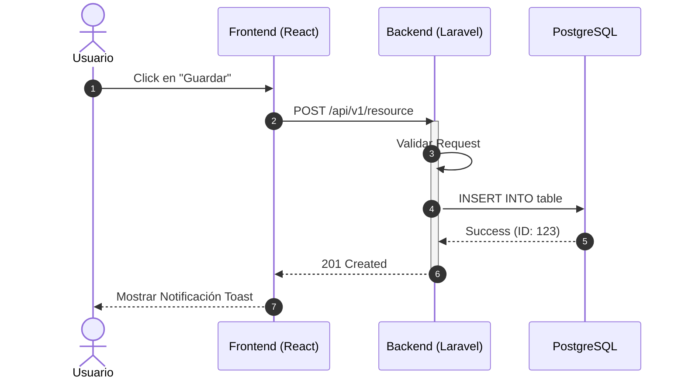
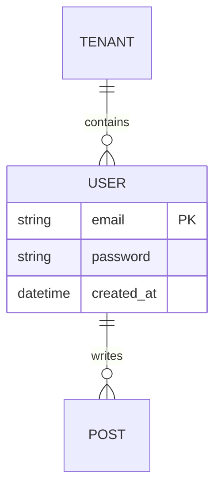
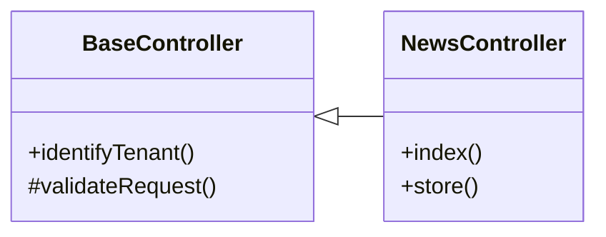
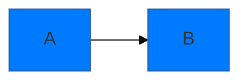

# Experto en Diagramas Mermaid (Expert Mermaid Designer)

Esta habilidad te permite transformar lógica compleja, arquitecturas y procesos en diagramas visuales precisos, estables y estéticamente agradables utilizando la sintaxis de **Mermaid.js**.

## 🚀 Principios de Calidad (Nivel Experto)

Para que un diagrama sea considerado de "calidad experto", debe seguir estas reglas:

1.  **Claridad sobre Complejidad:** Si un diagrama es demasiado grande, divídelo usando subgrafos (subgraphs) o crea múltiples diagramas vinculados.
2.  **Sintaxis Robusta:** Usa siempre comillas `"` para etiquetas que contengan caracteres especiales o palabras reservadas.
3.  **Identificadores Claros:** Usa IDs cortos y descriptivos para los nodos, y etiquetas (labels) legibles para los humanos.
    *   *Mal:* `N1 --> N2`
    *   *Bien:* `ProcessOrder[Procesar Orden] --> SendEmail[Enviar Email]`
4.  **Estética Consistente:** Define esquemas de colores que diferencien capas (Frontend, Backend, DB, Terceros).
5.  **Direccionamiento Lógico:**
    *   `graph TD` (Top-Down) para jerarquías y procesos lógicos.
    *   `graph LR` (Left-Right) para flujos temporales o de datos con muchos pasos internos.

---

## 🛠️ Catálogo de Diagramas y Templates

### 1. Diagramas de Flujo (Flowcharts) - `graph` / `flowchart`
Úsalos para algoritmos, procesos de negocio y decisiones.



### 2. Diagramas de Secuencia (Sequence) - `sequenceDiagram`
Indispensables para interacciones entre sistemas (APIs, Webhooks, Auth).

**Reglas de Oro:**
- Usa `autonumber` para facilitar el seguimiento.
- Usa `actor` para usuarios y `participant` para sistemas/servicios.
- Usa `activate`/`deactivate` para mostrar vida del proceso.



### 3. Diagramas de Entidad-Relación (ER) - `erDiagram`
Específicos para modelado de base de datos.



### 4. Diagramas de Clase (Class) - `classDiagram`
Para estructuras de código y jerarquías de herencia.



---

## 🎨 Estilización Avanzada y Temas

Puedes inyectar configuraciones globales al inicio del bloque de código Mermaid:



**Temas Disponibles:** `default`, `forest`, `dark`, `neutral`, `base`.

---

## ⚠️ Solución de Problemas (Pitfalls)

1.  **Palabras Reservadas:** Palabras como `end`, `graph`, `subgraph` dentro de etiquetas pueden romper el render.
    *   *Solución:* Escríbelas con mayúscula inicial (`End`) o úsalas dentro de comillas (`"end"`).
2.  **Caracteres Especiales:** Paréntesis, brackets o símbolos de moneda deben ir entre comillas.
    *   *Ejemplo:* `Node["Valor ($USD)"]`
3.  **Cross-linking:** En GitHub, los enlaces (`click`) solo funcionan en ciertos contextos de seguridad. Prefiere documentar los enlaces en texto plano debajo del diagrama.
4.  **Diagramas Gigantes:** Si el diagrama no se ve bien, usa `subgraph` para agrupar lógica:
    ```mermaid
    graph TD
        subgraph Interno [Capa Privada]
            A --> B
        end
        subgraph Externo [Capa Pública]
            C --> D
        end
        B --> C
    ```

## 📚 Integración con PLAGIE-SaaS

- **Checklist de Documentación:** Antes de guardar un diagrama en `doc/`, verifica que:
    - [ ] Representa fielmente la arquitectura actual (ver `Monumental_Architecture.md`).
    - [ ] Usa los nombres de tablas y entidades definidos en `migration_data_dictionary.md`.
    - [ ] Incluye una breve descripción técnica debajo del diagrama.
- **Ubicación Recomendada:**
    - Arquitectura Global: `doc/00_Arquitectura/`.
    - Flujos de Usuario: `doc/02_Funcional/`.
    - Detalles Técnicos: `doc/03_Tecnico/`.

**Documentación Viva (OBLIGATORIO):** Revisa el estado actual del sistema en `doc/` antes de generar un diagrama para asegurar que la nomenclatura sea coherente con el lenguaje del negocio de PLAGIE.
