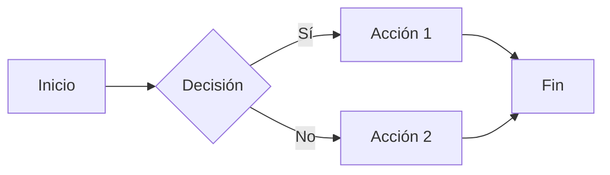

# Documentación en Markdown (Experto)

Mejores prácticas para redactar documentación técnica efectiva y visualmente atractiva en Markdown.

## Estructura de README

### README Minimalista

```markdown
# Nombre del Proyecto

Descripción breve de lo que hace este proyecto.

## Instalación

Instrucciones para instalar.

## Uso

Ejemplo básico de uso.

## Licencia

MIT
```

### README Integral (Completo)

```markdown
# Nombre del Proyecto


Descripción de un párrafo sobre el proyecto.

## Características

- Característica uno
- Característica dos
- Característica tres

## Instalación

### Prerrequisitos

- Requisito 1
- Requisito 2

### Pasos

Instrucciones detalladas...

## Uso

### Ejemplo Básico

Ejemplo de código...

### Uso Avanzado

Más ejemplos...

## Configuración

Opciones de configuración...

## Referencia de API

Documentación de la API...

## Contribución

Ver [CONTRIBUTING.md](CONTRIBUTING.md)

## Licencia

Licencia MIT - ver [LICENSE](LICENSE)
```

## Organización de Documentos

### Nomenclatura de Archivos

```
docs/
├── README.md           # Punto de entrada
├── CONTRIBUTING.md     # Guía de contribución
├── CHANGELOG.md        # Historial de versiones
├── CODE_OF_CONDUCT.md  # Reglas de la comunidad
├── getting-started.md  # Guía de inicio rápido
├── api/
│   ├── README.md       # Resumen de API
│   └── endpoints.md    # Referencia de endpoints
└── guides/
    ├── installation.md
    └── configuration.md
```

### Enlaces entre Documentos

```markdown
Consulta la [guía de instalación](./guides/installation.md) para más detalles.

Para la referencia de API, revisa los [endpoints](./api/endpoints.md#authentication).
```

## Estilo de Redacción

### Sé Conciso

```markdown
<!-- Mal -->
Para poder instalar la aplicación, necesitarás ejecutar el siguiente comando.

<!-- Bien -->
Instala la aplicación:
```

### Usa Voz Activa

```markdown
<!-- Mal -->
El archivo de configuración debería ser creado en el directorio personal.

<!-- Bien -->
Crea el archivo de configuración en tu directorio personal.
```

### Dirígete al Lector

```markdown
<!-- Mal -->
Los usuarios pueden configurar el ajuste de tiempo de espera.

<!-- Bien -->
Puedes configurar el tiempo de espera.
```

## Documentación de Código

### Código en Línea vs Bloques de Código

```markdown
Usa `npm install` para instalar dependencias.

Para múltiples comandos, usa un bloque de código:

```bash
npm install
npm run build
npm start
```

### Ejemplos de Comandos

Muestra tanto el comando como la salida:

```bash
$ npm --version
10.2.0
```

### Ejemplos de Configuración

Muestra siempre ejemplos completos y válidos:

Crea `config.json`:

```json
{
  "port": 3000,
  "debug": true,
  "database": {
    "host": "localhost",
    "name": "myapp"
  }
}
```

## Alertas y Avisos

### Alertas Estilo GitHub

```markdown
> [!NOTE]
> Información útil que los usuarios deben conocer.

> [!TIP]
> Consejos útiles para hacer las cosas mejor.

> [!IMPORTANT]
> Información clave que los usuarios necesitan saber.

> [!WARNING]
> Información urgente que requiere atención inmediata.

> [!CAUTION]
> Advierte sobre riesgos o resultados negativos.
```

### Avisos Personalizados (Basados en Emojis)

```markdown
⚠️ **Advertencia**: Esta acción no se puede deshacer.

💡 **Tip**: Usa variables de entorno para datos sensibles.

📝 **Nota**: Esta característica requiere la versión 2.0+.
```

## Documentación de API

### Documentación de Endpoints

#### Crear Usuario

Crea una nueva cuenta de usuario.

**Request:** `POST /api/users`

**Cabeceras (Headers):**

| Cabecera | Valor | Requerido |
|----------|-------|:---------:|
| Content-Type | application/json | ✅ |
| Authorization | Bearer {token} | ✅ |

**Cuerpo (Body):**

```json
{
  "name": "Juan Pérez",
  "email": "juan@example.com"
}
```

**Respuesta (201):**

```json
{
  "id": "abc123",
  "name": "Juan Pérez",
  "email": "juan@example.com"
}
```

## Diagramas

### Mermaid (Soportado por GitHub)

````markdown

````

### Diagramas ASCII

````markdown
```
┌─────────┐     ┌─────────┐     ┌─────────┐
│ Cliente │────▶│ Servidor│────▶│ Base de │
│         │     │         │     │ Datos   │
└─────────┘     └─────────┘     └─────────┘
```
````

## Mejores Prácticas

1. **Empieza con el "por qué"**: Explica qué hace el proyecto y por qué existe.
2. **Muestra, no solo cuentes**: Proporciona ejemplos de código funcionales.
3. **Manténlo actualizado**: Actualiza los documentos cuando el código cambie.
4. **Prueba los ejemplos**: Asegúrate de que los fragmentos de código funcionen realmente.
5. **Usa terminología consistente**: Define términos y úsalos de manera coherente.
6. **Proporciona contexto**: Enlaza a prerrequisitos y documentos relacionados.
7. **Considera a tu audiencia**: Escribe para el nivel de habilidad de tus usuarios.
8. **Incluye solución de problemas**: Documenta errores comunes y sus soluciones.
