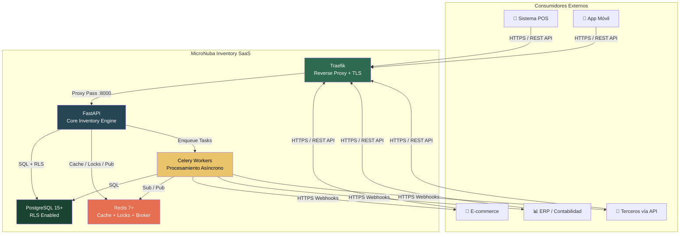
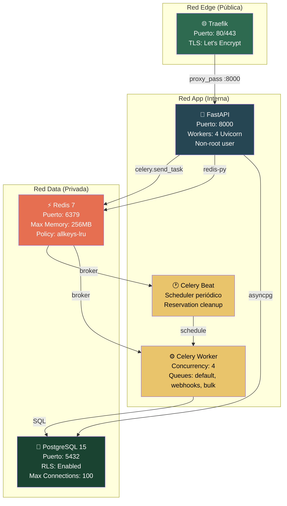
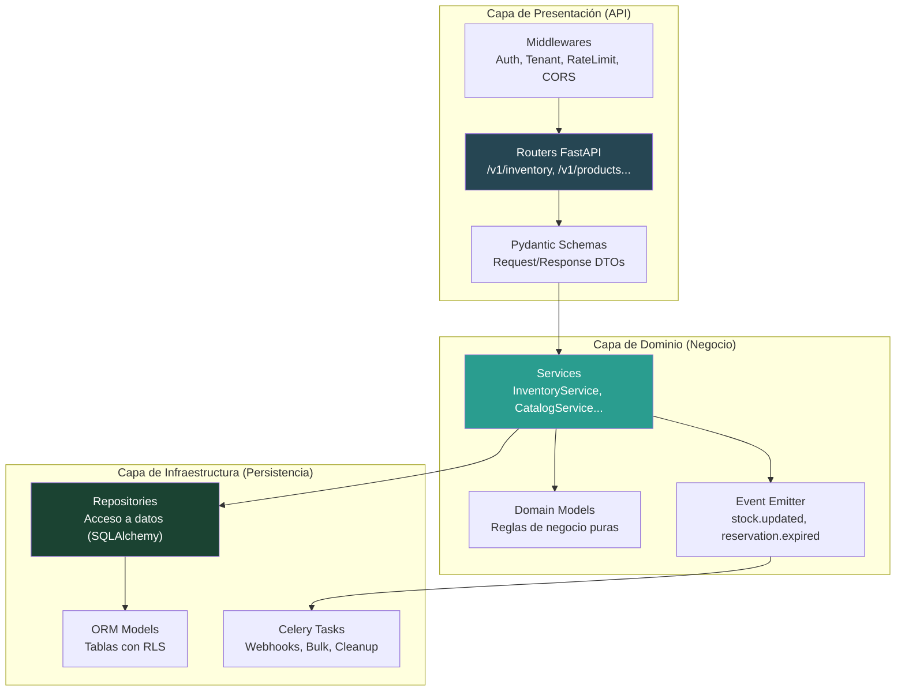
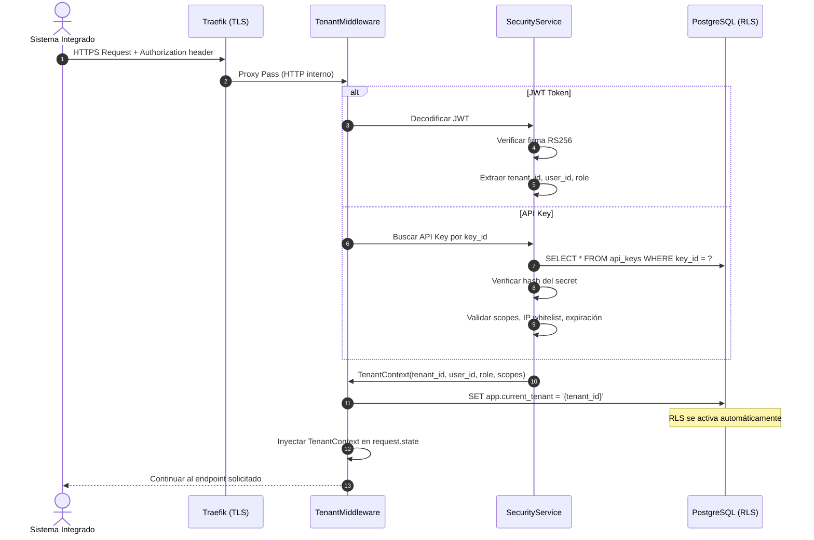

# Arquitectura Física — MicroNuba Inventory SaaS

**Versión:** 1.0  
**Estado:** Aprobada  
**Fecha:** 2026-04-24  
**Origen:** Adaptación de `doc/Documentacion de Idea/Arquitectura de Referencia_*.md`  
**Referencia Funcional:** `doc/Funcional/mejorado/00_definicion-solucion_saas/DEFINICION_SAAS.md`

---

## 1. Principios Arquitectónicos

| # | Principio | Implicación |
|---|-----------|-------------|
| PA-1 | **API-First** | El sistema se consume exclusivamente vía REST API. No hay frontend en el MVP |
| PA-2 | **Multi-Tenant por RLS** | Aislamiento a nivel de base de datos. PostgreSQL RLS es la barrera final |
| PA-3 | **Transacciones Atómicas (ACID)** | Toda operación de inventario es una transacción indivisible |
| PA-4 | **Ledger Inmutable** | Los registros del Kardex nunca se eliminan ni modifican |
| PA-5 | **Event-Driven** | Los cambios de stock emiten eventos para procesamiento asíncrono |
| PA-6 | **Monolito Modular** | Un solo servicio backend con módulos internos bien definidos. No microservicios |
| PA-7 | **Container-First** | Todo corre en Docker. Sin dependencias del host |
| PA-8 | **Zero Trust** | Toda petición se autentica y autoriza. Sin excepciones |

> [!IMPORTANT]
> **PA-6 (Monolito Modular)** es una decisión deliberada para el MVP. La arquitectura de referencia original propone microservicios en Go, pero para esta fase adoptamos un monolito en **FastAPI** que puede evolucionar a microservicios cuando la escala lo justifique. Esto reduce complejidad operativa sin sacrificar modularidad interna.

---

## 2. Vista de Contexto del Sistema (C4 Nivel 1)



---

## 3. Stack Tecnológico Definido

### 3.1. Decisiones vs. Arquitectura de Referencia

| Componente | Referencia Original | **Decisión MVP** | Justificación |
|------------|--------------------|--------------------|---------------|
| Lenguaje Backend | Go (Golang 1.21+) | **Python 3.12 + FastAPI** | Productividad de desarrollo, ecosistema maduro, tipado estricto con Pydantic |
| API Gateway | Kong | **Traefik v3** | Nativo para Docker, auto-discovery, TLS automático, más ligero |
| ORM / DB Access | Raw SQL + pgx | **SQLAlchemy 2.0 + Alembic** | Migraciones versionadas, ORM async, modelos declarativos |
| Mensajería | RabbitMQ | **Redis Streams + Celery** | Reduce un contenedor. Redis ya se usa para cache y locks |
| Rate Limiting | Redis + Lua | **Middleware FastAPI + Redis** | Mismo efecto, implementación más simple |
| Documentación API | Swagger manual | **OpenAPI 3.0 auto-generada** | FastAPI genera OpenAPI automáticamente desde los modelos |
| Validación | Validación manual | **Pydantic v2** | Validación automática, serialización, tipado estricto |

### 3.2. Stack Completo

| Capa | Tecnología | Versión | Propósito |
|------|-----------|---------|-----------|
| **Reverse Proxy** | Traefik | v3.x | TLS termination, routing, health checks, rate limiting global |
| **Backend** | FastAPI | 0.110+ | Framework async, OpenAPI auto, dependency injection |
| **Validación** | Pydantic | v2 | Schemas de request/response, settings, validación |
| **ORM** | SQLAlchemy | 2.0 | Modelos declarativos, async sessions, unit of work |
| **Migraciones** | Alembic | 1.13+ | Versionado de schema, upgrade/downgrade |
| **Base de Datos** | PostgreSQL | 15+ | RLS, JSONB, partitioning, CTEs, window functions |
| **Cache / Broker** | Redis | 7+ | Cache de saldos, distributed locks, message broker (Celery) |
| **Workers** | Celery | 5.4+ | Webhooks, bulk processing, auto-expiration de reservas |
| **Auth** | PyJWT + bcrypt | — | JWT RS256, hashing de passwords y API Key secrets |
| **Linting** | Ruff | latest | Linter + formatter (reemplaza flake8 + black + isort) |
| **Tipado** | mypy | 1.10+ | Verificación estática de tipos |
| **Testing** | pytest + httpx | — | Tests unitarios, integración, fixtures async |

---

## 4. Arquitectura de Contenedores (C4 Nivel 2)



### 4.1. Redes Docker

| Red | Tipo | Servicios | Propósito |
|-----|------|-----------|-----------|
| `edge_network` | bridge | Traefik | Única red expuesta al exterior |
| `app_network` | bridge | FastAPI, Celery Worker, Celery Beat, Redis | Comunicación interna de aplicación |
| `data_network` | bridge | PostgreSQL, Redis, FastAPI, Celery | Acceso a persistencia (solo servicios autorizados) |

> [!WARNING]
> PostgreSQL **nunca** se expone a la red `edge_network`. Solo es accesible desde `data_network`.

---

## 5. Capas de la Aplicación (Clean Architecture)



### 5.1. Estructura de Directorios del Backend

```
core_backend/
├── app/
│   ├── api/                    # Capa de Presentación
│   │   ├── v1/                 # Versionado de API
│   │   │   ├── auth.py         # Login, refresh, API Keys
│   │   │   ├── products.py     # CRUD de productos
│   │   │   ├── categories.py   # Categorías jerárquicas
│   │   │   ├── warehouses.py   # Almacenes y ubicaciones
│   │   │   ├── inventory.py    # Movimientos (entry, exit, transfer...)
│   │   │   ├── reservations.py # Reservas
│   │   │   ├── reports.py      # Kardex, snapshots, valoración
│   │   │   ├── webhooks.py     # Suscripciones webhook
│   │   │   └── bulk.py         # Operaciones masivas
│   │   └── deps.py             # Dependencias compartidas (get_db, get_current_user)
│   ├── core/                   # Configuración central
│   │   ├── config.py           # Settings (Pydantic BaseSettings)
│   │   ├── security.py         # JWT, hashing, API Key validation
│   │   ├── middleware.py       # TenantMiddleware, RateLimitMiddleware
│   │   └── exceptions.py      # Excepciones personalizadas
│   ├── domain/                 # Capa de Dominio
│   │   ├── inventory.py        # Motor transaccional (reglas de negocio)
│   │   ├── catalog.py          # Lógica de catálogo
│   │   ├── reservations.py     # Lógica de reservas
│   │   └── valuation.py        # Cálculo CPP, PEPS
│   ├── models/                 # ORM Models (SQLAlchemy)
│   │   ├── tenant.py
│   │   ├── user.py
│   │   ├── product.py
│   │   ├── warehouse.py
│   │   ├── stock_balance.py
│   │   ├── inventory_ledger.py
│   │   ├── reservation.py
│   │   └── audit_log.py
│   ├── repositories/           # Data Access Layer
│   │   ├── base.py             # BaseRepository con tenant filtering
│   │   ├── product_repo.py
│   │   ├── warehouse_repo.py
│   │   ├── inventory_repo.py
│   │   └── reservation_repo.py
│   ├── schemas/                # Pydantic DTOs
│   │   ├── auth.py
│   │   ├── product.py
│   │   ├── warehouse.py
│   │   ├── inventory.py
│   │   └── common.py           # PaginatedResponse, ErrorResponse
│   ├── tasks/                  # Celery Tasks
│   │   ├── webhooks.py
│   │   ├── bulk_processor.py
│   │   └── reservation_cleanup.py
│   └── main.py                 # FastAPI app factory
├── alembic/                    # Migraciones de BD
│   ├── versions/
│   └── env.py
├── tests/
│   ├── unit/
│   ├── integration/
│   ├── security/               # Tests de aislamiento RLS
│   └── conftest.py             # Fixtures (test DB, test client, mock tenants)
├── alembic.ini
├── pyproject.toml
├── Dockerfile
└── requirements.txt
```

---

## 6. Flujo de Autenticación y Tenant Context



---

## 7. Estrategia de Concurrencia (Race Conditions)

Para evitar sobreventas simultáneas, el sistema implementa un mecanismo dual:

### 7.1. Optimistic Locking (Primary)

```sql
-- Cada STOCK_BALANCE tiene un campo `version`
UPDATE stock_balances
SET physical_qty = physical_qty - :quantity,
    available_qty = available_qty - :quantity,
    version = version + 1
WHERE id = :balance_id
  AND version = :expected_version
  AND available_qty >= :quantity;
-- Si affected_rows = 0 → Conflicto de concurrencia → Reintentar
```

### 7.2. Distributed Lock (Fallback para operaciones críticas)

```python
# Redis lock para transferencias y operaciones multi-registro
async with redis.lock(f"inv:{tenant_id}:{product_id}:{warehouse_id}", timeout=5):
    # Operación atómica protegida
    await inventory_service.process_movement(...)
```

---

## 8. Estrategia de Seguridad

| Capa | Mecanismo | Implementación |
|------|-----------|---------------|
| **Transporte** | TLS 1.3 | Traefik + Let's Encrypt (auto-renovación) |
| **Autenticación** | JWT RS256 + API Keys | Tokens firmados con clave asimétrica |
| **Autorización** | RBAC + Scopes | Roles predefinidos + scopes granulares en API Keys |
| **Aislamiento** | PostgreSQL RLS | `current_setting('app.current_tenant')` en cada query |
| **Secrets** | Variables de entorno | `.env` files, nunca hardcodeados |
| **Passwords** | bcrypt (12 rounds) | Hashing irreversible |
| **API Key Secrets** | SHA-256 | Secret hasheado, mostrado una sola vez |
| **Webhooks** | HMAC-SHA256 | Firma de payloads para verificar autenticidad |
| **Rate Limiting** | Redis + Sliding Window | Límites por tenant, headers informativos |
| **CORS** | Middleware restrictivo | Orígenes permitidos explícitamente |
| **Contenedores** | Non-root user | UID 1000, filesystem read-only donde sea posible |

---

## 9. Mitigación de Riesgos Arquitectónicos

| # | Riesgo | Probabilidad | Impacto | Mitigación | Estado |
|---|--------|-------------|---------|------------|--------|
| R1 | Race conditions en ventas simultáneas | Alta | 🔴 Crítico | Optimistic locking (`version` en STOCK_BALANCE) + Redis locks | Diseñado |
| R2 | Fuga de datos entre tenants | Media | 🔴 Crítico | RLS en PostgreSQL + TenantMiddleware + tests de aislamiento obligatorios (100% cobertura) | Diseñado |
| R3 | Degradación de performance en Kardex | Media | 🟡 Medio | Paginación obligatoria + índices en `(tenant_id, product_id, created_at)` + particionamiento futuro | Diseñado |
| R4 | Error en cálculo de CPP | Media | 🔴 Crítico | Función pura en capa de dominio + tests con casos de borde (stock cero, costos decimales) | Diseñado |
| R5 | Webhook delivery failures | Alta | 🟡 Medio | Retry con backoff exponencial (3 intentos) + dead letter queue + status tracking | Diseñado |
| R6 | Redis single point of failure | Baja | 🟡 Medio | Operación degradada: rate limiting desactivado, locks por DB advisory locks | Planificado |

---

## 10. Decisiones Arquitectónicas (ADR)

### ADR-001: Monolito Modular vs Microservicios

- **Decisión:** Monolito modular con FastAPI
- **Contexto:** La referencia propone microservicios en Go. Para un equipo pequeño y un MVP, la complejidad operativa de microservicios (networking, service discovery, distributed tracing) no se justifica.
- **Consecuencia:** Menor complejidad operativa. Posibilidad de extraer servicios cuando la escala lo requiera.

### ADR-002: Celery + Redis vs RabbitMQ

- **Decisión:** Celery con Redis como broker
- **Contexto:** RabbitMQ agrega un contenedor adicional. Redis ya se usa para cache y locks.
- **Consecuencia:** Un contenedor menos. Redis Streams proporciona durabilidad suficiente para el volumen esperado.

### ADR-003: SQLAlchemy 2.0 vs Raw SQL

- **Decisión:** SQLAlchemy 2.0 con async sessions
- **Contexto:** Raw SQL es más performante pero menos mantenible. SQLAlchemy 2.0 ofrece un buen balance con soporte async nativo.
- **Consecuencia:** Productividad en desarrollo. Posibilidad de raw SQL para queries críticas de performance.

### ADR-004: RS256 vs HS256 para JWT

- **Decisión:** RS256 (asimétrico)
- **Contexto:** RS256 permite que servicios externos verifiquen tokens sin conocer el secret. Preparación para futuro API Gateway externo.
- **Consecuencia:** Los consumers de API pueden verificar tokens con la clave pública sin exponer el secret.

---

## 11. Referencias Cruzadas

| Documento | Ubicación |
|-----------|-----------|
| Definición Funcional (35 RF) | `doc/Funcional/mejorado/` |
| Especificaciones de Infraestructura | `doc/Arquitectura/Arquitectura definida/ESPECIFICACIONES_INFRAESTRUCTURA.md` |
| Arquitectura de Referencia (Original) | `doc/Documentacion de Idea/Arquitectura de Referencia_*.md` |
| Product Backlog | `doc/Planeacion/Backlog/product_backlog.md` |
| Reglas del Agente | `.agent/RULES.md` |
