# Modelo de Datos — MicroNuba Inventory SaaS

**Versión:** 1.0  
**Estado:** Aprobado  
**Fecha:** 2026-04-24  
**Motor:** PostgreSQL 15+ con RLS  
**ORM:** SQLAlchemy 2.0  
**Migraciones:** Alembic

---

## 1. Diagrama Entidad-Relación Completo

```mermaid
erDiagram
    TENANT ||--o{ USER : "usuarios"
    TENANT ||--o{ API_KEY : "api keys"
    TENANT ||--o{ PRODUCT : "productos"
    TENANT ||--o{ CATEGORY : "categorias"
    TENANT ||--o{ WAREHOUSE : "almacenes"
    TENANT ||--o{ WEBHOOK_SUBSCRIPTION : "webhooks"
    TENANT ||--o{ BULK_JOB : "jobs masivos"
    TENANT ||--o{ CYCLE_COUNT : "conteos"
    TENANT ||--o{ AUDIT_LOG : "auditoria"

    CATEGORY ||--o{ CATEGORY : "subcategorias"
    CATEGORY ||--o{ PRODUCT : "productos"

    PRODUCT ||--o{ PRODUCT_UOM : "unidades"
    PRODUCT ||--o{ STOCK_BALANCE : "saldos"
    PRODUCT ||--o{ PRODUCT_SUPPLIER : "proveedores"
    PRODUCT ||--o{ KIT_COMPONENT : "componentes hijo"
    PRODUCT ||--o{ KIT_COMPONENT : "padre kit"

    WAREHOUSE ||--o{ LOCATION : "ubicaciones"
    WAREHOUSE ||--o{ STOCK_BALANCE : "inventarios"
    WAREHOUSE ||--o{ CYCLE_COUNT : "conteos"

    STOCK_BALANCE ||--o{ INVENTORY_LEDGER : "movimientos"
    STOCK_BALANCE ||--o{ RESERVATION : "reservas"

    WEBHOOK_SUBSCRIPTION ||--o{ WEBHOOK_DELIVERY : "entregas"
    BULK_JOB ||--o{ BULK_JOB_LINE : "lineas"
    CYCLE_COUNT ||--o{ CYCLE_COUNT_LINE : "lineas conteo"

    TENANT {
        uuid id PK
        string name "Nombre del tenant"
        string slug "Identificador URL-friendly"
        string tier "FREE | STANDARD | PREMIUM"
        jsonb config "Políticas del negocio"
        boolean is_active
        timestamp created_at
        timestamp updated_at
    }

    USER {
        uuid id PK
        uuid tenant_id FK "RLS Key"
        string email "Unique per tenant"
        string password_hash "bcrypt"
        string full_name
        string role "OWNER | ADMIN | OPERATOR | VIEWER"
        boolean is_active
        timestamp last_login_at
        timestamp created_at
    }

    API_KEY {
        uuid id PK
        uuid tenant_id FK "RLS Key"
        string key_id "Identificador publico"
        string key_hash "SHA-256 del secret"
        string name "Etiqueta descriptiva"
        jsonb scopes "Lista de permisos"
        jsonb ip_whitelist "IPs permitidas"
        timestamp expires_at "Nullable"
        boolean is_active
        timestamp created_at
    }

    CATEGORY {
        uuid id PK
        uuid tenant_id FK "RLS Key"
        uuid parent_id FK "Nullable - Self ref"
        string name
        string slug
        integer sort_order
        boolean is_active
        string path "Materialized path"
    }

    PRODUCT {
        uuid id PK
        uuid tenant_id FK "RLS Key"
        uuid category_id FK "Nullable"
        string sku "Unique per tenant"
        string name
        string description
        string base_uom "Unidad base"
        decimal current_cpp "Costo Promedio Ponderado"
        jsonb metadata "Atributos dinamicos"
        boolean track_serial "Requiere serial"
        boolean track_lot "Requiere lote"
        boolean is_kit "Es un combo"
        boolean is_active
        decimal reorder_point "Punto de reorden"
        boolean low_stock_alert_enabled
        timestamp created_at
        timestamp updated_at
    }

    PRODUCT_UOM {
        uuid id PK
        uuid product_id FK
        string uom_code "BOX PACK PALLET"
        decimal conversion_factor "12 para caja de 12"
        boolean is_purchase_uom
        boolean is_sale_uom
    }

    PRODUCT_SUPPLIER {
        uuid id PK
        uuid tenant_id FK "RLS Key"
        uuid product_id FK
        string supplier_name
        string supplier_sku "Codigo del proveedor"
        decimal last_cost "Ultimo costo"
        integer lead_time_days
        boolean is_preferred
    }

    KIT_COMPONENT {
        uuid id PK
        uuid kit_product_id FK "Producto padre"
        uuid component_product_id FK "Producto hijo"
        decimal quantity "Cantidad requerida"
    }

    WAREHOUSE {
        uuid id PK
        uuid tenant_id FK "RLS Key"
        string name
        string code "Codigo corto"
        string type "WAREHOUSE | STORE | VIRTUAL"
        string address
        jsonb geolocation "lat lng"
        string status "ACTIVE | MAINTENANCE | CLOSED"
        boolean is_active
        timestamp created_at
    }

    LOCATION {
        uuid id PK
        uuid warehouse_id FK
        string code "A-01-03"
        string zone "RECEIVING | STORAGE | SHIPPING | QUARANTINE"
        string status "AVAILABLE | BLOCKED | DAMAGED"
        string block_reason "Nullable"
    }

    STOCK_BALANCE {
        uuid id PK
        uuid tenant_id FK "RLS Key"
        uuid product_id FK
        uuid warehouse_id FK
        uuid location_id FK "Nullable"
        decimal physical_qty "Stock fisico"
        decimal reserved_qty "Reservado"
        decimal available_qty "Calculado: phys - reserved"
        decimal unit_cost "CPP vigente"
        integer version "Optimistic locking"
        timestamp updated_at
    }

    INVENTORY_LEDGER {
        uuid id PK
        uuid tenant_id FK "RLS Key"
        uuid stock_balance_id FK
        uuid product_id FK "Denormalizado para queries"
        uuid warehouse_id FK "Denormalizado"
        string type "ENTRY EXIT TRANSFER_OUT TRANSFER_IN ADJUSTMENT RETURN SCRAP REPACK"
        decimal quantity "Valor absoluto"
        decimal unit_cost "Costo al momento"
        decimal balance_after "Saldo resultante"
        string reference_type "PO SO ADJUSTMENT MANUAL"
        string reference_id "ID del documento"
        string reason_code "PURCHASE SALE DAMAGE PHYSICAL_COUNT"
        uuid created_by FK
        jsonb metadata "Datos adicionales"
        timestamp created_at
    }

    RESERVATION {
        uuid id PK
        uuid tenant_id FK "RLS Key"
        uuid stock_balance_id FK
        uuid product_id FK "Denormalizado"
        uuid warehouse_id FK "Denormalizado"
        string channel "ECOMMERCE POS API"
        string external_ref "ID del carrito"
        decimal quantity
        string status "SOFT HARD RELEASED EXPIRED CONSUMED"
        timestamp expires_at "TTL"
        timestamp created_at
        timestamp confirmed_at "Nullable"
    }

    WEBHOOK_SUBSCRIPTION {
        uuid id PK
        uuid tenant_id FK "RLS Key"
        string url "URL destino"
        jsonb events "Eventos suscritos"
        string secret "Para firma HMAC"
        string status "ACTIVE | INACTIVE"
        integer consecutive_failures
        timestamp created_at
    }

    WEBHOOK_DELIVERY {
        uuid id PK
        uuid subscription_id FK
        string event
        jsonb payload
        integer http_status
        integer attempt
        boolean success
        timestamp created_at
    }

    BULK_JOB {
        uuid id PK
        uuid tenant_id FK "RLS Key"
        string type "BULK_ENTRY | BULK_ADJUSTMENT | BULK_CATALOG_IMPORT"
        string status "PENDING | PROCESSING | COMPLETED | COMPLETED_WITH_ERRORS"
        integer total_lines
        integer processed_lines
        integer success_count
        integer error_count
        uuid created_by FK
        timestamp created_at
        timestamp completed_at
    }

    BULK_JOB_LINE {
        uuid id PK
        uuid job_id FK
        integer line_number
        jsonb data
        string status "PENDING | SUCCESS | ERROR"
        string error_message "Nullable"
    }

    CYCLE_COUNT {
        uuid id PK
        uuid tenant_id FK "RLS Key"
        uuid warehouse_id FK
        string status "DRAFT | IN_PROGRESS | PENDING_APPROVAL | APPROVED | APPLIED"
        uuid created_by FK
        uuid approved_by FK "Nullable"
        timestamp created_at
        timestamp approved_at
    }

    CYCLE_COUNT_LINE {
        uuid id PK
        uuid cycle_count_id FK
        uuid product_id FK
        decimal theoretical_qty
        decimal counted_qty "Nullable"
        decimal difference
        decimal difference_value "diferencia x CPP"
    }

    AUDIT_LOG {
        uuid id PK
        uuid tenant_id FK "RLS Key"
        string entity "products warehouses stock_balances"
        uuid entity_id
        string action "CREATE UPDATE DELETE"
        jsonb old_values "Nullable"
        jsonb new_values
        uuid performed_by FK
        string ip_address
        timestamp created_at
    }
```



---

## 2. Convenciones de Modelo

| Convención | Regla |
|------------|-------|
| **Primary Key** | `id UUID` (generado con `uuid_generate_v4()`) |
| **Tenant Key** | `tenant_id UUID NOT NULL` en toda tabla transaccional |
| **Timestamps** | `created_at TIMESTAMP WITH TIME ZONE DEFAULT NOW()` |
| **Soft Delete** | `is_active BOOLEAN DEFAULT TRUE` (nunca DELETE físico en maestros) |
| **Naming** | `snake_case` para tablas y columnas |
| **Índices** | Todo `tenant_id` indexado como primer campo de índices compuestos |
| **RLS** | Habilitado en TODA tabla con `tenant_id` |
| **Locking** | `version INTEGER DEFAULT 1` en `STOCK_BALANCE` para optimistic locking |

---

## 3. Políticas RLS (Template)

```sql
-- === Aplicar a CADA tabla transaccional ===

-- 1. Habilitar RLS
ALTER TABLE {table_name} ENABLE ROW LEVEL SECURITY;

-- 2. Política de aislamiento
CREATE POLICY tenant_isolation_policy ON {table_name}
    FOR ALL
    USING (tenant_id = current_tenant_id())
    WITH CHECK (tenant_id = current_tenant_id());

-- 3. Forzar RLS incluso para el owner de la tabla
ALTER TABLE {table_name} FORCE ROW LEVEL SECURITY;
```

**Tablas con RLS obligatorio:** `users`, `api_keys`, `categories`, `products`, `product_uom`, `product_supplier`, `kit_component`, `warehouses`, `locations`, `stock_balances`, `inventory_ledger`, `reservations`, `webhook_subscriptions`, `webhook_deliveries`, `bulk_jobs`, `bulk_job_lines`, `cycle_counts`, `cycle_count_lines`, `audit_logs`.

---

## 4. Configuración del Tenant (JSONB Schema)

```json
{
  "allow_negative_stock": false,
  "default_valuation_method": "CPP",
  "reservation_ttl_minutes": 15,
  "low_stock_alert_enabled": true,
  "auto_release_reservations": true,
  "require_approval_for_adjustments": true,
  "adjustment_approval_threshold": 1000.00,
  "default_currency": "COP",
  "timezone": "America/Bogota"
}
```

---

## 5. Fórmula de CPP (Costo Promedio Ponderado)

```
CPP_nuevo = (stock_actual × CPP_actual + cantidad_entrante × costo_unitario_entrante)
            ÷ (stock_actual + cantidad_entrante)
```

**Casos de borde manejados:**
- Stock actual = 0 → CPP = costo de la nueva entrada
- Cantidad entrante = 0 → CPP no cambia
- Ambos = 0 → CPP = 0 (no debería ocurrir)

---

## 6. Volumen Esperado por Tabla

| Tabla | Volumen Estimado (1 año, 100 tenants) | Estrategia |
|-------|--------------------------------------|-----------|
| `inventory_ledger` | 10M+ registros | Particionamiento por `created_at` si supera 50M |
| `stock_balances` | 500K registros | Índices compuestos suficientes |
| `products` | 100K registros | Sin estrategia especial |
| `reservations` | 1M registros (con rotación alta) | Cleanup periódico de expiradas |
| `audit_logs` | 5M+ registros | Archivado mensual a tabla histórica |
| `webhook_deliveries` | 2M registros | Retención 30 días, luego purge |

---

## 7. Referencias

| Documento | Ubicación |
|-----------|-----------|
| Arquitectura Física | `doc/Arquitectura/Arquitectura definida/ARQUITECTURA_FISICA.md` |
| Especificaciones de Infraestructura | `doc/Arquitectura/Arquitectura definida/ESPECIFICACIONES_INFRAESTRUCTURA.md` |
| Definición Funcional (35 RF) | `doc/Funcional/mejorado/` |
