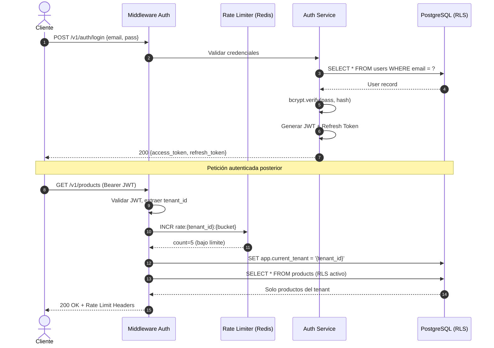

# Definición Técnica — Módulo 01: Gobierno y Seguridad

**Versión:** 1.0  
**Estado:** Borrador  
**Fecha:** 2026-04-24  
**RF Cubiertos:** RF-001 a RF-005  
**Prioridad:** P0 — Bloqueante  
**Autor:** Agente Antigravity (Arquitecto de Soluciones)

---

> [!IMPORTANT]
> Este módulo es **prerequisito** de todos los demás. Ningún endpoint del sistema funciona sin autenticación y aislamiento de tenant activos.

## 1. Resumen de Endpoints

| # | Método | Endpoint | RF | Descripción | Auth |
|---|--------|----------|----|-------------|------|
| 1 | `POST` | `/v1/auth/login` | RF-001 | Autenticación de usuario | Pública |
| 2 | `POST` | `/v1/auth/refresh` | RF-001 | Renovar access token | Refresh Token |
| 3 | `POST` | `/v1/auth/logout` | RF-001 | Invalidar refresh token | JWT |
| 4 | `GET` | `/v1/api-keys` | RF-002 | Listar API Keys del tenant | JWT (`ADMIN`) |
| 5 | `POST` | `/v1/api-keys` | RF-002 | Crear nueva API Key | JWT (`ADMIN`) |
| 6 | `DELETE` | `/v1/api-keys/{key_id}` | RF-002 | Revocar API Key | JWT (`ADMIN`) |
| 7 | `GET` | `/v1/tenant/config` | RF-005 | Consultar políticas del tenant | JWT/API Key (`ADMIN`) |
| 8 | `PATCH` | `/v1/tenant/config` | RF-005 | Actualizar políticas | JWT (`ADMIN`) |
| 9 | `GET` | `/v1/audit-logs` | RF-004 | Consultar audit trail (paginado) | JWT (`ADMIN`) |

---

## 2. Contratos API Detallados

### 2.1 POST `/v1/auth/login` — Autenticación de Usuario

**RF:** RF-001 | **Tablas:** `users`, `tenants`

#### Request

```json
{
  "email": "admin@miempresa.com",
  "password": "SecureP@ss123!"
}
```

| Campo | Tipo | Requerido | Validación |
|-------|------|:---------:|------------|
| `email` | `string (EmailStr)` | ✅ | Formato email válido, max 255 chars |
| `password` | `string` | ✅ | Min 8 chars |

#### Response — `200 OK`

```json
{
  "access_token": "eyJhbGciOiJIUzI1NiIs...",
  "refresh_token": "dGhpcyBpcyBhIHJlZnJl...",
  "token_type": "bearer",
  "expires_in": 1800,
  "user": {
    "id": "550e8400-e29b-41d4-a716-446655440000",
    "email": "admin@miempresa.com",
    "full_name": "Juan Admin",
    "role": "tenant_admin",
    "tenant_id": "a1b2c3d4-e5f6-7890-abcd-ef1234567890"
  }
}
```

**JWT Claims (payload del access_token):**

```json
{
  "sub": "550e8400-e29b-41d4-a716-446655440000",
  "tenant_id": "a1b2c3d4-e5f6-7890-abcd-ef1234567890",
  "role": "tenant_admin",
  "iat": 1714000000,
  "exp": 1714001800,
  "type": "access"
}
```

#### Errores

| Código | Condición | Cuerpo |
|--------|-----------|--------|
| `401` | Credenciales inválidas | `{"detail": "Credenciales inválidas"}` (sin revelar qué campo falló) |
| `403` | Tenant inactivo | `{"detail": "Cuenta suspendida. Contacte soporte."}` |
| `422` | Campos faltantes/inválidos | `{"detail": [{"loc": ["body","email"], "msg": "campo requerido", "type": "value_error.missing"}]}` |
| `429` | Rate limit excedido | `{"detail": "Demasiadas solicitudes", "retry_after": 45}` |

#### Lógica de Negocio

1. Buscar usuario por `email` en tabla `users` (sin RLS — lookup global).
2. Verificar `password_hash` con bcrypt.
3. Verificar que `user.is_active = true` y `tenant.is_active = true`.
4. Generar JWT con claims: `sub`, `tenant_id`, `role`.
5. Generar refresh token (opaco, almacenado en Redis con TTL = 7 días).
6. Actualizar `users.last_login_at`.

---

### 2.2 POST `/v1/auth/refresh` — Renovar Access Token

**RF:** RF-001 | **Tablas:** `users` | **Almacén:** Redis

#### Request

```json
{
  "refresh_token": "dGhpcyBpcyBhIHJlZnJl..."
}
```

#### Response — `200 OK`

```json
{
  "access_token": "eyJhbGciOiJIUzI1NiIs...",
  "refresh_token": "bmV3IHJlZnJlc2ggdG9r...",
  "token_type": "bearer",
  "expires_in": 1800
}
```

#### Errores

| Código | Condición |
|--------|-----------|
| `401` | Refresh token inválido o expirado |
| `403` | Usuario o tenant desactivado |

#### Lógica de Negocio

1. Buscar refresh token en Redis.
2. Invalidar el refresh token usado (rotación).
3. Verificar que el usuario y tenant siguen activos.
4. Emitir nuevo par access_token + refresh_token.

---

### 2.3 POST `/v1/auth/logout` — Invalidar Sesión

**RF:** RF-001 | **Almacén:** Redis

#### Request

```json
{
  "refresh_token": "dGhpcyBpcyBhIHJlZnJl..."
}
```

#### Response — `204 No Content`

#### Lógica de Negocio

1. Eliminar refresh token de Redis.
2. (Opcional) Agregar access_token a blacklist en Redis con TTL = tiempo restante de expiración.

---

### 2.4 GET `/v1/api-keys` — Listar API Keys

**RF:** RF-002 | **Tablas:** `api_keys` | **Scope:** `ADMIN`

#### Query Parameters

| Param | Tipo | Default | Descripción |
|-------|------|---------|-------------|
| `page` | `int` | `1` | Página actual |
| `page_size` | `int` | `20` | Elementos por página (max: 100) |
| `is_active` | `bool` | `null` | Filtrar por estado |

#### Response — `200 OK`

```json
{
  "data": [
    {
      "id": "key-uuid-1",
      "key_id": "mk_live_abc123",
      "name": "POS Tienda Norte",
      "scopes": ["READ_INVENTORY", "WRITE_INVENTORY"],
      "ip_whitelist": ["192.168.1.0/24"],
      "is_active": true,
      "expires_at": "2027-01-01T00:00:00Z",
      "created_at": "2026-04-24T10:00:00Z"
    }
  ],
  "pagination": {
    "page": 1,
    "page_size": 20,
    "total_items": 3,
    "total_pages": 1
  }
}
```

> [!NOTE]
> El `key_secret` **nunca** se retorna en el listado. Solo se muestra al momento de la creación.

---

### 2.5 POST `/v1/api-keys` — Crear API Key

**RF:** RF-002 | **Tablas:** `api_keys` | **Scope:** `ADMIN`

#### Request

```json
{
  "name": "Integración E-commerce",
  "scopes": ["READ_INVENTORY", "WRITE_INVENTORY", "MANAGE_RESERVATIONS"],
  "ip_whitelist": ["203.0.113.50"],
  "expires_at": "2027-06-01T00:00:00Z"
}
```

| Campo | Tipo | Requerido | Validación |
|-------|------|:---------:|------------|
| `name` | `string` | ✅ | Min 3, max 100 chars |
| `scopes` | `list[string]` | ✅ | Valores permitidos: `READ_INVENTORY`, `WRITE_INVENTORY`, `READ_CATALOG`, `WRITE_CATALOG`, `MANAGE_WAREHOUSES`, `MANAGE_RESERVATIONS`, `ADMIN` |
| `ip_whitelist` | `list[string]` | ❌ | IPs o CIDRs válidos |
| `expires_at` | `datetime` | ❌ | Debe ser fecha futura |

#### Response — `201 Created`

```json
{
  "id": "key-uuid-new",
  "key_id": "mk_live_xyz789",
  "key_secret": "mk_secret_REAL_SECRET_SOLO_SE_MUESTRA_UNA_VEZ",
  "name": "Integración E-commerce",
  "scopes": ["READ_INVENTORY", "WRITE_INVENTORY", "MANAGE_RESERVATIONS"],
  "ip_whitelist": ["203.0.113.50"],
  "is_active": true,
  "expires_at": "2027-06-01T00:00:00Z",
  "created_at": "2026-04-24T15:30:00Z"
}
```

> [!CAUTION]
> El campo `key_secret` se muestra **UNA SOLA VEZ** en esta respuesta. Debe almacenarse de forma segura por el cliente. No se puede recuperar después.

#### Lógica de Negocio

1. Generar `key_id` con prefijo `mk_live_` + 24 chars random.
2. Generar `key_secret` con prefijo `mk_secret_` + 48 chars random.
3. Almacenar SHA-256 de `key_secret` en `api_keys.key_hash`.
4. Vincular al `tenant_id` del JWT del solicitante.
5. Registrar en audit_log (RF-004).

---

### 2.6 DELETE `/v1/api-keys/{key_id}` — Revocar API Key

**RF:** RF-002 | **Tablas:** `api_keys` | **Scope:** `ADMIN`

#### Response — `204 No Content`

#### Errores

| Código | Condición |
|--------|-----------|
| `404` | API Key no encontrada (o pertenece a otro tenant — RLS) |

#### Lógica de Negocio

1. Marcar `api_keys.is_active = false`.
2. Invalidar caché en Redis (si existe).
3. Registrar en audit_log.

---

### 2.7 GET `/v1/tenant/config` — Consultar Políticas

**RF:** RF-005 | **Tablas:** `tenants` | **Scope:** `ADMIN`

#### Response — `200 OK`

```json
{
  "tenant_id": "a1b2c3d4-e5f6-7890-abcd-ef1234567890",
  "config": {
    "allow_negative_stock": false,
    "valuation_method": "CPP",
    "auto_reserve_on_order": false,
    "reservation_ttl_minutes": 30,
    "low_stock_alert_enabled": true,
    "require_reason_code": true,
    "default_currency": "COP",
    "timezone": "America/Bogota"
  },
  "subscription_tier": "PROFESSIONAL",
  "updated_at": "2026-04-24T10:00:00Z"
}
```

---

### 2.8 PATCH `/v1/tenant/config` — Actualizar Políticas

**RF:** RF-005 | **Tablas:** `tenants`, `audit_logs` | **Scope:** `ADMIN`

#### Request

```json
{
  "allow_negative_stock": true,
  "reservation_ttl_minutes": 15
}
```

| Campo | Tipo | Validación |
|-------|------|------------|
| `allow_negative_stock` | `bool` | — |
| `valuation_method` | `enum` | `CPP` \| `PEPS` |
| `auto_reserve_on_order` | `bool` | — |
| `reservation_ttl_minutes` | `int` | 1–1440 |
| `low_stock_alert_enabled` | `bool` | — |
| `require_reason_code` | `bool` | — |

> Todos los campos son opcionales (PATCH parcial). Solo se actualizan los campos enviados.

#### Response — `200 OK`

```json
{
  "tenant_id": "a1b2c3d4-...",
  "config": { "...config actualizada..." },
  "updated_at": "2026-04-24T15:45:00Z"
}
```

#### Errores

| Código | Condición |
|--------|-----------|
| `409` | Cambio de `valuation_method` con movimientos en período actual |
| `422` | Valor inválido (ej: `reservation_ttl_minutes: -5`) |

#### Lógica de Negocio

1. Validar cada campo contra reglas de negocio (RN-005-1, RN-005-2).
2. Si `valuation_method` cambia: verificar que no existan registros en `inventory_ledger` del período contable actual.
3. Actualizar `tenants.config` (JSONB merge).
4. Registrar en audit_log con diff de valores.

---

### 2.9 GET `/v1/audit-logs` — Consultar Audit Trail

**RF:** RF-004 | **Tablas:** `audit_logs` | **Scope:** `ADMIN`

#### Query Parameters

| Param | Tipo | Default | Descripción |
|-------|------|---------|-------------|
| `page` | `int` | `1` | Página actual |
| `page_size` | `int` | `50` | Max: 100 |
| `entity` | `string` | `null` | Filtrar: `products`, `stock_balances`, `warehouses`, etc. |
| `action` | `string` | `null` | Filtrar: `CREATE`, `UPDATE`, `DELETE` |
| `user_id` | `uuid` | `null` | Filtrar por usuario ejecutor |
| `date_from` | `datetime` | `null` | Inicio del rango |
| `date_to` | `datetime` | `null` | Fin del rango |

#### Response — `200 OK`

```json
{
  "data": [
    {
      "id": "log-uuid-1",
      "entity": "stock_balances",
      "entity_id": "balance-uuid-1",
      "action": "UPDATE",
      "old_values": {
        "physical_qty": 200,
        "available_qty": 200
      },
      "new_values": {
        "physical_qty": 250,
        "available_qty": 250
      },
      "performed_by": {
        "type": "user",
        "id": "user-uuid-1",
        "email": "admin@miempresa.com"
      },
      "ip_address": "203.0.113.50",
      "user_agent": "MicroNuba-POS/1.0",
      "created_at": "2026-04-24T14:30:00Z"
    }
  ],
  "pagination": {
    "page": 1,
    "page_size": 50,
    "total_items": 1234,
    "total_pages": 25
  }
}
```

> [!IMPORTANT]
> Los audit logs son **inmutables**. No se expone operación DELETE ni PATCH sobre este recurso. Intentar DELETE retorna `405 Method Not Allowed`.

---

## 3. Tablas de Base de Datos Afectadas

| Tabla | Operación | Endpoints que la afectan | RLS |
|-------|-----------|--------------------------|:---:|
| `tenants` | READ, UPDATE | Login, Config | ❌ (lookup global en login) |
| `users` | READ, UPDATE (`last_login`) | Login, Refresh | ✅ |
| `api_keys` | CRUD | API Keys endpoints | ✅ |
| `audit_logs` | INSERT, READ | Todos (INSERT automático) | ✅ |

### Índices Requeridos

```sql
-- users: lookup por email (login)
CREATE UNIQUE INDEX idx_users_email_tenant ON users(tenant_id, email);

-- api_keys: lookup por key_id
CREATE UNIQUE INDEX idx_api_keys_key_id ON api_keys(key_id);
CREATE INDEX idx_api_keys_tenant_active ON api_keys(tenant_id, is_active);

-- audit_logs: consultas frecuentes
CREATE INDEX idx_audit_logs_tenant_entity ON audit_logs(tenant_id, entity, created_at DESC);
CREATE INDEX idx_audit_logs_tenant_user ON audit_logs(tenant_id, performed_by, created_at DESC);
CREATE INDEX idx_audit_logs_tenant_date ON audit_logs(tenant_id, created_at DESC);
```

---

## 4. Modelo Pydantic (Schemas Python)

```python
# === Auth Schemas ===
class LoginRequest(BaseModel):
    email: EmailStr
    password: str = Field(..., min_length=8)

class TokenResponse(BaseModel):
    access_token: str
    refresh_token: str
    token_type: str = "bearer"
    expires_in: int
    user: UserSummary

class UserSummary(BaseModel):
    id: UUID
    email: str
    full_name: str
    role: UserRole
    tenant_id: UUID

class UserRole(str, Enum):
    SUPER_ADMIN = "super_admin"
    TENANT_ADMIN = "tenant_admin"
    INVENTORY_MANAGER = "inventory_manager"
    VIEWER = "viewer"

# === API Key Schemas ===
class ApiKeyCreate(BaseModel):
    name: str = Field(..., min_length=3, max_length=100)
    scopes: list[ApiKeyScope]
    ip_whitelist: list[str] | None = None
    expires_at: datetime | None = None

class ApiKeyScope(str, Enum):
    READ_INVENTORY = "READ_INVENTORY"
    WRITE_INVENTORY = "WRITE_INVENTORY"
    READ_CATALOG = "READ_CATALOG"
    WRITE_CATALOG = "WRITE_CATALOG"
    MANAGE_WAREHOUSES = "MANAGE_WAREHOUSES"
    MANAGE_RESERVATIONS = "MANAGE_RESERVATIONS"
    ADMIN = "ADMIN"

class ApiKeyResponse(BaseModel):
    id: UUID
    key_id: str
    name: str
    scopes: list[ApiKeyScope]
    ip_whitelist: list[str] | None
    is_active: bool
    expires_at: datetime | None
    created_at: datetime

class ApiKeyCreateResponse(ApiKeyResponse):
    key_secret: str  # Solo en creación

# === Tenant Config Schemas ===
class TenantConfigUpdate(BaseModel):
    allow_negative_stock: bool | None = None
    valuation_method: Literal["CPP", "PEPS"] | None = None
    auto_reserve_on_order: bool | None = None
    reservation_ttl_minutes: int | None = Field(None, ge=1, le=1440)
    low_stock_alert_enabled: bool | None = None
    require_reason_code: bool | None = None

class TenantConfigResponse(BaseModel):
    tenant_id: UUID
    config: dict
    subscription_tier: str
    updated_at: datetime

# === Audit Log Schemas ===
class AuditLogEntry(BaseModel):
    id: UUID
    entity: str
    entity_id: UUID
    action: Literal["CREATE", "UPDATE", "DELETE"]
    old_values: dict | None
    new_values: dict
    performed_by: PerformerInfo
    ip_address: str
    user_agent: str | None
    created_at: datetime

class PerformerInfo(BaseModel):
    type: Literal["user", "api_key"]
    id: UUID
    email: str | None = None
```

---

## 5. Headers de Rate Limiting (RF-003)

Toda respuesta autenticada incluye estos headers:

```
X-RateLimit-Limit: 1000
X-RateLimit-Remaining: 997
X-RateLimit-Reset: 1714001860
```

**Implementación:** Redis con clave `rate:{tenant_id}:{minute_bucket}` y TTL de 60 segundos.

| Tier | RPM | Almacén |
|------|-----|---------|
| `STARTER` | 60 | Redis INCR + EXPIRE |
| `PROFESSIONAL` | 1,000 | Redis INCR + EXPIRE |
| `ENTERPRISE` | 10,000 | Redis INCR + EXPIRE |

---

## 6. Middleware de Aislamiento RLS (RF-001)

```python
# Pseudocódigo del middleware
async def tenant_isolation_middleware(request, call_next):
    # 1. Extraer tenant_id del JWT/API Key
    tenant_id = extract_tenant_id(request)
    
    # 2. Inyectar en la conexión de BD
    async with db.session() as session:
        await session.execute(
            text("SET app.current_tenant = :tid"),
            {"tid": str(tenant_id)}
        )
        # 3. Toda query posterior está filtrada por RLS
        response = await call_next(request)
    
    return response
```

---

## 7. Diagrama de Secuencia: Flujo Completo de Autenticación



---

## 8. Trazabilidad RF → Endpoint → Tabla

| RF | Endpoints | Tablas Primarias | Tablas Secundarias |
|----|-----------|------------------|-------------------|
| RF-001 | `/auth/login`, `/auth/refresh`, `/auth/logout` | `users`, `tenants` | Redis (tokens) |
| RF-002 | `/api-keys` (CRUD) | `api_keys` | `audit_logs` |
| RF-003 | Middleware (todos los endpoints) | — | Redis (counters) |
| RF-004 | `/audit-logs` (GET) + INSERT automático | `audit_logs` | — |
| RF-005 | `/tenant/config` (GET, PATCH) | `tenants` | `audit_logs`, `inventory_ledger` (validación) |

---

## 9. Respuesta Estándar de Error

Todos los endpoints del sistema usan el formato de error unificado:

```json
{
  "detail": "Mensaje descriptivo del error",
  "error_code": "TENANT_INACTIVE",
  "timestamp": "2026-04-24T15:30:00Z",
  "request_id": "req_abc123xyz"
}
```

Para errores de validación (422):

```json
{
  "detail": [
    {
      "loc": ["body", "email"],
      "msg": "campo requerido",
      "type": "value_error.missing"
    }
  ]
}
```
