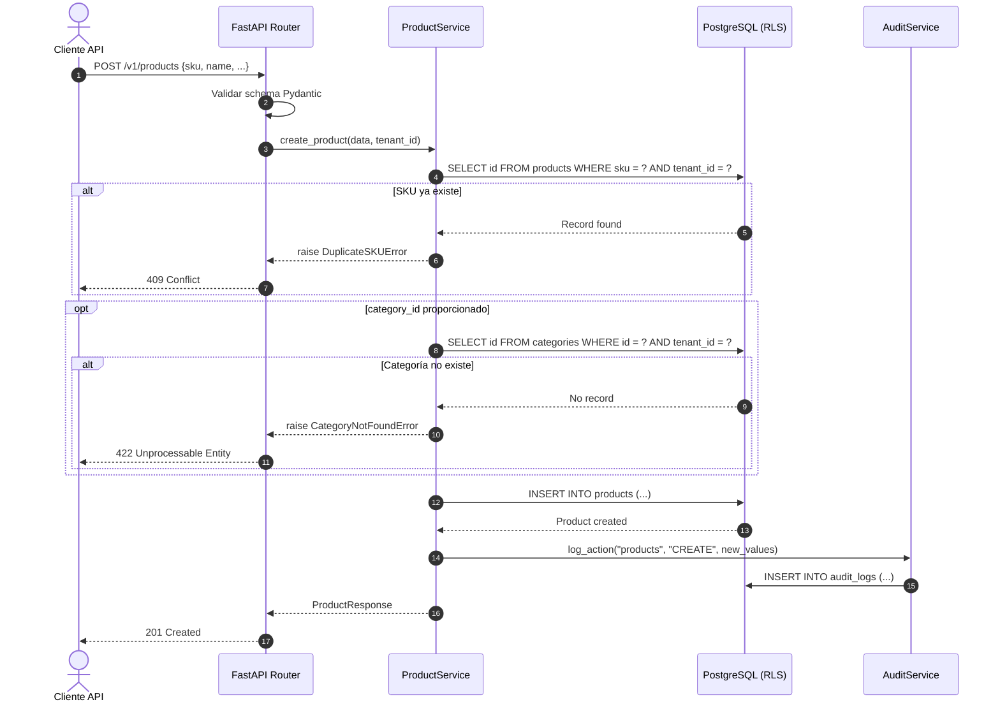

# Definición Técnica — Módulo 02: Catálogo de Productos

**Versión:** 1.0  
**Estado:** Borrador  
**Fecha:** 2026-04-24  
**RF Cubiertos:** RF-006 a RF-012  
**Prioridad:** P0 (RF-006 a RF-008), P1 (RF-011, RF-012), P2 (RF-009, RF-010)  
**Autor:** Agente Antigravity (Arquitecto de Soluciones)

---

> [!IMPORTANT]
> El catálogo es **prerequisito** del motor transaccional. No puede existir inventario sin productos registrados.

## 1. Resumen de Endpoints

| # | Método | Endpoint | RF | Descripción | Scope |
|---|--------|----------|----|-------------|-------|
| 1 | `GET` | `/v1/products` | RF-006 | Listar productos (paginado, filtrable) | `READ_CATALOG` |
| 2 | `POST` | `/v1/products` | RF-006 | Crear producto | `WRITE_CATALOG` |
| 3 | `GET` | `/v1/products/{id}` | RF-006 | Detalle de producto | `READ_CATALOG` |
| 4 | `PATCH` | `/v1/products/{id}` | RF-006 | Actualizar producto | `WRITE_CATALOG` |
| 5 | `DELETE` | `/v1/products/{id}` | RF-006 | Desactivar producto (soft delete) | `WRITE_CATALOG` |
| 6 | `GET` | `/v1/categories` | RF-007 | Listar categorías (árbol) | `READ_CATALOG` |
| 7 | `POST` | `/v1/categories` | RF-007 | Crear categoría | `WRITE_CATALOG` |
| 8 | `GET` | `/v1/categories/{id}` | RF-007 | Detalle de categoría con descendientes | `READ_CATALOG` |
| 9 | `PATCH` | `/v1/categories/{id}` | RF-007 | Actualizar categoría | `WRITE_CATALOG` |
| 10 | `DELETE` | `/v1/categories/{id}` | RF-007 | Eliminar categoría | `WRITE_CATALOG` |
| 11 | `GET` | `/v1/products/{id}/uom` | RF-008 | Listar conversiones UOM | `READ_CATALOG` |
| 12 | `POST` | `/v1/products/{id}/uom` | RF-008 | Agregar conversión UOM | `WRITE_CATALOG` |
| 13 | `DELETE` | `/v1/products/{id}/uom/{uom_id}` | RF-008 | Eliminar conversión UOM | `WRITE_CATALOG` |
| 14 | `POST` | `/v1/products/{id}/kit` | RF-009 | Definir componentes del Kit | `WRITE_CATALOG` |
| 15 | `GET` | `/v1/products/{id}/kit` | RF-009 | Consultar componentes del Kit | `READ_CATALOG` |
| 16 | `GET` | `/v1/suppliers` | RF-011 | Listar proveedores | `READ_CATALOG` |
| 17 | `POST` | `/v1/suppliers` | RF-011 | Crear proveedor | `WRITE_CATALOG` |
| 18 | `GET` | `/v1/suppliers/{id}` | RF-011 | Detalle de proveedor | `READ_CATALOG` |
| 19 | `PATCH` | `/v1/suppliers/{id}` | RF-011 | Actualizar proveedor | `WRITE_CATALOG` |
| 20 | `POST` | `/v1/products/{id}/suppliers` | RF-011 | Vincular proveedor a producto | `WRITE_CATALOG` |

---

## 2. Contratos API Detallados

### 2.1 POST `/v1/products` — Crear Producto

**RF:** RF-006, RF-010 | **Tablas:** `products`, `categories`, `audit_logs`

#### Request

```json
{
  "sku": "MON-24-IPS-001",
  "name": "Monitor 24 pulgadas IPS",
  "description": "Monitor LED IPS Full HD 1080p",
  "category_id": "cat-uuid-electronica",
  "base_uom": "UNIT",
  "reorder_point": 10.0,
  "track_lots": false,
  "track_serials": true,
  "track_expiry": false,
  "low_stock_alert_enabled": true,
  "metadata": {
    "brand": "Samsung",
    "resolution": "1920x1080",
    "panel_type": "IPS",
    "warranty_months": 36
  }
}
```

| Campo | Tipo | Requerido | Validación |
|-------|------|:---------:|------------|
| `sku` | `string` | ✅ | Min 1, max 50. Único por tenant. Alfanumérico + guiones |
| `name` | `string` | ✅ | Min 1, max 255 |
| `description` | `string` | ❌ | Max 2000 |
| `category_id` | `uuid` | ❌ | Debe existir y estar activa en el tenant |
| `base_uom` | `string` | ✅ | Código de UOM válido |
| `reorder_point` | `decimal` | ❌ | ≥ 0, default 0 |
| `track_lots` | `bool` | ❌ | Default false |
| `track_serials` | `bool` | ❌ | Default false |
| `track_expiry` | `bool` | ❌ | Default false |
| `low_stock_alert_enabled` | `bool` | ❌ | Default true |
| `metadata` | `dict` | ❌ | JSONB libre, max 10KB |

#### Response — `201 Created`

```json
{
  "id": "prod-uuid-new",
  "tenant_id": "tenant-uuid",
  "sku": "MON-24-IPS-001",
  "name": "Monitor 24 pulgadas IPS",
  "description": "Monitor LED IPS Full HD 1080p",
  "category": {
    "id": "cat-uuid-electronica",
    "name": "Electrónica"
  },
  "base_uom": "UNIT",
  "current_cpp": 0.0,
  "reorder_point": 10.0,
  "track_lots": false,
  "track_serials": true,
  "track_expiry": false,
  "is_kit": false,
  "is_active": true,
  "low_stock_alert_enabled": true,
  "metadata": {
    "brand": "Samsung",
    "resolution": "1920x1080",
    "panel_type": "IPS",
    "warranty_months": 36
  },
  "created_at": "2026-04-24T10:00:00Z",
  "updated_at": "2026-04-24T10:00:00Z"
}
```

#### Errores

| Código | Condición | Cuerpo |
|--------|-----------|--------|
| `409` | SKU ya existe en el tenant | `{"detail": "El SKU 'MON-24-IPS-001' ya existe en este tenant", "error_code": "SKU_DUPLICATE"}` |
| `422` | Categoría referenciada no existe | `{"detail": "Categoría no encontrada", "error_code": "CATEGORY_NOT_FOUND"}` |
| `422` | Campos obligatorios faltantes | Formato estándar Pydantic |

#### Lógica de Negocio

1. Verificar unicidad de `sku` dentro del tenant (índice compuesto `tenant_id + sku`).
2. Si `category_id` proporcionado, verificar existencia y que pertenezca al tenant.
3. `current_cpp` inicia en 0.0 (se actualiza con la primera entrada RF-016).
4. `is_kit` se calcula automáticamente cuando se agregan componentes (RF-009).
5. Registrar en audit_log.

---

### 2.2 GET `/v1/products` — Listar Productos

**RF:** RF-006 | **Tablas:** `products`, `categories`

#### Query Parameters

| Param | Tipo | Default | Descripción |
|-------|------|---------|-------------|
| `page` | `int` | `1` | Página actual |
| `page_size` | `int` | `20` | Max: 100 |
| `search` | `string` | `null` | Búsqueda en `sku`, `name`, `description` |
| `category_id` | `uuid` | `null` | Filtrar por categoría (incluye descendientes) |
| `is_active` | `bool` | `true` | Filtrar por estado |
| `track_serials` | `bool` | `null` | Filtrar productos con control serial |
| `sort_by` | `string` | `created_at` | Campos: `name`, `sku`, `created_at`, `updated_at` |
| `sort_order` | `string` | `desc` | `asc` \| `desc` |

#### Response — `200 OK`

```json
{
  "data": [
    {
      "id": "prod-uuid-1",
      "sku": "MON-24-IPS-001",
      "name": "Monitor 24 pulgadas IPS",
      "category": { "id": "cat-uuid", "name": "Electrónica" },
      "base_uom": "UNIT",
      "current_cpp": 450000.00,
      "reorder_point": 10.0,
      "is_active": true,
      "is_kit": false,
      "created_at": "2026-04-24T10:00:00Z"
    }
  ],
  "pagination": {
    "page": 1,
    "page_size": 20,
    "total_items": 150,
    "total_pages": 8
  }
}
```

> [!NOTE]
> Cuando se filtra por `category_id`, la búsqueda es **recursiva**: incluye productos de la categoría seleccionada y todas sus subcategorías descendientes (usando materialized path).

---

### 2.3 PATCH `/v1/products/{id}` — Actualizar Producto

**RF:** RF-006 | **Tablas:** `products`, `audit_logs`

#### Request (parcial)

```json
{
  "name": "Monitor 24\" IPS Full HD (Actualizado)",
  "reorder_point": 15.0,
  "metadata": {
    "brand": "Samsung",
    "resolution": "1920x1080",
    "panel_type": "IPS",
    "warranty_months": 24,
    "color": "Negro"
  }
}
```

> [!WARNING]
> El campo `base_uom` **no se puede cambiar** si el producto ya tiene movimientos en `inventory_ledger` (RN-008-3). El campo `sku` **no se puede cambiar** después de la creación.

#### Campos no editables

| Campo | Motivo |
|-------|--------|
| `sku` | Identificador inmutable del producto |
| `base_uom` | Solo editable si no hay movimientos registrados |
| `current_cpp` | Calculado automáticamente por el sistema |
| `is_kit` | Derivado de la existencia de componentes |

---

### 2.4 DELETE `/v1/products/{id}` — Desactivar Producto

**RF:** RF-006 | **Tablas:** `products`, `audit_logs`

#### Response — `204 No Content`

#### Lógica de Negocio

1. Marcar `is_active = false` (soft delete, RN-006-2).
2. No eliminar registros relacionados (stock_balances, ledger histórico).
3. El producto ya no aparece en búsquedas por defecto.
4. Registrar en audit_log.

---

### 2.5 POST `/v1/categories` — Crear Categoría

**RF:** RF-007 | **Tablas:** `categories`, `audit_logs`

#### Request

```json
{
  "name": "Smartphones",
  "parent_id": "cat-uuid-celulares",
  "sort_order": 1
}
```

| Campo | Tipo | Requerido | Validación |
|-------|------|:---------:|------------|
| `name` | `string` | ✅ | Min 1, max 100. Único en su nivel/padre |
| `parent_id` | `uuid` | ❌ | Si se omite = categoría raíz |
| `sort_order` | `int` | ❌ | Default 0 |

#### Response — `201 Created`

```json
{
  "id": "cat-uuid-new",
  "tenant_id": "tenant-uuid",
  "name": "Smartphones",
  "parent_id": "cat-uuid-celulares",
  "path": "Electrónica / Celulares / Smartphones",
  "slug": "smartphones",
  "sort_order": 1,
  "is_active": true,
  "children_count": 0,
  "products_count": 0
}
```

#### Errores

| Código | Condición |
|--------|-----------|
| `409` | Nombre duplicado en el mismo nivel |
| `422` | `parent_id` no existe |

---

### 2.6 GET `/v1/categories` — Árbol de Categorías

**RF:** RF-007 | **Tablas:** `categories`

#### Query Parameters

| Param | Tipo | Default | Descripción |
|-------|------|---------|-------------|
| `flat` | `bool` | `false` | Si true, retorna lista plana; si false, árbol anidado |
| `include_counts` | `bool` | `false` | Incluir conteo de productos por categoría |

#### Response — `200 OK` (árbol anidado)

```json
{
  "data": [
    {
      "id": "cat-uuid-electronica",
      "name": "Electrónica",
      "slug": "electronica",
      "sort_order": 1,
      "products_count": 45,
      "children": [
        {
          "id": "cat-uuid-celulares",
          "name": "Celulares",
          "slug": "celulares",
          "sort_order": 1,
          "products_count": 20,
          "children": [
            {
              "id": "cat-uuid-smartphones",
              "name": "Smartphones",
              "slug": "smartphones",
              "sort_order": 1,
              "products_count": 15,
              "children": []
            }
          ]
        }
      ]
    }
  ]
}
```

---

### 2.7 DELETE `/v1/categories/{id}` — Eliminar Categoría

**RF:** RF-007 | **Tablas:** `categories`

#### Errores

| Código | Condición |
|--------|-----------|
| `409` | Categoría tiene subcategorías activas |
| `409` | Categoría tiene productos asignados |

#### Lógica de Negocio

1. Verificar que no tenga subcategorías activas (RN-007-3).
2. Verificar que no tenga productos asignados.
3. Marcar `is_active = false`.

---

### 2.8 POST `/v1/products/{id}/uom` — Agregar Conversión UOM

**RF:** RF-008 | **Tablas:** `product_uom`

#### Request

```json
{
  "uom_code": "BOX",
  "conversion_factor": 12.0,
  "is_purchase_uom": true,
  "is_sale_uom": false
}
```

| Campo | Tipo | Requerido | Validación |
|-------|------|:---------:|------------|
| `uom_code` | `string` | ✅ | Max 20 chars |
| `conversion_factor` | `decimal` | ✅ | > 0 (RN-008-2) |
| `is_purchase_uom` | `bool` | ❌ | Default false |
| `is_sale_uom` | `bool` | ❌ | Default false |

#### Response — `201 Created`

```json
{
  "id": "uom-uuid-new",
  "product_id": "prod-uuid",
  "uom_code": "BOX",
  "conversion_factor": 12.0,
  "is_purchase_uom": true,
  "is_sale_uom": false
}
```

#### Errores

| Código | Condición |
|--------|-----------|
| `422` | `conversion_factor` ≤ 0 |
| `409` | UOM code ya existe para el producto |

---

### 2.9 POST `/v1/products/{id}/kit` — Definir Kit/Combo

**RF:** RF-009 | **Tablas:** `kit_components`, `products`

#### Request

```json
{
  "components": [
    {
      "component_product_id": "prod-uuid-mouse",
      "quantity": 1.0
    },
    {
      "component_product_id": "prod-uuid-teclado",
      "quantity": 1.0
    },
    {
      "component_product_id": "prod-uuid-monitor",
      "quantity": 1.0
    }
  ]
}
```

#### Response — `201 Created`

```json
{
  "kit_product_id": "prod-uuid-kit-oficina",
  "is_kit": true,
  "components": [
    {
      "id": "comp-uuid-1",
      "product": { "id": "prod-uuid-mouse", "sku": "MOU-001", "name": "Mouse Inalámbrico" },
      "quantity": 1.0
    },
    {
      "id": "comp-uuid-2",
      "product": { "id": "prod-uuid-teclado", "sku": "TEC-001", "name": "Teclado USB" },
      "quantity": 1.0
    },
    {
      "id": "comp-uuid-3",
      "product": { "id": "prod-uuid-monitor", "sku": "MON-001", "name": "Monitor 24\"" },
      "quantity": 1.0
    }
  ]
}
```

#### Errores

| Código | Condición |
|--------|-----------|
| `422` | Referencia circular detectada (RN-009-3) |
| `404` | Componente no encontrado |
| `422` | Cantidad ≤ 0 |

#### Lógica de Negocio

1. Verificar que ningún componente sea el propio producto (self-reference).
2. Verificar que no se creen ciclos (componente A → Kit B → Componente A).
3. Reemplazar componentes existentes (PUT semántico).
4. Marcar `products.is_kit = true` en el producto padre.

---

### 2.10 POST `/v1/suppliers` — Crear Proveedor

**RF:** RF-011 | **Tablas:** `product_suppliers`

#### Request

```json
{
  "name": "Distribuidora TechCo",
  "contact_email": "ventas@techco.com",
  "phone": "+57 300 123 4567",
  "lead_time_days": 5
}
```

#### Response — `201 Created`

```json
{
  "id": "supplier-uuid-new",
  "tenant_id": "tenant-uuid",
  "name": "Distribuidora TechCo",
  "contact_email": "ventas@techco.com",
  "phone": "+57 300 123 4567",
  "lead_time_days": 5,
  "is_active": true,
  "created_at": "2026-04-24T10:00:00Z"
}
```

---

### 2.11 POST `/v1/products/{id}/suppliers` — Vincular Proveedor

**RF:** RF-011 | **Tablas:** `product_suppliers`

#### Request

```json
{
  "supplier_id": "supplier-uuid",
  "supplier_sku": "TC-MON24IPS",
  "last_cost": 420000.00,
  "lead_time_days": 3,
  "is_preferred": true
}
```

#### Response — `201 Created`

```json
{
  "id": "ps-uuid-new",
  "product_id": "prod-uuid",
  "supplier": { "id": "supplier-uuid", "name": "Distribuidora TechCo" },
  "supplier_sku": "TC-MON24IPS",
  "last_cost": 420000.00,
  "lead_time_days": 3,
  "is_preferred": true
}
```

---

## 3. Tablas de Base de Datos Afectadas

| Tabla | Operación | Endpoints | RLS |
|-------|-----------|-----------|:---:|
| `products` | CRUD + soft delete | Products endpoints | ✅ |
| `categories` | CRUD + soft delete | Categories endpoints | ✅ |
| `product_uom` | CRD | UOM endpoints | ✅ (via product) |
| `kit_components` | CR (replace) | Kit endpoints | ✅ (via product) |
| `product_suppliers` | CRU | Supplier link endpoints | ✅ |
| `audit_logs` | INSERT | Automático | ✅ |

### Índices Requeridos

```sql
-- products: búsqueda por SKU (unicidad por tenant)
CREATE UNIQUE INDEX idx_products_tenant_sku ON products(tenant_id, sku);
CREATE INDEX idx_products_tenant_category ON products(tenant_id, category_id) WHERE is_active = true;
CREATE INDEX idx_products_tenant_name ON products(tenant_id, name);

-- categories: árbol jerárquico
CREATE UNIQUE INDEX idx_categories_tenant_parent_name ON categories(tenant_id, parent_id, name);
CREATE INDEX idx_categories_tenant_path ON categories(tenant_id, path);

-- product_uom: lookup por producto
CREATE UNIQUE INDEX idx_product_uom_product_code ON product_uom(product_id, uom_code);

-- kit_components: lookup por kit
CREATE INDEX idx_kit_components_kit ON kit_components(kit_product_id);
CREATE INDEX idx_kit_components_component ON kit_components(component_product_id);

-- product_suppliers
CREATE INDEX idx_product_suppliers_product ON product_suppliers(product_id);
CREATE INDEX idx_product_suppliers_tenant ON product_suppliers(tenant_id);
```

---

## 4. Modelo Pydantic (Schemas Python)

```python
# === Product Schemas ===
class ProductCreate(BaseModel):
    sku: str = Field(..., min_length=1, max_length=50, pattern=r"^[A-Za-z0-9\-_]+$")
    name: str = Field(..., min_length=1, max_length=255)
    description: str | None = Field(None, max_length=2000)
    category_id: UUID | None = None
    base_uom: str = Field(..., max_length=20)
    reorder_point: Decimal = Field(default=Decimal("0"), ge=0)
    track_lots: bool = False
    track_serials: bool = False
    track_expiry: bool = False
    low_stock_alert_enabled: bool = True
    metadata: dict | None = None

class ProductUpdate(BaseModel):
    name: str | None = Field(None, min_length=1, max_length=255)
    description: str | None = None
    category_id: UUID | None = None
    reorder_point: Decimal | None = Field(None, ge=0)
    track_lots: bool | None = None
    track_serials: bool | None = None
    track_expiry: bool | None = None
    low_stock_alert_enabled: bool | None = None
    metadata: dict | None = None

class ProductResponse(BaseModel):
    id: UUID
    tenant_id: UUID
    sku: str
    name: str
    description: str | None
    category: CategorySummary | None
    base_uom: str
    current_cpp: Decimal
    reorder_point: Decimal
    track_lots: bool
    track_serials: bool
    track_expiry: bool
    is_kit: bool
    is_active: bool
    low_stock_alert_enabled: bool
    metadata: dict | None
    created_at: datetime
    updated_at: datetime

# === Category Schemas ===
class CategoryCreate(BaseModel):
    name: str = Field(..., min_length=1, max_length=100)
    parent_id: UUID | None = None
    sort_order: int = 0

class CategoryResponse(BaseModel):
    id: UUID
    tenant_id: UUID
    name: str
    parent_id: UUID | None
    path: str
    slug: str
    sort_order: int
    is_active: bool
    children_count: int
    products_count: int

class CategoryTreeNode(CategoryResponse):
    children: list["CategoryTreeNode"] = []

# === UOM Schemas ===
class ProductUomCreate(BaseModel):
    uom_code: str = Field(..., max_length=20)
    conversion_factor: Decimal = Field(..., gt=0)
    is_purchase_uom: bool = False
    is_sale_uom: bool = False

# === Kit Schemas ===
class KitComponentInput(BaseModel):
    component_product_id: UUID
    quantity: Decimal = Field(..., gt=0)

class KitDefineRequest(BaseModel):
    components: list[KitComponentInput] = Field(..., min_length=1)

# === Supplier Schemas ===
class SupplierCreate(BaseModel):
    name: str = Field(..., min_length=1, max_length=255)
    contact_email: EmailStr | None = None
    phone: str | None = Field(None, max_length=20)
    lead_time_days: int | None = Field(None, ge=0)

class ProductSupplierLink(BaseModel):
    supplier_id: UUID
    supplier_sku: str | None = Field(None, max_length=50)
    last_cost: Decimal | None = Field(None, gt=0)
    lead_time_days: int | None = Field(None, ge=0)
    is_preferred: bool = False
```

---

## 5. Trazabilidad RF → Endpoint → Tabla

| RF | Endpoints | Tablas Primarias | Prioridad |
|----|-----------|------------------|:---------:|
| RF-006 | `/products` (CRUD) | `products` | P0 |
| RF-007 | `/categories` (CRUD) | `categories` | P0 |
| RF-008 | `/products/{id}/uom` | `product_uom` | P0 |
| RF-009 | `/products/{id}/kit` | `kit_components`, `products` | P2 |
| RF-010 | Campos en `/products` | `products` (track_*) | P2 |
| RF-011 | `/suppliers`, `/products/{id}/suppliers` | `product_suppliers` | P1 |
| RF-012 | Automático via RF-016 | `products` (current_cpp) | P1 |

---

## 6. Diagrama de Secuencia: Crear Producto con Validación


