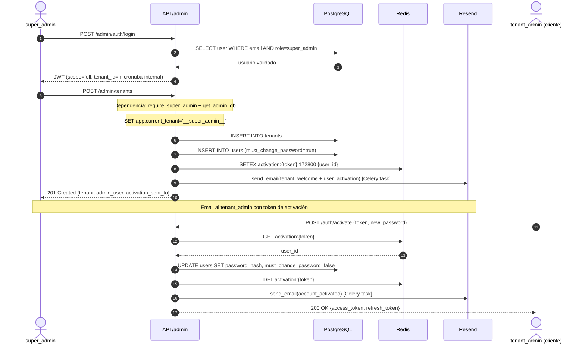
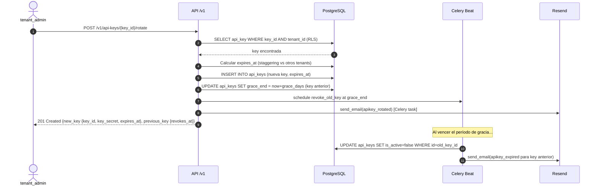
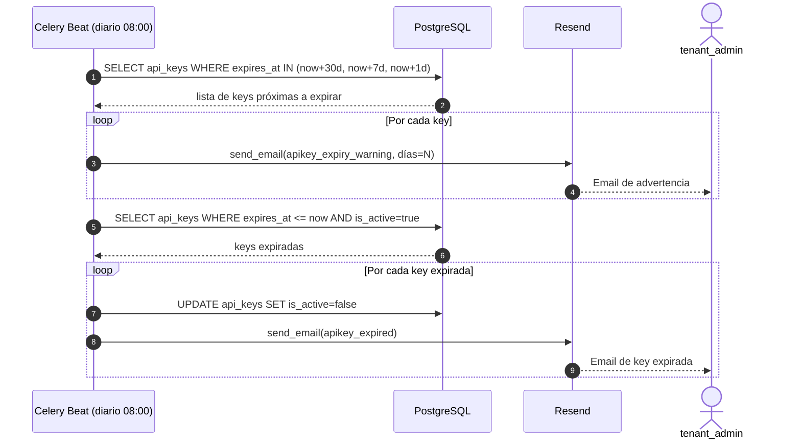

# Definición Técnica — Módulo 08: Administración Multi-tenant y Gestión de Acceso

**Versión:** 1.1  
**Estado:** Implementado ✅  
**Fecha Implementación:** 2026-04-30  
**RF Cubiertos:** RF-036 a RF-044  
**Prioridad:** P0/P1  
**Sprint:** Sprint 6 (Completado)

---

> [!IMPORTANT]
> Este módulo es **prerequisito para la operación comercial**. Sin él, no es posible incorporar clientes ni controlar quién accede al sistema. Depende del Módulo 01 (Gobierno y Seguridad) que debe estar completamente operativo.

---

## 1. Resumen de Endpoints

### Superficie Admin — `/admin/*` (solo `super_admin`)

| # | Método | Endpoint | RF | Descripción | Auth |
|---|--------|----------|----|-------------|------|
| 1 | `POST` | `/admin/auth/register` | RF-036 | Crear super_admin (bootstrap) | Header `X-Bootstrap-Secret` |
| 2 | `POST` | `/admin/auth/login` | RF-036 | Login exclusivo super_admin | Pública |
| 3 | `POST` | `/admin/tenants` | RF-037 | Crear tenant + admin inicial | JWT `super_admin` |
| 4 | `GET` | `/admin/tenants` | RF-037 | Listar tenants | JWT `super_admin` |
| 5 | `GET` | `/admin/tenants/{id}` | RF-037 | Detalle de tenant | JWT `super_admin` |
| 6 | `PATCH` | `/admin/tenants/{id}` | RF-037 | Actualizar tenant | JWT `super_admin` |
| 7 | `GET` | `/admin/tenants/{id}/api-keys` | RF-044 | Listar API Keys del tenant | JWT `super_admin` |
| 8 | `DELETE` | `/admin/tenants/{id}/api-keys/{key_id}` | RF-044 | Revocar key de emergencia | JWT `super_admin` |

### Superficie Cliente — `/auth/*` y `/v1/*`

| # | Método | Endpoint | RF | Descripción | Auth |
|---|--------|----------|----|-------------|------|
| 9 | `POST` | `/auth/activate` | RF-038 | Activar cuenta con token | Sin auth (token es credencial) |
| 10 | `POST` | `/auth/resend-activation/{user_id}` | RF-038 | Reenviar enlace de activación | JWT `tenant_admin` |
| 11 | `POST` | `/auth/change-password` | RF-040 | Cambio voluntario de contraseña | JWT `scope=full` |
| 12 | `GET` | `/v1/users` | RF-039 | Listar usuarios del tenant | JWT `tenant_admin` |
| 13 | `POST` | `/v1/users` | RF-039 | Crear usuario `api_consumer` | JWT `tenant_admin` |
| 14 | `PATCH` | `/v1/users/{user_id}` | RF-039 | Actualizar usuario | JWT `tenant_admin` |
| 15 | `POST` | `/v1/api-keys/{key_id}/rotate` | RF-041 | Rotar API Key | JWT `tenant_admin` |

---

## 2. Arquitectura de Seguridad — Superficies Separadas

```
POST /admin/auth/login    →  valida credenciales + role=super_admin
                              emite JWT con tenant_id=MICRONUBA_TENANT_ID
                              get_admin_db: SET app.current_tenant='__super_admin__'
                              → RLS policy permite acceso cross-tenant

POST /auth/login          →  valida credenciales + role≠super_admin (rechaza super_admin)
                              emite JWT con tenant_id del cliente
                              get_auth_db: SET app.current_tenant=tenant_id
                              → RLS policy filtra por tenant
```

### RLS Bypass — Política actualizada (Migración 012)

```sql
-- Política en users, api_keys, audit_logs
CREATE POLICY tenant_isolation ON users
USING (
    current_setting('app.current_tenant', true) = '__super_admin__'
    OR tenant_id::text = current_setting('app.current_tenant', true)
);
```

### Dependencias `deps.py`

| Dependencia | Usa | Propósito |
|-------------|-----|-----------|
| `get_db` | Sin RLS | Login, activación (no requieren tenant) |
| `get_auth_db` | RLS activo con `tenant_id` | Todos los endpoints de cliente |
| `get_admin_db` | RLS bypass `__super_admin__` | Todos los endpoints `/admin/*` |
| `require_super_admin` | Guard: `role=super_admin` | Protege `get_admin_db` |
| `require_admin` | Guard: `tenant_admin` o `super_admin` | Endpoints admin del tenant |

---

## 3. Contratos API Detallados

### 3.1 POST `/admin/auth/register` — Bootstrap Super Admin

**RF:** RF-036 | **Tablas:** `users`, `tenants`

#### Request

```
Header: X-Bootstrap-Secret: <valor de ADMIN_BOOTSTRAP_SECRET>
```

```json
{
  "email": "ops@micronuba.com",
  "password": "SecureP@ss123!",
  "full_name": "Operador MicroNuba"
}
```

| Campo | Tipo | Requerido | Validación |
|-------|------|:---------:|------------|
| `email` | `EmailStr` | ✅ | Formato válido, max 255 |
| `password` | `string` | ✅ | Mín 8 chars, 1 mayúscula, 1 número |
| `full_name` | `string` | ✅ | Max 255 chars |

#### Response — `201 Created`

```json
{
  "id": "uuid",
  "email": "ops@micronuba.com",
  "full_name": "Operador MicroNuba",
  "role": "super_admin",
  "tenant_id": "00000000-0000-0000-0000-000000000001"
}
```

#### Errores

| Código | Condición |
|--------|-----------|
| `503` | `ADMIN_BOOTSTRAP_SECRET` no configurado |
| `403` | Header ausente o secret incorrecto |
| `409` | Email ya registrado |

---

### 3.2 POST `/admin/auth/login` — Login Super Admin

**RF:** RF-036 | **Tablas:** `users`, `tenants`

#### Request

```json
{
  "email": "ops@micronuba.com",
  "password": "SecureP@ss123!"
}
```

#### Response — `200 OK`

```json
{
  "access_token": "eyJhbGciOiJIUzI1NiIs...",
  "refresh_token": "dGhpcyBpcyBhIHJlZnJl...",
  "token_type": "bearer",
  "expires_in": 1800,
  "user": {
    "id": "uuid",
    "email": "ops@micronuba.com",
    "full_name": "Operador MicroNuba",
    "role": "super_admin",
    "tenant_id": "00000000-0000-0000-0000-000000000001"
  }
}
```

**JWT Claims:**

```json
{
  "sub": "uuid-super-admin",
  "tenant_id": "00000000-0000-0000-0000-000000000001",
  "role": "super_admin",
  "scope": "full",
  "type": "access",
  "iat": 1714000000,
  "exp": 1714001800
}
```

#### Errores

| Código | Condición |
|--------|-----------|
| `403` | Credenciales válidas pero `role ≠ super_admin` (mismo código que credenciales inválidas — no revela información) |
| `401` | Credenciales inválidas |

---

### 3.3 POST `/admin/tenants` — Crear Tenant

**RF:** RF-037 | **Tablas:** `tenants`, `users` | **Eventos:** email `tenant_welcome`

#### Request

```json
{
  "name": "Ferretería López",
  "tier": "STARTER",
  "admin_email": "admin@ferreterialopez.com",
  "admin_full_name": "Carlos López"
}
```

| Campo | Tipo | Requerido | Validación |
|-------|------|:---------:|------------|
| `name` | `string` | ✅ | Max 255 chars |
| `tier` | `enum` | ✅ | `STARTER` / `PROFESSIONAL` / `ENTERPRISE` |
| `admin_email` | `EmailStr` | ✅ | Formato válido |
| `admin_full_name` | `string` | ✅ | Max 255 chars |

#### Response — `201 Created`

```json
{
  "tenant": {
    "id": "uuid",
    "name": "Ferretería López",
    "slug": "ferreteria-lopez",
    "tier": "STARTER",
    "is_active": true,
    "created_at": "2026-04-29T15:00:00Z"
  },
  "admin_user": {
    "id": "uuid",
    "email": "admin@ferreterialopez.com",
    "full_name": "Carlos López",
    "role": "tenant_admin",
    "must_change_password": true
  },
  "activation_sent_to": "admin@ferreterialopez.com"
}
```

> **Nota de seguridad:** La respuesta NO incluye contraseña temporal ni activation_token. El único mecanismo de acceso es el enlace enviado al email.

#### Errores

| Código | Condición |
|--------|-----------|
| `409` | Email de admin ya registrado en otro tenant |
| `422` | Tier inválido, email malformado |

---

### 3.4 PATCH `/admin/tenants/{id}` — Actualizar Tenant

**RF:** RF-037 | **Tablas:** `tenants` | **Eventos:** email `tenant_suspended` (si `is_active=false`)

#### Request (todos los campos opcionales)

```json
{
  "name": "Ferretería López & Hijos",
  "tier": "PROFESSIONAL",
  "is_active": false
}
```

#### Response — `200 OK`

```json
{
  "id": "uuid",
  "name": "Ferretería López & Hijos",
  "slug": "ferreteria-lopez",
  "tier": "PROFESSIONAL",
  "is_active": false,
  "updated_at": "2026-04-29T16:00:00Z"
}
```

---

### 3.5 GET `/admin/tenants` — Listar Tenants

**RF:** RF-037 | **Tablas:** `tenants`

#### Query Params

| Param | Tipo | Descripción |
|-------|------|-------------|
| `page` | `int` | Default: 1 |
| `size` | `int` | Default: 20, máx: 100 |
| `tier` | `string` | Filtro: STARTER / PROFESSIONAL / ENTERPRISE |
| `is_active` | `bool` | Filtro por estado |
| `search` | `string` | Búsqueda por nombre o slug |

#### Response — `200 OK`

```json
{
  "items": [
    {
      "id": "uuid",
      "name": "Ferretería López",
      "slug": "ferreteria-lopez",
      "tier": "STARTER",
      "is_active": true,
      "created_at": "2026-04-29T15:00:00Z"
    }
  ],
  "total": 1,
  "page": 1,
  "size": 20
}
```

---

### 3.6 POST `/auth/activate` — Activar Cuenta

**RF:** RF-038 | **Tablas:** `users` | **Redis:** consume `activation:{token}` | **Eventos:** email `account_activated`

#### Request

```json
{
  "token": "k8Hm2xPqL9...",
  "new_password": "MiPassword1!"
}
```

| Campo | Tipo | Requerido | Validación |
|-------|------|:---------:|------------|
| `token` | `string` | ✅ | Token del email de activación |
| `new_password` | `string` | ✅ | Mín 8 chars, 1 mayúscula, 1 número |

#### Response — `200 OK`

```json
{
  "access_token": "eyJhbGciOiJIUzI1NiIs...",
  "refresh_token": "dGhpcyBpcyBhIHJlZnJl...",
  "token_type": "bearer",
  "expires_in": 1800,
  "user": {
    "id": "uuid",
    "email": "admin@ferreterialopez.com",
    "full_name": "Carlos López",
    "role": "tenant_admin",
    "tenant_id": "uuid"
  }
}
```

#### Errores

| Código | Condición |
|--------|-----------|
| `401` | Token inválido o no encontrado en Redis |
| `410` | Token expirado (TTL vencido) |
| `422` | Contraseña no cumple reglas de complejidad |

---

### 3.7 POST `/v1/users` — Crear Usuario por Tenant Admin

**RF:** RF-039 | **Tablas:** `users` | **Eventos:** email `user_activation`

#### Request

```json
{
  "email": "operador@ferreterialopez.com",
  "full_name": "Juan Operador"
}
```

> El `role` siempre será `api_consumer` — no se acepta otro valor desde este endpoint.

#### Response — `201 Created`

```json
{
  "id": "uuid",
  "email": "operador@ferreterialopez.com",
  "full_name": "Juan Operador",
  "role": "api_consumer",
  "is_active": true,
  "must_change_password": true,
  "activation_sent_to": "operador@ferreterialopez.com",
  "created_at": "2026-04-29T15:00:00Z"
}
```

---

### 3.8 POST `/v1/api-keys/{key_id}/rotate` — Rotar API Key

**RF:** RF-041 | **Tablas:** `api_keys` | **Eventos:** email `apikey_rotated` | **Celery:** programa revocación de key anterior

#### Request

```json
{
  "name": "Key producción rotada",
  "immediate": false
}
```

| Campo | Tipo | Requerido | Descripción |
|-------|------|:---------:|-------------|
| `name` | `string` | ❌ | Nombre de la nueva key. Default: nombre anterior + " (rotada)" |
| `immediate` | `bool` | ❌ | Default: `false`. Si `true`: revoca key anterior sin período de gracia |

#### Response — `201 Created`

```json
{
  "new_key": {
    "key_id": "mk_live_...",
    "key_secret": "mk_secret_...",
    "name": "Key producción rotada",
    "expires_at": "2027-04-29T15:00:00Z"
  },
  "previous_key": {
    "key_id": "mk_live_anterior...",
    "revokes_at": "2026-05-29T15:00:00Z",
    "immediate": false
  }
}
```

> **Nota de seguridad:** `key_secret` solo se muestra en esta respuesta. No se almacena ni se puede recuperar posteriormente.

---

### 3.9 POST `/auth/change-password` — Cambio Voluntario de Contraseña

**RF:** RF-040 | **Tablas:** `users` | **Eventos:** email `password_changed`

#### Request

```json
{
  "current_password": "MiPasswordActual1!",
  "new_password": "MiNuevoPassword2@"
}
```

#### Response — `204 No Content`

#### Errores

| Código | Condición |
|--------|-----------|
| `401` | Contraseña actual incorrecta |
| `422` | Nueva contraseña igual a la actual, o no cumple reglas |

---

## 4. Diagramas de Secuencia

### 4.1 Onboarding Completo de un Tenant



### 4.2 Rotación de API Key con Período de Gracia



### 4.3 Notificaciones Automáticas de Expiración



---

## 5. Cambios al Modelo de Datos

### Migración 012 — Admin Bootstrap (ya ejecutada en F-1)

| Tabla | Columna | Tipo | Default | Propósito |
|-------|---------|------|---------|-----------|
| `users` | `must_change_password` | `Boolean` | `false` | Fuerza activación de cuenta nueva |
| `users` | `created_by` | `UUID nullable` | `null` | Trazabilidad de creación |
| `api_keys` | `last_used_at` | `DateTime(tz) nullable` | `null` | Trazabilidad de uso |

**Políticas RLS actualizadas** en `users`, `api_keys`, `audit_logs`:
```sql
USING (
    current_setting('app.current_tenant', true) = '__super_admin__'
    OR tenant_id::text = current_setting('app.current_tenant', true)
)
```

**Seed:** Tenant `micronuba-internal` (`id: 00000000-0000-0000-0000-000000000001`).

### Variables de Entorno Nuevas

| Variable | Default dev | Descripción |
|----------|------------|-------------|
| `ADMIN_BOOTSTRAP_SECRET` | `""` | Protege `POST /admin/auth/register`. Vaciar en prod post-bootstrap. |
| `RESEND_API_KEY` | `re_test_placeholder` | API key de Resend |
| `RESEND_FROM_EMAIL` | `onboarding@resend.dev` | Email remitente |
| `RESEND_FROM_NAME` | `MicroNuba` | Nombre remitente |
| `ACTIVATION_BASE_URL` | `http://api.inventarios.local:8090` | Base URL para enlaces de activación |
| `ACTIVATION_TOKEN_TTL_HOURS` | `48` | TTL del token en Redis |
| `API_KEY_EXPIRY_DAYS` | `365` | Vida útil de una API Key nueva |
| `API_KEY_ROTATION_GRACE_DAYS` | `30` | Días de gracia al rotar (sistema) |

---

## 6. Estructura de Archivos Nuevos

```
core_backend/app/
├── api/v1/endpoints/
│   ├── admin_auth.py          # POST /admin/auth/register, /login
│   ├── admin_tenants.py       # CRUD /admin/tenants + /api-keys
│   ├── users.py               # GET/POST/PATCH /v1/users
│   └── auth_activate.py       # POST /auth/activate, /resend-activation, /change-password
├── services/
│   ├── admin_auth.py          # register_super_admin, login_super_admin
│   ├── admin_tenant.py        # create_tenant, list_tenants, get_tenant, update_tenant
│   ├── user_management.py     # create_user, list_users, update_user
│   ├── activation.py          # generate_activation_token, activate_account, change_password
│   └── api_key_rotation.py    # rotate_api_key, _staggered_expiry, admin_list/revoke
├── schemas/
│   ├── admin_auth.py          # AdminRegisterRequest, AdminLoginResponse
│   ├── admin_tenant.py        # TenantCreate, TenantUpdate, TenantResponse, TenantCreateResponse
│   ├── user_management.py     # UserCreate, UserUpdate, UserResponse
│   └── activation.py          # ActivateRequest, ChangePasswordRequest, ActivationResponse
└── tasks.py                   # Celery app + send_email (9 templates) + check_expiring_api_keys + revoke_grace_period_key
```

---

## 7. Estrategia de Tests

### Tests de Seguridad (críticos — cobertura 100%)

| Test | Archivo | Qué verifica |
|------|---------|-------------|
| `test_super_admin_rejected_at_client_login` | `tests/test_admin_auth.py` | `POST /v1/auth/login` rechaza `super_admin` |
| `test_login_admin_wrong_role` | `tests/test_admin_auth.py` | `POST /admin/auth/login` rechaza `tenant_admin` |
| `test_admin_list_tenant_api_keys` | `tests/test_api_key_rotation.py` | super_admin ve API Keys de cualquier tenant |
| `test_admin_list_keys_requires_super_admin` | `tests/test_api_key_rotation.py` | `/admin/*` devuelve 403 a tenant_admin |
| `test_activate_token_single_use` | `tests/test_activation.py` | Token revocado tras primer uso |
| `test_activate_expired_token` | `tests/test_activation.py` | Token expirado devuelve 410 |

### Tests de Integración por Endpoint

| Endpoint | Escenarios mínimos |
|----------|--------------------|
| `POST /admin/auth/register` | Happy path, secret incorrecto, email duplicado, bootstrap desactivado |
| `POST /admin/auth/login` | Happy path, credenciales inválidas, rol incorrecto |
| `POST /admin/tenants` | Happy path, slug colisión, email duplicado |
| `PATCH /admin/tenants/{id}` | Suspensión, cambio de tier, tenant no existe |
| `POST /auth/activate` | Happy path, token inválido, token expirado, password débil |
| `POST /auth/resend-activation` | Happy path, usuario ya activo |
| `POST /auth/change-password` | Happy path, password actual incorrecto, mismo password |
| `POST /v1/users` | Happy path, rol no permitido, email duplicado en tenant |
| `POST /v1/api-keys/{id}/rotate` | Rotación normal, rotación inmediata, staggering |
| `GET /admin/tenants/{id}/api-keys` | Happy path, RLS verificado |
| `DELETE /admin/tenants/{id}/api-keys/{key_id}` | Revocación inmediata, email notificación |

### Métricas Sprint 6 — Resultado Final

| Métrica | Umbral | Resultado |
|---------|--------|-----------|
| Cobertura global | ≥ 90% | **93%** ✅ |
| Cobertura módulos auth/admin | 100% | **98–100%** ✅ |
| Errores ruff | 0 | **0** ✅ |
| Errores mypy | 0 | **0** ✅ |
| Tests nuevos | ≥ 60 | **76** (208→284) ✅ |
