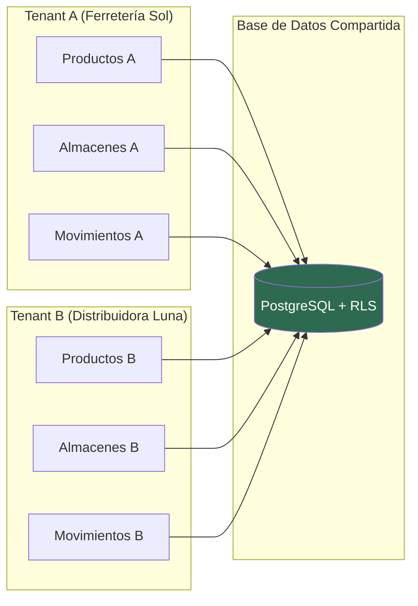
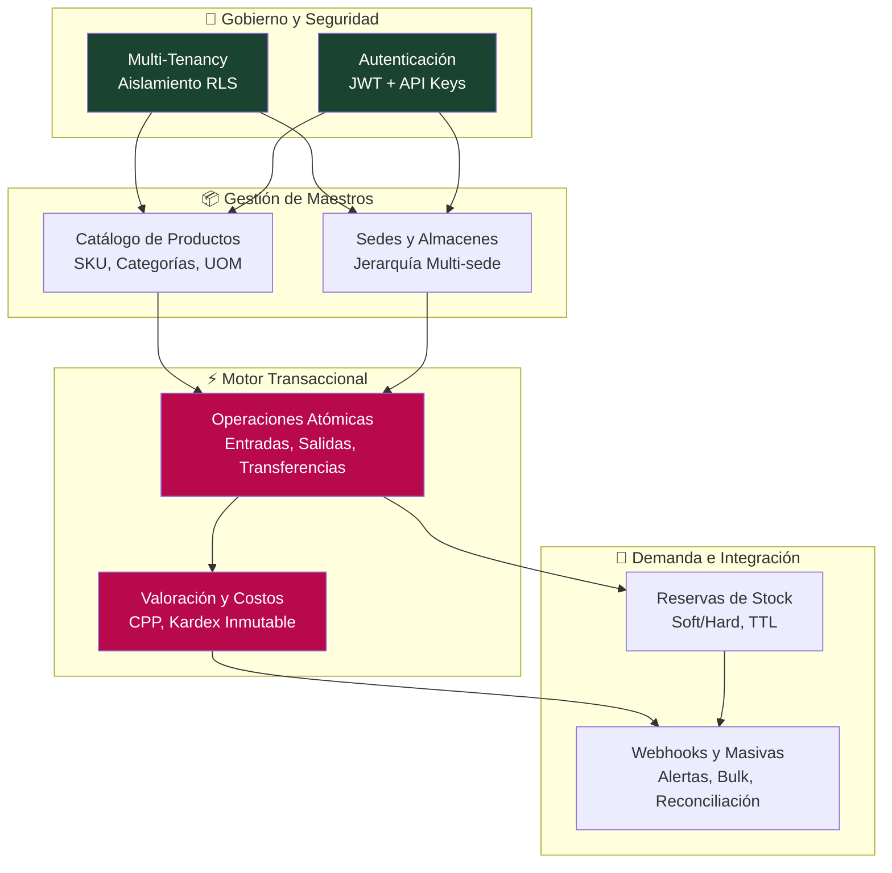
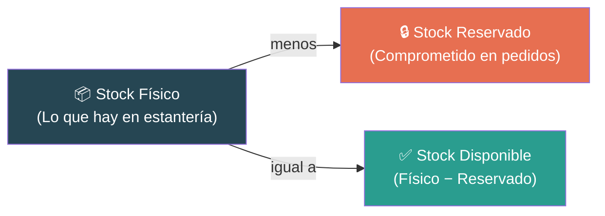
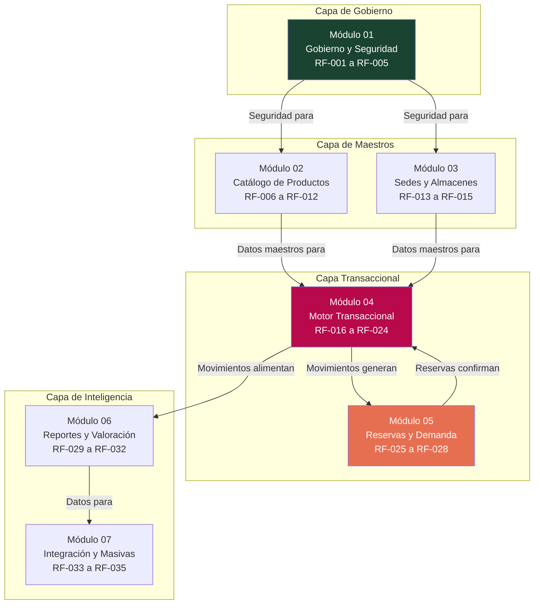
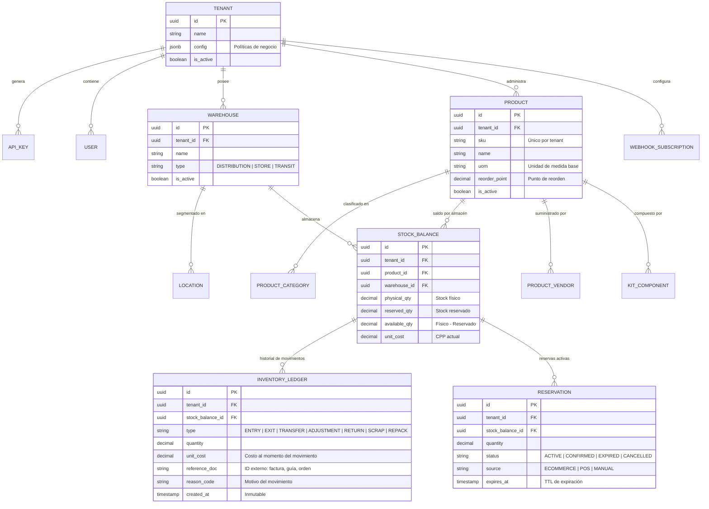
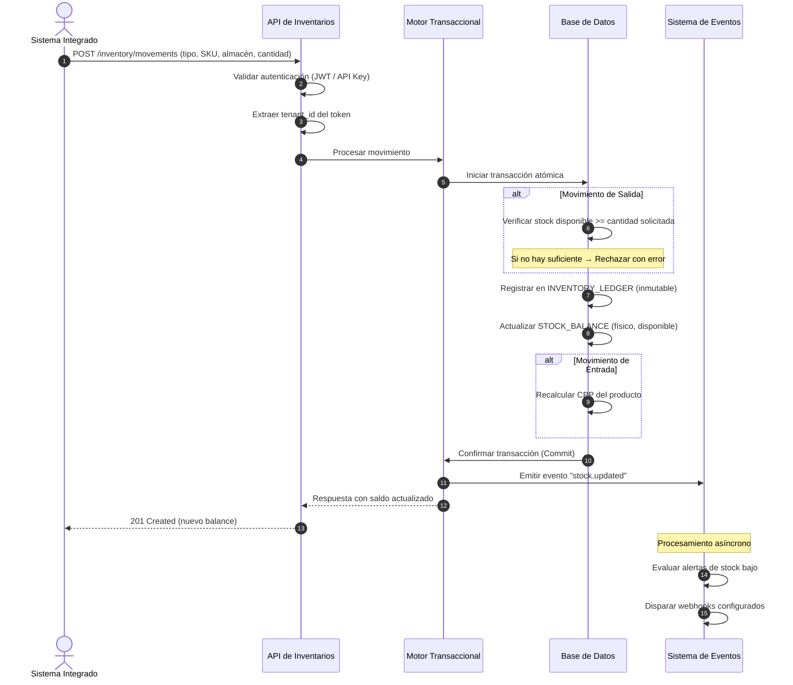

# Definición de la Solución SaaS — MicroNuba Inventory

**Versión:** 1.0  
**Estado:** Definición Funcional  
**Fecha:** 2026-04-24  
**Responsable:** Product Architect — MicroNuba

---

## 1. Visión del Producto

**MicroNuba Inventory** es una plataforma SaaS Multi-Tenant de gestión de inventarios diseñada para actuar como el **cerebro transaccional** de activos físicos. Su propósito es centralizar toda la lógica de existencias en un motor único, confiable y auditable, que pueda ser consumido por múltiples aplicaciones (E-commerce, POS, ERP, Apps Móviles) a través de una **API REST**.

### Propuesta de Valor

| Para... | Que necesitan... | MicroNuba Inventory ofrece... |
|---------|-----------------|-------------------------------|
| **Empresas multi-sede** | Control centralizado de stock en bodegas, tiendas y centros de distribución | Motor transaccional atómico con saldos por almacén en tiempo real |
| **Plataformas de E-commerce** | Evitar sobreventas (overselling) y gestionar reservas temporales | Sistema de reservas (Soft/Hard) con liberación automática por TTL |
| **Áreas contables** | Valoración precisa del inventario para estados financieros | Cálculo automático de Costo Promedio Ponderado (CPP) y Balance Snapshots |
| **Operaciones logísticas** | Trazabilidad total de cada movimiento de mercancía | Kardex histórico inmutable con auditoría forense |
| **Desarrolladores integradores** | API estable y bien documentada para construir sobre ella | API REST documentada con OpenAPI 3.0, webhooks y procesamiento masivo |

### Principio Fundamental

> **"La Verdad Única del Stock"** — Toda operación que afecte existencias pasa por el motor transaccional. No existen atajos ni canales secundarios. Cada unidad de inventario tiene una historia trazable desde su ingreso hasta su salida final.

---

## 2. Modelo de Negocio Multi-Tenant

### 2.1. ¿Qué es un Tenant?

Un **Tenant** representa a una empresa u organización cliente que contrata el servicio SaaS. Cada tenant opera de forma completamente aislada: tiene sus propios productos, almacenes, movimientos, configuraciones y usuarios.

### 2.2. Aislamiento de Datos

El aislamiento se implementa a nivel de base de datos mediante **Row-Level Security (RLS)**. Esto garantiza que:

- Cada registro en la base de datos pertenece a un `tenant_id`.
- Las consultas están filtradas automáticamente por el contexto del tenant autenticado.
- Incluso si la capa de aplicación tuviera un error, la base de datos impide el acceso cruzado.

### 2.3. Autenticación y Autorización

| Mecanismo | Uso | Descripción |
|-----------|-----|-------------|
| **JWT (JSON Web Token)** | Sesiones de usuario | Token firmado que incluye `tenant_id`, `user_id` y `role`. Validación en cada petición |
| **API Keys** | Integraciones sistema-a-sistema | Credenciales de larga duración con scopes granulares (ej: `READ_ONLY`, `WRITE_INVENTORY`). Cada API Key pertenece a un tenant |
| **RBAC (Control de Acceso por Roles)** | Permisos internos | Roles predefinidos: `super_admin`, `tenant_admin`, `inventory_manager`, `viewer` |

### 2.4. Configuración por Tenant (Políticas de Negocio)

Cada tenant podrá personalizar el comportamiento del motor de inventario:

| Política | Descripción | Valores Posibles |
|----------|-------------|-----------------|
| `allow_negative_stock` | ¿Permite vender sin existencias físicas? | `true` / `false` |
| `valuation_method` | Método de valoración contable | `CPP` (Costo Promedio Ponderado) / `PEPS` (Primeras Entradas, Primeras Salidas) |
| `auto_reserve_on_order` | ¿Reservar stock automáticamente al recibir una orden? | `true` / `false` |
| `reservation_ttl_minutes` | Tiempo máximo de una reserva temporal antes de liberarse | Entero (ej: `30`) |
| `low_stock_alert_enabled` | ¿Activar alertas de stock bajo? | `true` / `false` |

---

## 3. Capacidades Core del Motor de Inventarios

El sistema se construye sobre **8 capacidades funcionales** que definen todo lo que el motor puede hacer:

### Mapa de Capacidades

### Descripción de Cada Capacidad

| # | Capacidad | Descripción Funcional |
|---|-----------|----------------------|
| 1 | **Motor Transaccional Atómico** | Toda operación que modifique stock (entrada, salida, transferencia, ajuste) se ejecuta como una transacción indivisible. Si cualquier paso falla, todo se revierte. No existen estados intermedios |
| 2 | **Costo Promedio Ponderado (CPP)** | Cada vez que se registra una entrada de mercancía, el sistema recalcula automáticamente el costo unitario promedio. Fórmula: `Nuevo CPP = (Stock Actual × CPP Actual + Cantidad Ingresada × Costo Compra) / (Stock Actual + Cantidad Ingresada)` |
| 3 | **Kardex Histórico** | Registro inmutable de todos los movimientos de inventario. Funciona como un "libro mayor" contable: no se borran registros, se anulan con contrapartidas. Permite rastrear cada unidad desde su ingreso hasta su salida |
| 4 | **Multi-Sede** | Soporte para jerarquías de ubicaciones: Almacenes, Bodegas, Tiendas, Almacenes Virtuales (Tránsito). Cada nodo mantiene saldos independientes por producto |
| 5 | **Alertas y Reposición (Reorder Point)** | Evaluación constante de niveles de stock contra umbrales mínimos definidos por producto. Cuando el stock disponible cae por debajo del punto de reorden, se dispara una alerta o webhook |
| 6 | **Reservas de Stock (Soft Reservation)** | Bloqueo temporal de unidades para pedidos en proceso. El stock se descuenta del "disponible" pero permanece en el "físico". Si el pedido no se confirma en el tiempo configurado (TTL), la reserva se libera automáticamente |
| 7 | **Procesamiento Masivo (Bulk Engine)** | Carga y procesamiento de operaciones en lote (inventarios iniciales, ajustes masivos, importaciones). Ejecución asíncrona con seguimiento de progreso |
| 8 | **Balance Snapshots** | Consulta instantánea del estado del inventario en un momento dado. Tres dimensiones: **Físico** (en estantería), **Reservado** (comprometido en pedidos) y **Disponible** (Físico − Reservado) |

---

## 4. Modelo de Tipos de Stock

El sistema maneja tres estados de stock que son fundamentales para todas las operaciones:

| Tipo | Fórmula | Significado |
|------|---------|-------------|
| **Físico** | Suma de todas las entradas − Suma de todas las salidas | Lo que realmente está en el almacén |
| **Reservado** | Suma de reservas activas (no confirmadas ni expiradas) | Lo que está apartado para pedidos pendientes |
| **Disponible** | Físico − Reservado | Lo que se puede vender o mover libremente |

---

## 5. Tipos de Movimientos de Inventario

Cada operación que afecta el stock se clasifica en un tipo de movimiento:

| Tipo | Código | Efecto en Stock Físico | Descripción |
|------|--------|----------------------|-------------|
| **Entrada** | `ENTRY` | ➕ Incrementa | Recepción de mercancía por compra o producción |
| **Salida** | `EXIT` | ➖ Decrementa | Venta, consumo interno o despacho |
| **Transferencia** | `TRANSFER` | ➖ Origen / ➕ Destino | Movimiento entre almacenes (proceso de dos fases: salida → tránsito → entrada) |
| **Ajuste** | `ADJUSTMENT` | ➕ o ➖ | Corrección manual por inventario físico, sobrantes o faltantes |
| **Devolución (RMA)** | `RETURN` | ➕ Incrementa | Reingreso por devolución del cliente. Clasifica estado: Nuevo, Re-acondicionado, Dañado |
| **Baja (Scrap)** | `SCRAP` | ➖ Decrementa | Salida definitiva por avería, obsolescencia, robo o vencimiento |
| **Re-empaque** | `REPACK` | ➖ SKU Origen / ➕ SKU Destino | Transformación: desarmar un kit, re-etiquetar, cambiar presentación |

---

## 6. Mapa de Módulos Funcionales

El sistema se organiza en **7 módulos funcionales**, cada uno documentado en detalle en su carpeta correspondiente:

### Inventario de Requerimientos por Módulo

| Módulo | Documento | RF | Prioridad MVP |
|--------|-----------|-----|---------------|
| **01 — Gobierno y Seguridad** | [RF_gobierno_seguridad.md](../01_gobierno_seguridad/RF_gobierno_seguridad.md) | RF-001 a RF-005 | **P0** (Bloqueante) |
| **02 — Catálogo de Productos** | [RF_catalogo_productos.md](../02_catalogo_productos/RF_catalogo_productos.md) | RF-006 a RF-012 | **P0** (Bloqueante) |
| **03 — Sedes y Almacenes** | [RF_sedes_almacenes.md](../03_sedes_almacenes/RF_sedes_almacenes.md) | RF-013 a RF-015 | **P0** (Bloqueante) |
| **04 — Motor Transaccional** | [RF_motor_transaccional.md](../04_motor_transaccional/RF_motor_transaccional.md) | RF-016 a RF-024 | **P0** (Bloqueante) |
| **05 — Reservas y Demanda** | [RF_reservas_demanda.md](../05_reservas_demanda/RF_reservas_demanda.md) | RF-025 a RF-028 | **P1** |
| **06 — Reportes y Valoración** | [RF_reportes_valoracion.md](../06_reportes_valoracion/RF_reportes_valoracion.md) | RF-029 a RF-032 | **P1** |
| **07 — Integración y Masivas** | [RF_integracion_masivas.md](../07_integracion_masivas/RF_integracion_masivas.md) | RF-033 a RF-035 | **P2** |

---

## 7. Modelo de Datos General (ERD)

Este diagrama muestra las entidades principales y sus relaciones a alto nivel. Cada módulo detallará sus entidades en profundidad.

---

## 8. Flujo de un Movimiento Atómico

Este es el flujo funcional que sigue cualquier operación que modifique stock:

---

## 9. Matriz de Priorización MVP

La priorización sigue el esquema **P0 → P1 → P2** donde P0 es bloqueante para el lanzamiento:

| Prioridad | Módulo | Funcionalidad | Justificación |
|-----------|--------|---------------|---------------|
| **P0** | Gobierno | Multi-tenancy + Aislamiento RLS | Sin esto, no hay SaaS |
| **P0** | Gobierno | Autenticación JWT + API Keys | Sin esto, no hay acceso seguro |
| **P0** | Catálogo | CRUD de Productos (SKU, categorías, UOM) | Sin productos, no hay inventario |
| **P0** | Sedes | CRUD de Almacenes multi-sede | Sin almacenes, no hay dónde almacenar |
| **P0** | Motor | Movimientos atómicos (entrada, salida, transferencia) | Operación core del negocio |
| **P0** | Motor | Consulta de saldos en tiempo real | Necesidad básica de todo consumidor |
| **P1** | Motor | Ajustes por auditoría, devoluciones, bajas | Operaciones secundarias pero necesarias |
| **P1** | Valoración | Cálculo de CPP y valoración contable | Requerimiento contable |
| **P1** | Reportes | Kardex histórico y Balance Snapshots | Auditoría y reportes |
| **P1** | Reservas | Soft Reservation + liberación automática | Habilitador de e-commerce |
| **P2** | Catálogo | Kits/Combos, trazabilidad (lotes, seriales) | Funcionalidad avanzada |
| **P2** | Sedes | Zonificación (bins/slots) y bloqueos | Optimización logística avanzada |
| **P2** | Integración | Webhooks, carga masiva, inventario cíclico | Conectividad con ecosistema externo |

---

## 10. Glosario del Dominio

| Término | Definición |
|---------|-----------|
| **Tenant** | Empresa u organización cliente que contrata el servicio SaaS. Opera de forma aislada |
| **SKU** | *Stock Keeping Unit*. Código único que identifica un producto dentro de un tenant |
| **Almacén (Warehouse)** | Nodo físico o virtual donde se almacena inventario. Puede ser bodega, tienda o almacén de tránsito |
| **Ubicación (Location/Bin)** | Posición específica dentro de un almacén (pasillo, estante, nivel) |
| **Stock Físico** | Cantidad real de unidades presentes en un almacén |
| **Stock Reservado** | Cantidad comprometida en pedidos pendientes de despacho |
| **Stock Disponible** | Stock Físico − Stock Reservado. Lo que se puede vender o mover |
| **CPP** | *Costo Promedio Ponderado*. Método de valoración que calcula el costo unitario promedio ponderado por cantidades |
| **PEPS** | *Primeras Entradas, Primeras Salidas* (FIFO). Método de valoración alternativo |
| **Kardex** | Registro histórico de todos los movimientos de un producto. Equivale a un "libro mayor" de inventario |
| **Inventory Ledger** | Tabla inmutable que registra cada movimiento. No se borran registros: se anulan con contrapartidas |
| **Reorder Point** | Nivel mínimo de stock por debajo del cual se genera una alerta de reposición |
| **Soft Reservation** | Reserva temporal de stock que se libera automáticamente si no se confirma en un tiempo determinado (TTL) |
| **Hard Commitment** | Conversión de una reserva temporal en una salida real de inventario (tras confirmación de pago) |
| **RLS** | *Row-Level Security*. Mecanismo de PostgreSQL que filtra filas automáticamente por `tenant_id` |
| **TTL** | *Time-To-Live*. Tiempo máximo de vida de una reserva antes de su liberación automática |
| **RMA** | *Return Merchandise Authorization*. Proceso de gestión de devoluciones |
| **UOM** | *Unit of Measure*. Unidad de medida de un producto (unidades, cajas, pallets, kg, etc.) |
| **Kit/Combo (BOM)** | Producto "padre" cuyo stock depende de la disponibilidad de sus componentes "hijos" |
| **Balance Snapshot** | Estado del inventario en un punto específico del tiempo: físico, reservado y disponible |
| **Webhook** | Notificación HTTP automática enviada a un sistema externo cuando ocurre un evento relevante |
| **Bulk Engine** | Motor de procesamiento masivo para operaciones en lote (importaciones, ajustes, inventarios iniciales) |
| **API Key** | Credencial de acceso de larga duración con permisos granulares para integraciones sistema-a-sistema |

---

## 11. Convenciones de Documentación

### Identificadores de Requerimientos

Cada requerimiento funcional sigue el formato: **`RF-XXX`** donde `XXX` es un número secuencial global (001 a 035).

### Formato de Historias de Usuario

Las HU se escriben desde la perspectiva de quién consume el servicio:

- **Tenant Admin** — configura su empresa, almacenes y políticas
- **Sistema integrado** — cualquier aplicación que consume el API (POS, e-commerce, ERP)
- **Super Admin (MicroNuba)** — gestiona tenants y el servicio SaaS

### Criterios de Aceptación

Todos los criterios usan formato **Gherkin** (`Dado / Cuando / Entonces`) con un mínimo de 3 criterios por HU.

### Diagramas

Cada módulo incluye:
- **Diagrama de contexto** (relación del módulo con el resto del sistema)
- **ERD del módulo** (entidades y relaciones de datos)
- **Diagrama de secuencia** (flujo principal de al menos la operación más crítica)

---

## 12. Referencias

| Documento Fuente | Ubicación |
|-----------------|-----------|
| Alcance Funcional: Gestión de Inventarios SaaS | `doc/Documentacion de Idea/Alcance Funcional_*.md` |
| Arquitectura de Referencia: MicroNuba Inventory SaaS Core | `doc/Documentacion de Idea/Arquitectura de Referencia_*.md` |
| Especificación Técnica Enterprise: Motor de Inventarios Atómico | `doc/Documentacion de Idea/Especificación Técnica Enterprise_*.md` |
| Estructura del Proyecto | `doc/Estructura/estructura_proyecto.md` |
| Reglas Operativas | `.agent/RULES.md` |
