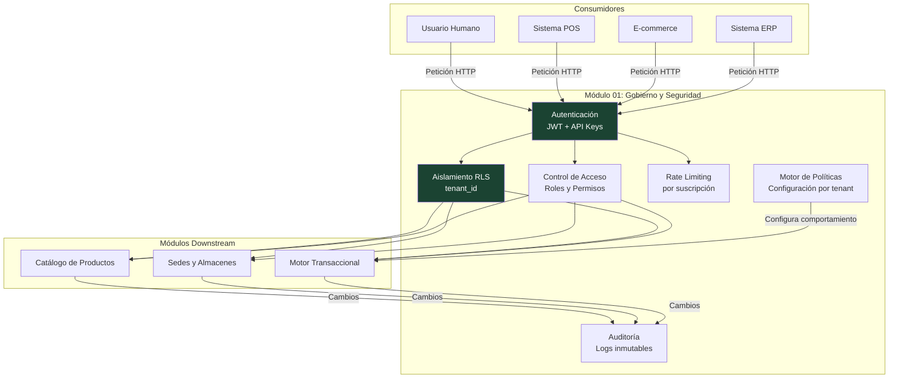
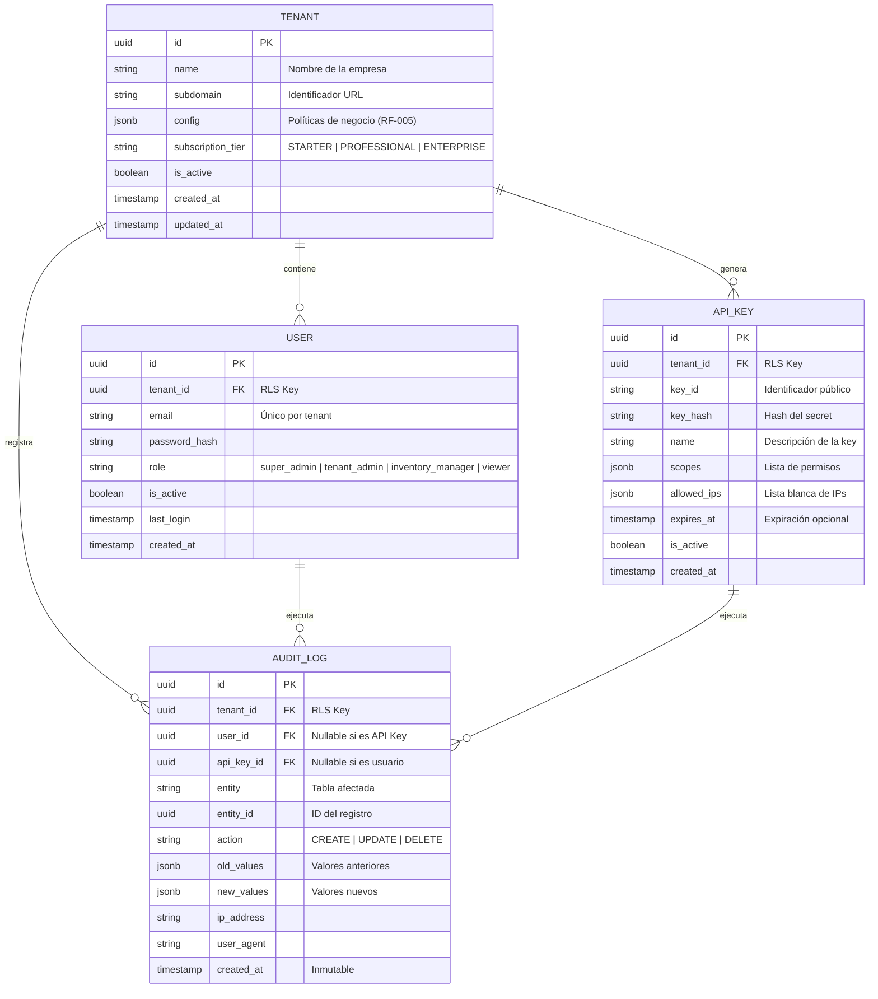
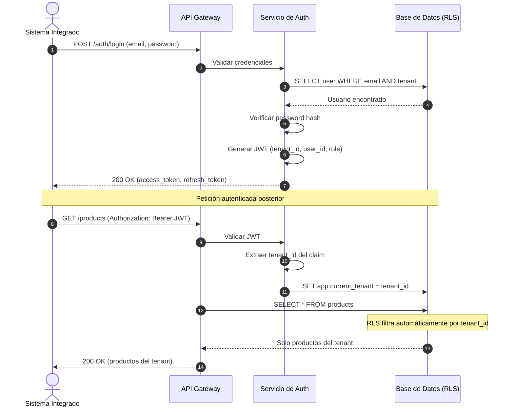

# Módulo 01: Gobierno y Seguridad (Multi-Tenancy)

**RF cubiertos:** RF-001 a RF-005  
**Prioridad MVP:** P0 (Bloqueante)  
**Documento padre:** [DEFINICION_SAAS.md](../00_definicion-solucion_saas/DEFINICION_SAAS.md)

---

## Contexto y Alcance

Este módulo establece los **cimientos de seguridad** sobre los cuales opera todo el sistema. Sin él, no existe SaaS. Su responsabilidad es garantizar que cada petición al API esté autenticada, autorizada y aislada al tenant correcto.

Abarca:
- Aislamiento de datos entre tenants (la prioridad #1 del sistema)
- Autenticación de usuarios y sistemas integradores
- Control de acceso granular mediante roles y API Keys
- Protección contra abuso (throttling)
- Auditoría de toda acción que modifique datos
- Políticas de negocio configurables por tenant

### Diagrama de Contexto

---

## Requerimientos Funcionales

### RF-001: Aislamiento Lógico de Datos (Multi-Tenancy)

- **ID:** RF-001
- **Módulo:** Gobierno y Seguridad
- **Prioridad:** P0 — Bloqueante
- **Descripción:** El sistema debe garantizar que cada consulta, inserción, actualización o eliminación en la base de datos esté filtrada automáticamente por el `tenant_id` del solicitante. Ningún proceso puede acceder a datos de un tenant distinto al autenticado.
- **Pre-condiciones:**
  1. El solicitante posee un token JWT válido o una API Key activa.
  2. El token/key contiene un `tenant_id` verificable.
- **Flujo Principal:**
  1. El sistema recibe una petición HTTP con credenciales.
  2. Extrae el `tenant_id` del claim del token JWT o de la API Key.
  3. Inyecta el `tenant_id` como variable de sesión en la conexión a base de datos (`SET app.current_tenant = '{tenant_id}'`).
  4. Todas las consultas posteriores en esa conexión son filtradas automáticamente por RLS.
  5. El sistema procesa la operación y retorna los datos que corresponden exclusivamente al tenant autenticado.
- **Post-condiciones:**
  - Los datos retornados pertenecen exclusivamente al tenant autenticado.
  - El `tenant_id` queda registrado en el contexto de la petición para auditoría.
- **Reglas de Negocio:**
  - RN-001-1: Toda tabla que almacene datos transaccionales o de configuración de un tenant DEBE tener la columna `tenant_id` y RLS habilitado.
  - RN-001-2: Las políticas RLS deben estar vinculadas a `current_setting('app.current_tenant')`.
  - RN-001-3: Las tablas de catálogo global del sistema (si las hay, como unidades de medida estándar) están exentas de RLS.
- **Manejo de Errores:**
  - Si el token no contiene `tenant_id` → `401 Unauthorized`.
  - Si se intenta acceder a un recurso de otro tenant (por manipulación de ID en URL) → `403 Forbidden` o silenciosamente el RLS retorna vacío (recurso no encontrado para ese tenant → `404 Not Found`).

---

### RF-002: Gestión de API Keys y Perfiles de Aplicación

- **ID:** RF-002
- **Módulo:** Gobierno y Seguridad
- **Prioridad:** P0 — Bloqueante
- **Descripción:** Cada tenant podrá crear credenciales de acceso programático (API Keys) con niveles de permiso granulares (scopes), destinadas a integraciones sistema-a-sistema. Esto permite que un POS, un e-commerce o un ERP se autentiquen sin usar credenciales de usuario.
- **Pre-condiciones:**
  1. El solicitante tiene rol `tenant_admin` o `super_admin`.
  2. El tenant está activo.
- **Flujo Principal:**
  1. El administrador del tenant solicita la creación de una nueva API Key indicando: nombre descriptivo, scopes (permisos), y opcionalmente: lista blanca de IPs y fecha de expiración.
  2. El sistema genera un par de credenciales: un `key_id` público y un `key_secret` (mostrado una única vez).
  3. El sistema almacena el hash del `key_secret` (nunca en texto plano).
  4. La API Key queda vinculada al tenant y con los scopes asignados.
  5. El sistema permite listar, revocar y rotar API Keys existentes.
- **Post-condiciones:**
  - La API Key está activa y lista para usarse en integraciones.
  - El `key_secret` solo se muestra una vez al momento de la creación.
- **Reglas de Negocio:**
  - RN-002-1: Los scopes disponibles son granulares y acumulativos: `READ_INVENTORY`, `WRITE_INVENTORY`, `READ_CATALOG`, `WRITE_CATALOG`, `MANAGE_WAREHOUSES`, `MANAGE_RESERVATIONS`, `ADMIN`.
  - RN-002-2: Una API Key con scope `READ_ONLY` (alias de `READ_INVENTORY + READ_CATALOG`) no puede ejecutar operaciones de escritura.
  - RN-002-3: Al revocar una API Key, todas las peticiones futuras con esa key deben ser rechazadas inmediatamente.
  - RN-002-4: Cada API Key pertenece a un único tenant y hereda su `tenant_id`.
- **Manejo de Errores:**
  - Si se usa una API Key revocada → `401 Unauthorized` con mensaje descriptivo.
  - Si se usa una API Key expirada → `401 Unauthorized`.
  - Si la IP del solicitante no está en la lista blanca (cuando está configurada) → `403 Forbidden`.
  - Si se intenta una operación fuera del scope → `403 Forbidden` indicando el scope requerido.

---

### RF-003: Rate Limiting Dinámico por Suscripción

- **ID:** RF-003
- **Módulo:** Gobierno y Seguridad
- **Prioridad:** P0 — Bloqueante
- **Descripción:** El sistema debe limitar la cantidad de peticiones que un tenant puede realizar por unidad de tiempo, basándose en su nivel de suscripción. Esto protege la infraestructura contra abusos (intencionales o accidentales) y garantiza equidad de servicio entre tenants.
- **Pre-condiciones:**
  1. El tenant tiene un nivel de suscripción asignado.
  2. Existe un contador de peticiones activo para el tenant.
- **Flujo Principal:**
  1. El sistema recibe una petición autenticada.
  2. Identifica el `tenant_id` y consulta su nivel de suscripción.
  3. Verifica el contador de peticiones del tenant en el período actual.
  4. Si el contador no ha superado el límite → procesa la petición y responde normalmente incluyendo headers informativos.
  5. Si el contador ha superado el límite → rechaza la petición.
- **Post-condiciones:**
  - El contador del tenant se incrementa en 1.
  - Los headers de respuesta incluyen información de uso: `X-RateLimit-Limit`, `X-RateLimit-Remaining`, `X-RateLimit-Reset`.
- **Reglas de Negocio:**
  - RN-003-1: Los tiers de suscripción y sus límites son:

    | Tier | Límite (RPM) | Descripción |
    |------|-------------|-------------|
    | Starter | 60 | Plan básico |
    | Professional | 1,000 | Plan profesional |
    | Enterprise | 10,000 | Plan empresarial, con soporte para picos |

  - RN-003-2: El contador se reinicia cada minuto.
  - RN-003-3: El rate limiting aplica por tenant (no por API Key individual), sumando todas las peticiones de todas las keys del tenant.
- **Manejo de Errores:**
  - Si se excede el límite → `429 Too Many Requests` con header `Retry-After` indicando segundos hasta el próximo reinicio.

---

### RF-004: Auditoría Forense de Operaciones (Audit Trail)

- **ID:** RF-004
- **Módulo:** Gobierno y Seguridad
- **Prioridad:** P0 — Bloqueante
- **Descripción:** El sistema debe registrar cada operación que modifique datos (creación, actualización, eliminación) en un log de auditoría inmutable. Este registro permite rastrear **quién hizo qué, cuándo y desde dónde**, cumpliendo con requisitos de auditoría contable y seguridad.
- **Pre-condiciones:**
  1. La operación ya fue autenticada y autorizada.
  2. Existe una modificación de datos que debe registrarse.
- **Flujo Principal:**
  1. Un usuario o sistema realiza una operación que modifica datos (crear producto, registrar movimiento, ajustar stock, etc.).
  2. El sistema captura automáticamente los metadatos del contexto: `user_id` (o `api_key_id`), `tenant_id`, `timestamp`, `ip_address`, `user_agent`.
  3. Registra la operación con: entidad afectada, tipo de acción (`CREATE`, `UPDATE`, `DELETE`), valores anteriores y valores nuevos (diff).
  4. El registro se almacena en una tabla de auditoría separada, protegida contra modificaciones.
- **Post-condiciones:**
  - El registro de auditoría es inmutable (no se puede editar ni eliminar).
  - Queda disponible para consulta por administradores del tenant y super admins.
- **Reglas de Negocio:**
  - RN-004-1: Los registros de auditoría NO pueden ser eliminados ni modificados, ni siquiera por un `super_admin`.
  - RN-004-2: Las consultas de lectura (GET) no generan registros de auditoría detallados (solo los cambios: POST, PUT, PATCH, DELETE).
  - RN-004-3: El diff de valores debe capturar los campos que cambiaron, su valor anterior y su valor nuevo.
  - RN-004-4: Los registros de auditoría están sujetos a RLS — cada tenant solo puede ver sus propias auditorías.
- **Manejo de Errores:**
  - Si el sistema de auditoría falla, la operación original **NO debe continuar** (fail-safe). La integridad del audit trail es más importante que la disponibilidad momentánea.

---

### RF-005: Motor de Configuración de Políticas de Negocio

- **ID:** RF-005
- **Módulo:** Gobierno y Seguridad
- **Prioridad:** P0 — Bloqueante
- **Descripción:** Cada tenant podrá configurar parámetros que modifican el comportamiento del motor de inventario según sus necesidades operativas. Estas políticas se aplican automáticamente a todas las operaciones transaccionales del tenant.
- **Pre-condiciones:**
  1. El solicitante tiene rol `tenant_admin`.
  2. El tenant existe y está activo.
- **Flujo Principal:**
  1. El administrador del tenant consulta su configuración actual.
  2. Modifica uno o más parámetros de política.
  3. El sistema valida que los valores sean coherentes (ej: no se puede activar `PEPS` sin tener habilitado el registro de costos por lote).
  4. Guarda la configuración actualizada.
  5. Las operaciones transaccionales futuras aplican las nuevas políticas.
- **Post-condiciones:**
  - La configuración queda persistida y activa para todas las operaciones del tenant.
  - El cambio queda registrado en el audit trail (RF-004).
- **Reglas de Negocio:**
  - RN-005-1: Las políticas disponibles y sus opciones son:

    | Política | Tipo | Valores | Default |
    |----------|------|---------|---------|
    | `allow_negative_stock` | boolean | `true` / `false` | `false` |
    | `valuation_method` | enum | `CPP` / `PEPS` | `CPP` |
    | `auto_reserve_on_order` | boolean | `true` / `false` | `false` |
    | `reservation_ttl_minutes` | integer | 1–1440 | `30` |
    | `low_stock_alert_enabled` | boolean | `true` / `false` | `true` |
    | `require_reason_code` | boolean | `true` / `false` | `true` |

  - RN-005-2: Cambiar la política `valuation_method` solo es posible si no existen movimientos registrados en el período contable actual (para evitar inconsistencias en la valoración). Si ya existen movimientos, el cambio se aplica a partir del siguiente período.
  - RN-005-3: Los valores por defecto se aplican automáticamente al crear un nuevo tenant.
- **Manejo de Errores:**
  - Si se intenta un valor inválido para una política → `422 Unprocessable Entity` con detalle del error.
  - Si se intenta cambiar `valuation_method` con movimientos existentes → `409 Conflict` con mensaje explicativo.

---

## Historias de Usuario

### HU-GOB-001: Registro y Autenticación de Tenant Admin

- **Narrativa:** Como **administrador de un tenant**, quiero autenticarme en el sistema con mis credenciales, para obtener un token JWT que me permita operar sobre los datos de mi empresa.
- **Criterios de Aceptación:**
  1. **Dado** que proporciono email y contraseña válidos, **Cuando** envío la petición de login, **Entonces** recibo un token JWT con mi `tenant_id`, `user_id` y `role`, y un refresh token para renovación.
  2. **Dado** que proporciono credenciales inválidas, **Cuando** envío la petición de login, **Entonces** recibo un `401 Unauthorized` sin revelar si el error es de email o contraseña (por seguridad).
  3. **Dado** que mi token JWT ha expirado, **Cuando** envío una petición con ese token, **Entonces** recibo un `401 Unauthorized` con indicación de token expirado.
  4. **Dado** que tengo un refresh token válido, **Cuando** solicito un nuevo access token, **Entonces** recibo un nuevo JWT sin necesidad de re-ingresar credenciales.

### HU-GOB-002: Creación de API Key con Scopes

- **Narrativa:** Como **administrador de un tenant**, quiero crear una API Key con permisos específicos (scopes), para que mi sistema POS pueda registrar ventas sin necesidad de usar credenciales de usuario.
- **Criterios de Aceptación:**
  1. **Dado** que soy `tenant_admin`, **Cuando** creo una API Key con scope `WRITE_INVENTORY`, **Entonces** recibo un `key_id` y un `key_secret` que solo se muestra una vez.
  2. **Dado** que un sistema externo usa mi API Key con scope `WRITE_INVENTORY`, **Cuando** intenta crear un producto (operación de catálogo), **Entonces** recibe un `403 Forbidden` porque el scope no incluye `WRITE_CATALOG`.
  3. **Dado** que revoco una API Key activa, **Cuando** un sistema intenta usarla, **Entonces** recibe un `401 Unauthorized` de inmediato.
  4. **Dado** que configuro una lista blanca de IPs para una API Key, **Cuando** se recibe una petición desde una IP no autorizada, **Entonces** se rechaza con `403 Forbidden`.

### HU-GOB-003: Configuración de Políticas de Inventario

- **Narrativa:** Como **administrador de un tenant**, quiero configurar si mi empresa permite stock negativo y cuál método de valoración contable usar, para adaptar el sistema a mis reglas de negocio.
- **Criterios de Aceptación:**
  1. **Dado** que configuro `allow_negative_stock = false`, **Cuando** un sistema intenta registrar una salida mayor al stock disponible, **Entonces** la operación es rechazada con `409 Conflict` indicando stock insuficiente.
  2. **Dado** que configuro `allow_negative_stock = true`, **Cuando** un sistema registra una salida mayor al stock disponible, **Entonces** la operación se procesa y el saldo queda en negativo.
  3. **Dado** que intento cambiar `valuation_method` de CPP a PEPS, **Cuando** ya existen movimientos en el período contable actual, **Entonces** recibo un `409 Conflict` indicando que el cambio se aplicará en el siguiente período.

### HU-GOB-004: Consulta de Audit Trail

- **Narrativa:** Como **administrador de un tenant**, quiero consultar el historial de cambios realizados en mi inventario, para saber quién modificó un saldo, cuándo y desde qué IP.
- **Criterios de Aceptación:**
  1. **Dado** que consulto el audit trail de mi tenant, **Cuando** filtro por entidad `STOCK_BALANCE` y rango de fechas, **Entonces** recibo una lista paginada de cambios con: usuario, acción, valores anteriores, valores nuevos, IP y timestamp.
  2. **Dado** que soy admin del Tenant A, **Cuando** consulto el audit trail, **Entonces** solo veo registros de mi tenant (aislamiento RLS verificado).
  3. **Dado** que intento eliminar un registro de auditoría, **Cuando** envío una petición DELETE, **Entonces** recibo un `405 Method Not Allowed` (inmutabilidad del audit trail).

---

## Modelo de Datos del Módulo

---

## Diagrama de Secuencia: Autenticación y Aislamiento

---

## Matriz de Endpoints del Módulo

| Método | Endpoint | Descripción | Autenticación | Scope Requerido |
|--------|----------|-------------|---------------|-----------------|
| `POST` | `/v1/auth/login` | Autenticación de usuario | Pública | — |
| `POST` | `/v1/auth/refresh` | Renovar access token | Refresh Token | — |
| `POST` | `/v1/auth/logout` | Invalidar refresh token | JWT | — |
| `GET` | `/v1/api-keys` | Listar API Keys del tenant | JWT | `ADMIN` |
| `POST` | `/v1/api-keys` | Crear nueva API Key | JWT | `ADMIN` |
| `DELETE` | `/v1/api-keys/{key_id}` | Revocar API Key | JWT | `ADMIN` |
| `GET` | `/v1/tenant/config` | Consultar políticas del tenant | JWT / API Key | `ADMIN` |
| `PATCH` | `/v1/tenant/config` | Actualizar políticas | JWT | `ADMIN` |
| `GET` | `/v1/audit-logs` | Consultar audit trail (paginado, filtrable) | JWT | `ADMIN` |
