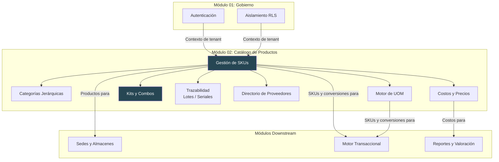
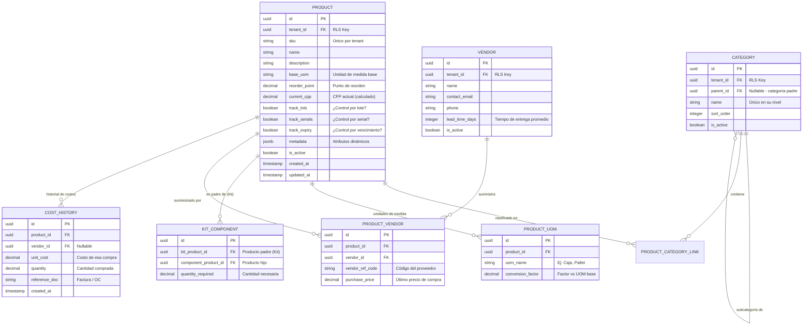

# Módulo 02: Catálogo de Productos (Maestros)

**RF cubiertos:** RF-006 a RF-012  
**Prioridad MVP:** P0 (Bloqueante)  
**Documento padre:** [DEFINICION_SAAS.md](../00_definicion-solucion_saas/DEFINICION_SAAS.md)

---

## Contexto y Alcance

El catálogo de productos es la **base de datos maestra** del sistema de inventarios. Define **qué se almacena**: cada artículo con su identificador único (SKU), sus atributos, su clasificación y sus relaciones con proveedores y unidades de medida.

Sin catálogo no existen productos, y sin productos no hay inventario que gestionar. Este módulo es prerequisito de todos los módulos transaccionales.

Abarca:
- Gestión completa de SKUs con atributos estándar y dinámicos
- Clasificación en categorías jerárquicas (árbol multinivel)
- Motor de conversión de unidades de medida
- Definición de Kits/Combos (productos compuestos)
- Configuración de trazabilidad (lotes, números de serie, vencimientos)
- Vinculación con proveedores
- Gestión de costos de reposición y listas de precios

### Diagrama de Contexto

---

## Requerimientos Funcionales

### RF-006: Gestión Maestra de SKUs (Global Catalog)

- **ID:** RF-006
- **Módulo:** Catálogo de Productos
- **Prioridad:** P0 — Bloqueante
- **Descripción:** El sistema debe permitir crear, consultar, actualizar y desactivar productos (SKUs). Cada producto tiene atributos estándar obligatorios y un campo de metadatos dinámico (JSONB) para atributos específicos de la industria del tenant (ej: talla/color para retail, voltaje para electrónica, concentración para farmacéuticas).
- **Pre-condiciones:**
  1. El solicitante tiene permisos de escritura en el catálogo (`WRITE_CATALOG`).
  2. El tenant está activo.
- **Flujo Principal:**
  1. El solicitante envía los datos del producto: SKU (código), nombre, descripción, categoría, unidad de medida base, punto de reorden y atributos extendidos (opcionales).
  2. El sistema valida que el código SKU no exista previamente dentro del mismo tenant.
  3. El sistema valida que la categoría y la unidad de medida referenciadas existan.
  4. Crea el registro del producto con estado `activo`.
  5. Retorna el producto creado con su ID generado.
- **Post-condiciones:**
  - El producto está disponible para ser asociado a almacenes (STOCK_BALANCE).
  - El audit trail registra la creación.
- **Reglas de Negocio:**
  - RN-006-1: El código SKU es único por tenant. Dos tenants pueden tener el mismo SKU sin conflicto.
  - RN-006-2: Un producto NO se elimina físicamente. Se desactiva (`is_active = false`). Los productos desactivados no aparecen en búsquedas por defecto pero sus movimientos históricos permanecen intactos.
  - RN-006-3: El campo `metadata` (JSONB) no tiene esquema fijo — cada tenant puede almacenar los atributos que necesite.
  - RN-006-4: La unidad de medida base (`uom`) define la unidad en la que se almacena y reporta el stock (ej: "unidades", "kg", "litros").
  - RN-006-5: El punto de reorden (`reorder_point`) define el umbral bajo el cual se generan alertas de stock bajo (RF-031).
- **Manejo de Errores:**
  - SKU duplicado dentro del tenant → `409 Conflict`.
  - Categoría o UOM referenciada no existe → `422 Unprocessable Entity`.
  - Campos obligatorios faltantes → `422 Unprocessable Entity` con detalle de cada campo.

---

### RF-007: Taxonomía Jerárquica de Categorías

- **ID:** RF-007
- **Módulo:** Catálogo de Productos
- **Prioridad:** P0 — Bloqueante
- **Descripción:** El sistema debe permitir organizar los productos en un árbol jerárquico de categorías con profundidad ilimitada. Esto facilita la navegación, filtrado y reportería del catálogo.
- **Pre-condiciones:**
  1. El solicitante tiene permisos de escritura en el catálogo.
- **Flujo Principal:**
  1. El solicitante crea una categoría con nombre y, opcionalmente, una categoría padre.
  2. Si no se indica categoría padre, se crea como categoría raíz.
  3. El sistema permite anidar categorías sin límite de profundidad.
  4. Al consultar productos, se puede filtrar por categoría y el sistema devuelve todos los productos de esa categoría y sus descendientes (búsqueda recursiva).
- **Post-condiciones:**
  - La categoría está disponible para asignar productos.
- **Reglas de Negocio:**
  - RN-007-1: El nombre de la categoría es único dentro del mismo nivel (no pueden existir dos categorías hermanas con el mismo nombre).
  - RN-007-2: Al consultar una categoría, se puede solicitar el árbol completo de descendientes.
  - RN-007-3: No se puede eliminar una categoría que tenga productos o subcategorías asociadas. Primero se deben reasignar o eliminar.
  - RN-007-4: Las categorías están sujetas a RLS — cada tenant tiene su propio árbol.
- **Manejo de Errores:**
  - Nombre duplicado en el mismo nivel → `409 Conflict`.
  - Categoría padre no existe → `422 Unprocessable Entity`.
  - Intento de eliminar categoría con productos → `409 Conflict` con mensaje explicativo.

---

### RF-008: Motor de Conversión de Unidades de Medida (UOM Engine)

- **ID:** RF-008
- **Módulo:** Catálogo de Productos
- **Prioridad:** P0 — Bloqueante
- **Descripción:** El sistema debe soportar múltiples unidades de medida para un mismo producto, con factores de conversión automáticos. Esto permite que un producto se compre en una unidad (ej: pallets), se almacene en otra (ej: cajas) y se venda en otra (ej: unidades individuales).
- **Pre-condiciones:**
  1. Existe una unidad de medida base definida para el producto.
  2. Los factores de conversión están configurados.
- **Flujo Principal:**
  1. El administrador define unidades de medida (ej: "Unidad", "Caja", "Pallet", "Kg", "Litro").
  2. Para un producto, define factores de conversión entre unidades: ej: `1 Caja = 12 Unidades`, `1 Pallet = 48 Cajas`.
  3. Cuando una operación de inventario se registra en una unidad diferente a la base, el sistema convierte automáticamente a la unidad base antes de actualizar saldos.
  4. Los reportes pueden mostrarse en cualquier unidad configurada.
- **Post-condiciones:**
  - Los saldos se almacenan siempre en la unidad base del producto.
  - Las conversiones se aplican transparentemente en operaciones y consultas.
- **Reglas de Negocio:**
  - RN-008-1: La conversión es bidireccional: `Cantidad en UOM destino = Cantidad en UOM origen × (Factor destino / Factor origen)`.
  - RN-008-2: Los factores de conversión deben ser numéricos positivos mayores que cero.
  - RN-008-3: Cada producto tiene una UOM base que no puede cambiarse si ya tiene movimientos registrados.
  - RN-008-4: Las unidades de medida pueden ser globales del sistema (Kg, Litro, Unidad) o específicas del tenant.
- **Manejo de Errores:**
  - Factor de conversión cero o negativo → `422 Unprocessable Entity`.
  - Operación con UOM no definida para el producto → `422 Unprocessable Entity` indicando UOMs válidas.

---

### RF-009: Orquestación de Kits y Combos (Bill of Materials)

- **ID:** RF-009
- **Módulo:** Catálogo de Productos
- **Prioridad:** P2 — Tercer Corte
- **Descripción:** El sistema debe permitir definir productos "Padre" (Kit/Combo) cuya disponibilidad depende de la existencia de productos "Hijo" (componentes). Cuando se vende un Kit, se descuenta automáticamente el stock de cada componente según la receta definida.
- **Pre-condiciones:**
  1. Los productos componentes (Hijos) ya existen en el catálogo.
  2. El producto Kit (Padre) está creado.
- **Flujo Principal:**
  1. El administrador crea la relación Kit → Componentes, indicando para cada componente la cantidad requerida.
  2. Al consultar el stock disponible de un Kit, el sistema calcula: `Stock Kit = MIN(Stock Componente_N / Cantidad Requerida_N)` para todos los componentes.
  3. Al registrar una salida de un Kit, el sistema genera automáticamente una salida por cada componente según las cantidades de la receta.
- **Post-condiciones:**
  - El stock del Kit refleja dinámicamente la disponibilidad de sus componentes.
  - Los movimientos de los componentes se registran individualmente en el Kardex.
- **Reglas de Negocio:**
  - RN-009-1: Un Kit no tiene stock propio — su disponibilidad es derivada de sus componentes.
  - RN-009-2: Un producto puede ser componente de múltiples Kits.
  - RN-009-3: No se permiten referencias circulares (un Kit no puede ser componente de sí mismo ni de sus descendientes).
  - RN-009-4: Al desarmar un Kit (re-empaque, RF-021), se revierte la relación: el stock del Kit se reduce y el de los componentes se incrementa.
- **Manejo de Errores:**
  - Referencia circular detectada → `422 Unprocessable Entity`.
  - Componente no encontrado → `404 Not Found`.

---

### RF-010: Configuración de Atributos de Trazabilidad

- **ID:** RF-010
- **Módulo:** Catálogo de Productos
- **Prioridad:** P2 — Tercer Corte
- **Descripción:** El sistema debe permitir configurar, por cada SKU, si requiere control estricto de trazabilidad: gestión por lote (batch), por número de serie (serial), y/o por fecha de vencimiento. Esto es esencial para industrias reguladas (farmacéutica, alimentos, electrónica).
- **Pre-condiciones:**
  1. El producto existe en el catálogo.
- **Flujo Principal:**
  1. Al crear o editar un producto, el administrador indica qué tipo de trazabilidad requiere:
     - **Por Lote:** Agrupa unidades ingresadas juntas (misma fecha de producción, misma remesa).
     - **Por Serial:** Cada unidad individual tiene un identificador único.
     - **Por Vencimiento:** Cada lote o unidad tiene fecha de expiración.
  2. Si el producto requiere trazabilidad, toda operación de entrada exige proporcionar los datos de trazabilidad (número de lote, serial o fecha de vencimiento).
  3. Las operaciones de salida deben indicar de qué lote/serial se despacha.
- **Post-condiciones:**
  - Cada movimiento queda vinculado a su lote, serial o fecha de vencimiento.
  - El Kardex permite rastrear una unidad individual o un lote completo.
- **Reglas de Negocio:**
  - RN-010-1: Los tipos de trazabilidad son combinables (un producto puede requerir lote + vencimiento).
  - RN-010-2: Si la trazabilidad está activada, las operaciones de entrada SIN datos de trazabilidad son rechazadas.
  - RN-010-3: Un número de serial es único dentro de un tenant: no puede existir dos veces en stock activo (RF-024).
  - RN-010-4: Los productos con vencimiento activan automáticamente alertas cuando se acercan a la fecha de expiración (RF-023).
- **Manejo de Errores:**
  - Entrada sin datos de trazabilidad requeridos → `422 Unprocessable Entity`.
  - Serial duplicado en stock activo → `409 Conflict`.

---

### RF-011: Directorio de Proveedores y Vinculación con SKU

- **ID:** RF-011
- **Módulo:** Catálogo de Productos
- **Prioridad:** P1 — Segundo Corte
- **Descripción:** El sistema debe permitir gestionar un directorio de proveedores y vincular cada proveedor con los productos que suministra, incluyendo su código de referencia y tiempo de entrega estimado. Esto facilita la gestión de compras y la identificación del proveedor óptimo cuando el stock está bajo.
- **Pre-condiciones:**
  1. El tenant está activo.
  2. Los productos ya existen en el catálogo.
- **Flujo Principal:**
  1. El administrador crea un proveedor con: nombre, contacto, datos de facturación y tiempo de entrega promedio.
  2. Vincula proveedores con productos, indicando: código del proveedor para ese producto (referencia cruzada), precio de compra y lead time específico.
  3. Al consultar un producto, se puede ver la lista de proveedores que lo suministran.
  4. Al dispararse una alerta de stock bajo (RF-031), el sistema puede sugerir el proveedor con mejor precio o menor lead time.
- **Post-condiciones:**
  - La vinculación producto-proveedor queda disponible para consulta.
- **Reglas de Negocio:**
  - RN-011-1: Un producto puede tener múltiples proveedores.
  - RN-011-2: Un proveedor puede suministrar múltiples productos.
  - RN-011-3: El código de referencia del proveedor permite buscar un producto por el código que el proveedor usa en sus facturas.
  - RN-011-4: Los proveedores están sujetos a RLS — cada tenant gestiona sus propios proveedores.
- **Manejo de Errores:**
  - Proveedor no encontrado → `404 Not Found`.

---

### RF-012: Gestión de Costos de Reposición y Listas de Precios

- **ID:** RF-012
- **Módulo:** Catálogo de Productos
- **Prioridad:** P1 — Segundo Corte
- **Descripción:** El sistema debe permitir gestionar los costos base de reposición de cada producto, diferenciando entre el costo de compra (reposición) y el costo promedio contable (CPP). Esto es fundamental para análisis de rentabilidad y decisiones de pricing.
- **Pre-condiciones:**
  1. El producto existe en el catálogo.
- **Flujo Principal:**
  1. Al registrar una entrada de mercancía (RF-016), se captura obligatoriamente el costo de compra.
  2. El sistema almacena el historial de costos de compra por proveedor y por fecha.
  3. El costo promedio contable (CPP) se calcula automáticamente (RF-004 del motor transaccional).
  4. El sistema permite consultar: último costo de compra, CPP actual, historial de costos y diferencia entre costo y precio de venta.
- **Post-condiciones:**
  - El historial de costos queda disponible para reportes de valoración (RF-032).
- **Reglas de Negocio:**
  - RN-012-1: El costo de reposición es un dato histórico: cada compra registra su propio costo, sin sobreescribir los anteriores.
  - RN-012-2: El CPP se actualiza automáticamente con cada entrada y no puede ser editado manualmente (integridad contable).
  - RN-012-3: Los precios de venta son informativos en este módulo — el sistema de inventario no gestiona la venta, solo almacena la referencia para análisis.
- **Manejo de Errores:**
  - Costo de compra negativo o cero → `422 Unprocessable Entity`.

---

## Historias de Usuario

### HU-CAT-001: Crear Producto en el Catálogo

- **Narrativa:** Como **administrador del tenant**, quiero registrar un nuevo producto con su código SKU, nombre, categoría y unidad de medida, para que pueda gestionarse su inventario en los almacenes.
- **Criterios de Aceptación:**
  1. **Dado** que ingreso un SKU que no existe en mi tenant, **Cuando** guardo el producto con todos los campos obligatorios, **Entonces** el producto se crea exitosamente y queda disponible en el catálogo.
  2. **Dado** que ingreso un SKU que ya existe en mi tenant, **Cuando** intento guardar, **Entonces** recibo un `409 Conflict` indicando SKU duplicado.
  3. **Dado** que otro tenant ya tiene el mismo código SKU, **Cuando** yo creo un producto con ese SKU, **Entonces** se crea sin conflicto (aislamiento por tenant).
  4. **Dado** que omito un campo obligatorio (nombre, UOM), **Cuando** intento guardar, **Entonces** recibo un `422` con la lista de campos faltantes.

### HU-CAT-002: Organizar Productos en Categorías

- **Narrativa:** Como **administrador del tenant**, quiero organizar mis productos en categorías jerárquicas (ej: Electrónica → Celulares → Smartphones), para facilitar la búsqueda y el filtrado en reportes.
- **Criterios de Aceptación:**
  1. **Dado** que creo la categoría "Electrónica" sin padre, **Cuando** creo "Celulares" como hija de "Electrónica", **Entonces** puedo ver el árbol: Electrónica → Celulares.
  2. **Dado** que busco productos en "Electrónica", **Cuando** hay productos asignados a "Celulares" (subcategoría), **Entonces** los resultados incluyen los productos de "Celulares" y todas las subcategorías descendientes.
  3. **Dado** que intento eliminar "Electrónica" cuando tiene subcategorías, **Cuando** envío el DELETE, **Entonces** recibo un `409 Conflict` indicando que debo eliminar o reasignar las subcategorías primero.

### HU-CAT-003: Configurar Conversión de Unidades

- **Narrativa:** Como **administrador del tenant**, quiero definir que mi producto "Agua Mineral" se compra en pallets, se almacena en cajas y se vende en unidades, para que el sistema convierta automáticamente las cantidades.
- **Criterios de Aceptación:**
  1. **Dado** que defino "Unidad" como UOM base y "1 Caja = 12 Unidades", **Cuando** registro una entrada de 5 Cajas, **Entonces** el saldo se incrementa en 60 Unidades.
  2. **Dado** que consulto el saldo en "Cajas", **Cuando** el saldo base es 60 Unidades, **Entonces** el sistema muestra 5 Cajas.
  3. **Dado** que intento registrar una operación en una UOM no configurada para el producto, **Cuando** envío la petición, **Entonces** recibo un `422` indicando las UOMs válidas.

---

## Modelo de Datos del Módulo

---

## Matriz de Endpoints del Módulo

| Método | Endpoint | Descripción | Scope Requerido |
|--------|----------|-------------|-----------------|
| `GET` | `/v1/products` | Listar productos (paginado, filtrable por categoría, SKU, estado) | `READ_CATALOG` |
| `POST` | `/v1/products` | Crear producto | `WRITE_CATALOG` |
| `GET` | `/v1/products/{id}` | Detalle de un producto | `READ_CATALOG` |
| `PATCH` | `/v1/products/{id}` | Actualizar producto | `WRITE_CATALOG` |
| `DELETE` | `/v1/products/{id}` | Desactivar producto (soft delete) | `WRITE_CATALOG` |
| `GET` | `/v1/categories` | Listar categorías (árbol) | `READ_CATALOG` |
| `POST` | `/v1/categories` | Crear categoría | `WRITE_CATALOG` |
| `PATCH` | `/v1/categories/{id}` | Actualizar categoría | `WRITE_CATALOG` |
| `DELETE` | `/v1/categories/{id}` | Eliminar categoría | `WRITE_CATALOG` |
| `GET` | `/v1/products/{id}/uom` | Listar UOMs del producto | `READ_CATALOG` |
| `POST` | `/v1/products/{id}/uom` | Agregar conversión UOM | `WRITE_CATALOG` |
| `POST` | `/v1/products/{id}/kit` | Definir componentes del Kit | `WRITE_CATALOG` |
| `GET` | `/v1/products/{id}/kit` | Consultar componentes del Kit | `READ_CATALOG` |
| `GET` | `/v1/vendors` | Listar proveedores | `READ_CATALOG` |
| `POST` | `/v1/vendors` | Crear proveedor | `WRITE_CATALOG` |
| `POST` | `/v1/products/{id}/vendors` | Vincular proveedor a producto | `WRITE_CATALOG` |
