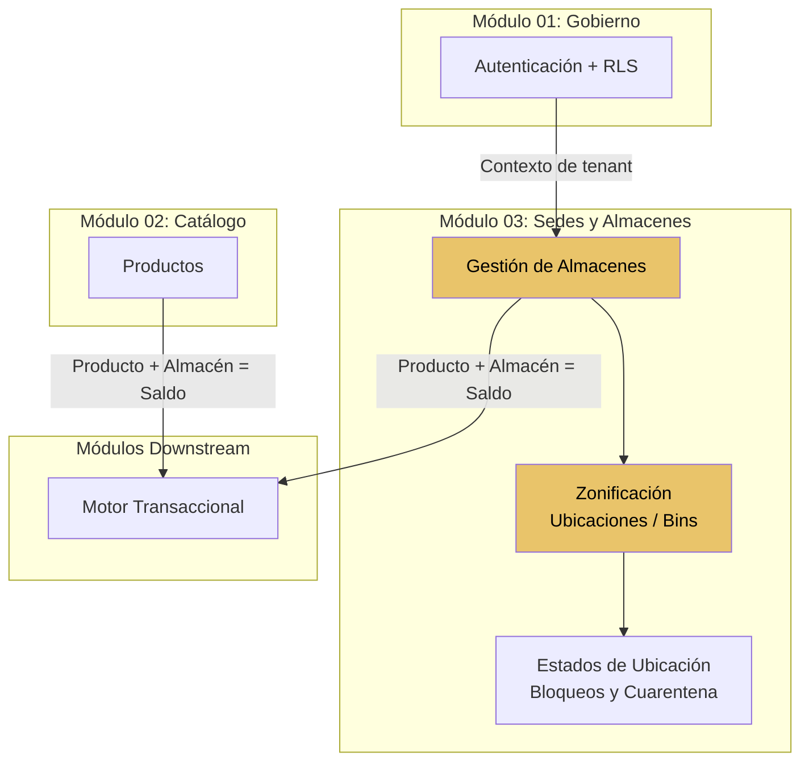
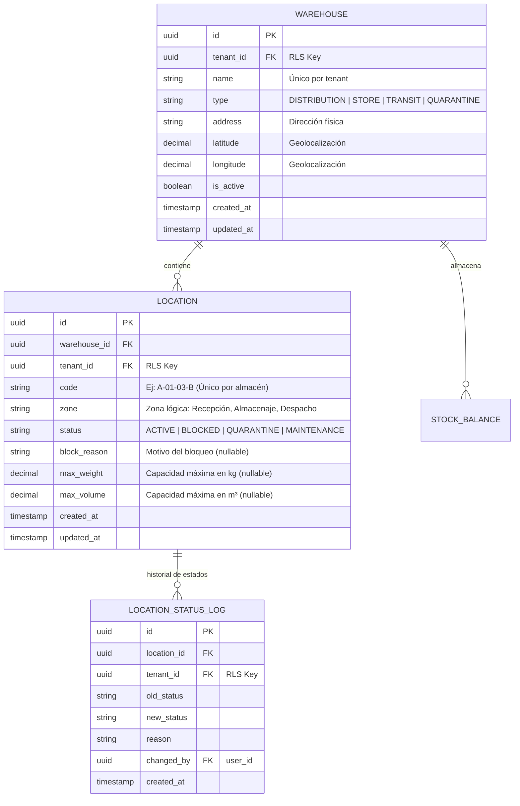

# Módulo 03: Sedes y Almacenes (Infraestructura Logística)

**RF cubiertos:** RF-013 a RF-015  
**Prioridad MVP:** P0 (Bloqueante)  
**Documento padre:** [DEFINICION_SAAS.md](../00_definicion-solucion_saas/DEFINICION_SAAS.md)

---

## Contexto y Alcance

Este módulo define **dónde se almacena el inventario**. Permite a cada tenant crear una red de ubicaciones físicas y virtuales organizadas jerárquicamente: desde centros de distribución hasta posiciones específicas de estantería.

Sin almacenes, no hay dónde registrar stock. Los saldos de inventario siempre están asociados a un almacén + producto, por lo tanto este módulo es prerequisito del Motor Transaccional.

Abarca:
- Gestión de almacenes multi-sede con tipificación (distribución, tienda, tránsito)
- Zonificación interna: pasillo, estante, nivel, posición (bins/slots)
- Gestión de estados de ubicación (activa, en cuarentena, bloqueada)

### Diagrama de Contexto

---

## Requerimientos Funcionales

### RF-013: Gestión de Almacenes Multi-Sede

- **ID:** RF-013
- **Módulo:** Sedes y Almacenes
- **Prioridad:** P0 — Bloqueante
- **Descripción:** El sistema debe permitir a cada tenant definir múltiples nodos logísticos donde se almacena inventario. Cada almacén tiene su propio saldo independiente por producto. Los almacenes se clasifican por tipo funcional para diferenciar su propósito operativo.
- **Pre-condiciones:**
  1. El solicitante tiene permisos de gestión de almacenes (`MANAGE_WAREHOUSES`).
  2. El tenant está activo.
- **Flujo Principal:**
  1. El administrador crea un almacén indicando: nombre, tipo, dirección o geolocalización (opcional) y estado.
  2. El sistema valida que no exista otro almacén con el mismo nombre en el tenant.
  3. Crea el registro del almacén con estado `activo`.
  4. El almacén queda disponible para recibir productos y registrar movimientos.
- **Post-condiciones:**
  - El almacén está listo para asociarse con productos (STOCK_BALANCE).
  - Se registra en el audit trail.
- **Reglas de Negocio:**
  - RN-013-1: Los tipos de almacén son:

    | Tipo | Descripción | Uso |
    |------|-------------|-----|
    | `DISTRIBUTION` | Centro de distribución | Grandes volúmenes, despacho a tiendas |
    | `STORE` | Tienda o punto de venta | Stock de proximidad al cliente |
    | `TRANSIT` | Almacén virtual de tránsito | Productos en movimiento entre almacenes (RF-018) |
    | `QUARANTINE` | Almacén de cuarentena | Productos en inspección o devueltos |

  - RN-013-2: Cada tenant debe tener al menos un almacén activo para operar.
  - RN-013-3: Un almacén de tipo `TRANSIT` se crea automáticamente por el sistema para gestionar transferencias entre almacenes. No requiere creación manual.
  - RN-013-4: Un almacén NO se elimina físicamente si tiene saldos o movimientos históricos. Se desactiva. Un almacén desactivado no acepta nuevos movimientos.
  - RN-013-5: Los almacenes están sujetos a RLS — cada tenant gestiona sus propias sedes.
- **Manejo de Errores:**
  - Nombre de almacén duplicado en el tenant → `409 Conflict`.
  - Intento de desactivar el único almacén activo → `409 Conflict` con mensaje explicativo.
  - Intento de desactivar almacén con saldo físico > 0 → `409 Conflict` indicando que debe transferirse el stock primero.

---

### RF-014: Zonificación y Ubicaciones (Bins/Slots)

- **ID:** RF-014
- **Módulo:** Sedes y Almacenes
- **Prioridad:** P2 — Tercer Corte
- **Descripción:** El sistema debe permitir mapear la distribución interna de cada almacén mediante una jerarquía de ubicaciones: Pasillo → Estante → Nivel → Posición (Bin). Esto permite saber exactamente dónde se encuentra cada producto dentro del almacén, optimizando las rutas de recolección (picking).
- **Pre-condiciones:**
  1. El almacén existe y está activo.
  2. El solicitante tiene permisos de gestión de almacenes.
- **Flujo Principal:**
  1. El administrador define ubicaciones dentro de un almacén, con una convención de nomenclatura: ej: `A-01-03-B` (Pasillo A, Estante 01, Nivel 03, Posición B).
  2. El sistema permite asignar productos a ubicaciones específicas.
  3. Al consultar el stock de un producto en un almacén, se puede ver el desglose por ubicación.
  4. Las operaciones de entrada pueden indicar la ubicación de destino; las de salida, la ubicación de origen.
- **Post-condiciones:**
  - El inventario tiene granularidad a nivel de posición dentro del almacén.
- **Reglas de Negocio:**
  - RN-014-1: La nomenclatura de ubicación es libre (cada tenant define su convención).
  - RN-014-2: El código de ubicación es único dentro de un almacén.
  - RN-014-3: Las ubicaciones son opcionales — un tenant puede operar solo a nivel de almacén sin granularidad de bins.
  - RN-014-4: No se puede eliminar una ubicación que tenga stock asignado.
  - RN-014-5: Cada ubicación puede tener una capacidad máxima opcional (peso o volumen).
- **Manejo de Errores:**
  - Código de ubicación duplicado en el almacén → `409 Conflict`.
  - Intento de asignar producto a ubicación con capacidad excedida → `409 Conflict`.

---

### RF-015: Gestión de Estados de Ubicación y Bloqueos

- **ID:** RF-015
- **Módulo:** Sedes y Almacenes
- **Prioridad:** P2 — Tercer Corte
- **Descripción:** El sistema debe permitir cambiar el estado de una ubicación o almacén completo para reflejar situaciones operativas: mantenimiento, inspección de calidad, sospecha de contaminación o daño. Las ubicaciones bloqueadas no aceptan ni despachan mercancía.
- **Pre-condiciones:**
  1. La ubicación o almacén existe.
  2. El solicitante tiene permisos de gestión de almacenes.
- **Flujo Principal:**
  1. El administrador cambia el estado de una ubicación a `BLOCKED` o `QUARANTINE`, indicando un motivo.
  2. El sistema marca el stock en esa ubicación como no disponible: se resta del `available_qty` pero permanece en el `physical_qty`.
  3. Mientras está bloqueada, las operaciones de entrada y salida sobre esa ubicación son rechazadas.
  4. Al desbloquear, el stock vuelve a estar disponible.
- **Post-condiciones:**
  - El stock en ubicaciones bloqueadas no cuenta como disponible.
  - El cambio de estado queda registrado en auditoría.
- **Reglas de Negocio:**
  - RN-015-1: Los estados posibles de una ubicación son:

    | Estado | Acepta Entradas | Acepta Salidas | Stock Cuenta como Disponible |
    |--------|:-:|:-:|:-:|
    | `ACTIVE` | ✅ | ✅ | ✅ |
    | `BLOCKED` | ❌ | ❌ | ❌ |
    | `QUARANTINE` | ✅ (solo recepciones de RMA) | ❌ | ❌ |
    | `MAINTENANCE` | ❌ | ❌ | ❌ |

  - RN-015-2: Bloquear una ubicación no elimina el stock — solo lo excluye del cálculo de disponibilidad.
  - RN-015-3: El motivo del bloqueo es obligatorio y queda en el audit trail.
  - RN-015-4: Las transferencias desde ubicaciones bloqueadas requieren una autorización explícita (rol `tenant_admin`).
- **Manejo de Errores:**
  - Intento de despachar desde ubicación bloqueada → `409 Conflict` indicando el estado actual y motivo.
  - Intento de recibir mercancía en ubicación en mantenimiento → `409 Conflict`.

---

## Historias de Usuario

### HU-SED-001: Crear Almacén para una Sede

- **Narrativa:** Como **administrador del tenant**, quiero crear un almacén para mi nueva sucursal, para poder registrar el inventario que se recibe en esa sede.
- **Criterios de Aceptación:**
  1. **Dado** que creo un almacén "Bodega Central" de tipo `DISTRIBUTION`, **Cuando** guardo los datos, **Entonces** el almacén queda activo y listo para recibir productos.
  2. **Dado** que ya existe un almacén "Bodega Central" en mi tenant, **Cuando** intento crear otro con el mismo nombre, **Entonces** recibo un `409 Conflict`.
  3. **Dado** que mi almacén tiene stock físico > 0, **Cuando** intento desactivarlo, **Entonces** recibo un `409 Conflict` indicando que debo transferir el stock primero.
  4. **Dado** que creo un segundo almacén, **Cuando** listo los almacenes de mi tenant, **Entonces** veo ambos almacenes pero no los de otros tenants.

### HU-SED-002: Consultar Red de Almacenes

- **Narrativa:** Como **sistema integrado (ERP)**, quiero obtener la lista de almacenes del tenant con sus tipos y estados, para saber dónde puedo registrar entradas y salidas de mercancía.
- **Criterios de Aceptación:**
  1. **Dado** que consulto `/v1/warehouses`, **Cuando** el tenant tiene 3 almacenes, **Entonces** recibo la lista completa con nombre, tipo y estado de cada uno.
  2. **Dado** que filtro por tipo `STORE`, **Cuando** hay 1 almacén tipo tienda, **Entonces** solo recibo ese almacén.
  3. **Dado** que un almacén está desactivado, **Cuando** listo almacenes sin filtro de estado, **Entonces** por defecto solo veo los activos.

### HU-SED-003: Bloquear Ubicación por Inspección

- **Narrativa:** Como **administrador del tenant**, quiero bloquear una ubicación de mi almacén cuando detecto un problema (ej: plagas, humedad), para que no se despache mercancía potencialmente dañada.
- **Criterios de Aceptación:**
  1. **Dado** que cambio el estado de la ubicación "A-02-01" a `QUARANTINE` con motivo "Sospecha de humedad", **Cuando** un sistema intenta registrar una salida desde esa ubicación, **Entonces** recibe un `409 Conflict`.
  2. **Dado** que la ubicación está en cuarentena, **Cuando** consulto el saldo disponible del almacén, **Entonces** el stock de esa ubicación NO se suma al disponible.
  3. **Dado** que resuelvo el problema y desbloqueo la ubicación, **Cuando** consulto el saldo disponible, **Entonces** el stock vuelve a contabilizarse como disponible.

---

## Modelo de Datos del Módulo

---

## Matriz de Endpoints del Módulo

| Método | Endpoint | Descripción | Scope Requerido |
|--------|----------|-------------|-----------------|
| `GET` | `/v1/warehouses` | Listar almacenes (filtrable por tipo, estado) | `READ_INVENTORY` |
| `POST` | `/v1/warehouses` | Crear almacén | `MANAGE_WAREHOUSES` |
| `GET` | `/v1/warehouses/{id}` | Detalle de un almacén | `READ_INVENTORY` |
| `PATCH` | `/v1/warehouses/{id}` | Actualizar almacén | `MANAGE_WAREHOUSES` |
| `DELETE` | `/v1/warehouses/{id}` | Desactivar almacén (soft delete) | `MANAGE_WAREHOUSES` |
| `GET` | `/v1/warehouses/{id}/locations` | Listar ubicaciones del almacén | `READ_INVENTORY` |
| `POST` | `/v1/warehouses/{id}/locations` | Crear ubicación (bin) | `MANAGE_WAREHOUSES` |
| `PATCH` | `/v1/locations/{id}` | Actualizar ubicación | `MANAGE_WAREHOUSES` |
| `POST` | `/v1/locations/{id}/status` | Cambiar estado de ubicación (bloquear/desbloquear) | `MANAGE_WAREHOUSES` |
| `DELETE` | `/v1/locations/{id}` | Eliminar ubicación (si no tiene stock) | `MANAGE_WAREHOUSES` |
