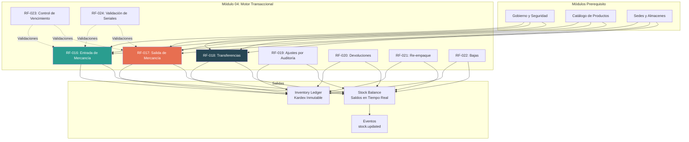
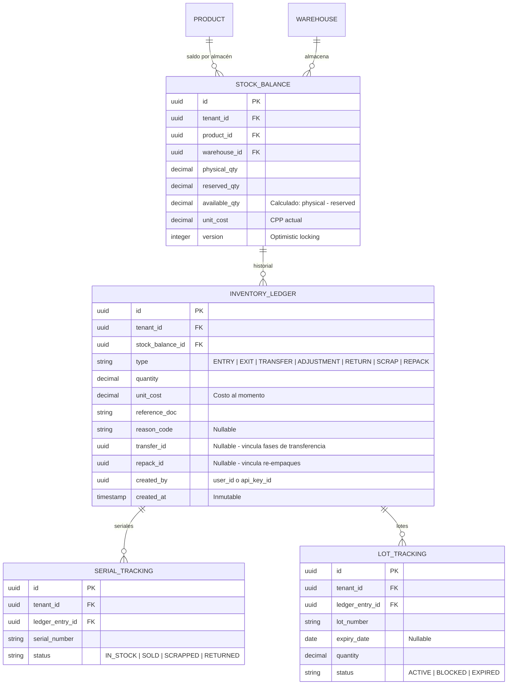

# Módulo 04: Motor Transaccional (Operaciones de Inventario)

**RF cubiertos:** RF-016 a RF-024  
**Prioridad MVP:** P0 (Bloqueante)  
**Documento padre:** [DEFINICION_SAAS.md](../00_definicion-solucion_saas/DEFINICION_SAAS.md)

---

## Contexto y Alcance

Este es el **corazón del sistema**. Gestiona toda operación que modifique stock: entradas, salidas, transferencias, ajustes, devoluciones, bajas y re-empaques. Cada operación es **atómica** (ACID): si cualquier paso falla, todo se revierte. No existen estados intermedios.

El motor también es responsable del recálculo automático del **Costo Promedio Ponderado (CPP)** ante cada entrada de mercancía y del registro inmutable en el **Inventory Ledger** (Kardex).

---

## Requerimientos Funcionales

### RF-016: Registro de Entrada de Mercancía (Purchase Receipt)

- **ID:** RF-016 | **Prioridad:** P0
- **Descripción:** Procesar ingresos de stock incrementando el saldo físico y disponible del almacén de destino. Cada entrada recalcula el CPP del producto.
- **Pre-condiciones:** Producto y almacén existen y están activos. El solicitante tiene scope `WRITE_INVENTORY`.
- **Flujo Principal:**
  1. El sistema recibe: `product_id`, `warehouse_id`, `quantity`, `unit_cost`, `reference_doc` (factura/OC), y opcionalmente `lot_number`, `serial_numbers`, `expiry_date`.
  2. Valida que la cantidad y el costo sean positivos.
  3. Si el producto requiere trazabilidad (RF-010), valida los datos correspondientes.
  4. Inicia transacción atómica: registra en INVENTORY_LEDGER, actualiza STOCK_BALANCE (`physical_qty += quantity`, `available_qty += quantity`), recalcula CPP.
  5. Emite evento `stock.updated`.
- **Reglas de Negocio:**
  - RN-016-1: **Fórmula CPP:** `Nuevo CPP = (Stock Actual × CPP Actual + Cantidad × Costo Compra) / (Stock Actual + Cantidad)`
  - RN-016-2: El costo de compra es obligatorio en toda entrada. No se permiten entradas sin costo.
  - RN-016-3: Si el STOCK_BALANCE no existe para esa combinación producto+almacén, se crea automáticamente.
- **Manejo de Errores:** Costo ≤ 0 → `422`. Producto/almacén inactivo → `409`. Datos de trazabilidad faltantes → `422`.

---

### RF-017: Registro de Salida de Mercancía (Sales/Consumption)

- **ID:** RF-017 | **Prioridad:** P0
- **Descripción:** Disminuir existencias por venta o consumo interno, con validación de disponibilidad según la política del tenant.
- **Pre-condiciones:** El producto tiene STOCK_BALANCE en el almacén indicado.
- **Flujo Principal:**
  1. El sistema recibe: `product_id`, `warehouse_id`, `quantity`, `reference_doc`, y opcionalmente `lot_number` o `serial_numbers`.
  2. Consulta la política `allow_negative_stock` del tenant.
  3. Si `allow_negative_stock = false`: valida que `available_qty >= quantity`. Si no → rechaza.
  4. Inicia transacción atómica: registra en LEDGER, decrementa STOCK_BALANCE (`physical_qty -= quantity`, `available_qty -= quantity`).
  5. El costo unitario registrado en el LEDGER es el CPP vigente al momento de la salida.
  6. Emite evento `stock.updated`.
- **Reglas de Negocio:**
  - RN-017-1: El stock reservado NO se descuenta con salidas estándar — las reservas se confirman con RF-026.
  - RN-017-2: Si hay trazabilidad por serial, se debe indicar exactamente qué seriales salen.
  - RN-017-3: Si hay trazabilidad por lote, se prioriza FEFO (First Expired, First Out) cuando el tenant tiene vencimiento activo.
- **Manejo de Errores:** Stock insuficiente (si política no permite negativo) → `409 Conflict`. Seriales no encontrados → `404`.

---

### RF-018: Transferencias entre Almacenes (Inter-Warehouse)

- **ID:** RF-018 | **Prioridad:** P0
- **Descripción:** Mover stock de un almacén a otro mediante un proceso de dos fases para garantizar que el inventario no "desaparezca" durante el tránsito.
- **Pre-condiciones:** Almacén origen y destino existen y están activos. Stock disponible en origen.
- **Flujo Principal:**
  1. **Fase 1 — Despacho:** Salida del almacén origen. El stock pasa a estado `IN_TRANSIT` (almacén virtual de tránsito).
  2. El sistema genera un `transfer_id` que vincula las dos fases.
  3. **Fase 2 — Recepción:** Entrada en el almacén destino. El stock sale de tránsito y entra al destino.
  4. Ambas fases generan registros en el LEDGER con el `transfer_id` como referencia cruzada.
- **Reglas de Negocio:**
  - RN-018-1: Un almacén de tipo `TRANSIT` se crea automáticamente por tenant para gestionar el stock en movimiento.
  - RN-018-2: El stock en tránsito cuenta como `physical` del almacén de tránsito pero NO como `available` de ningún almacén operativo.
  - RN-018-3: La Fase 2 puede registrar una cantidad diferente a la Fase 1 (ej: merma en tránsito). La diferencia se registra como ajuste automático.
  - RN-018-4: El CPP NO se recalcula en transferencias — el costo unitario se mantiene.
- **Manejo de Errores:** Almacén origen = destino → `422`. Stock insuficiente en origen → `409`. Transfer_id no encontrado para Fase 2 → `404`.

---

### RF-019: Ajustes de Inventario por Auditoría

- **ID:** RF-019 | **Prioridad:** P1
- **Descripción:** Incrementos o decrementos manuales para alinear el sistema con la realidad física (conteos, sobrantes, faltantes).
- **Pre-condiciones:** El solicitante tiene permisos de ajuste. Si la política `require_reason_code = true`, se requiere motivo.
- **Flujo Principal:**
  1. El sistema recibe: `product_id`, `warehouse_id`, `quantity` (positiva = sobrante, negativa = faltante), `reason_code`.
  2. Valida que el `reason_code` esté en la lista permitida: `SURPLUS`, `SHORTAGE`, `TYPING_ERROR`, `PHYSICAL_COUNT`, `OTHER`.
  3. Registra en LEDGER con tipo `ADJUSTMENT` y actualiza STOCK_BALANCE.
- **Reglas de Negocio:**
  - RN-019-1: Los ajustes quedan marcados en el Kardex con tipo `ADJUSTMENT` y el `reason_code` visible.
  - RN-019-2: No afectan el CPP — el costo unitario del ajuste es el CPP vigente.
- **Manejo de Errores:** `reason_code` requerido pero no proporcionado → `422`.

---

### RF-020: Gestión de Devoluciones (RMA)

- **ID:** RF-020 | **Prioridad:** P1
- **Descripción:** Reingreso de stock por devoluciones de clientes. El sistema debe clasificar el estado del producto devuelto para determinar su destino.
- **Flujo Principal:**
  1. El sistema recibe: `product_id`, `warehouse_id`, `quantity`, `condition` (`NEW`, `REFURBISHED`, `DAMAGED`), `reference_doc`.
  2. Según la condición: `NEW` → ingresa a stock disponible. `REFURBISHED` → ingresa a stock disponible con marca. `DAMAGED` → ingresa a almacén de cuarentena o se registra como baja directa.
  3. Registra en LEDGER con tipo `RETURN`.
- **Reglas de Negocio:**
  - RN-020-1: El costo unitario de la devolución es el CPP vigente (no recalcula CPP al ingresar).
  - RN-020-2: Las devoluciones `DAMAGED` pueden ir directamente a baja (RF-022) si el tenant lo configura.
- **Manejo de Errores:** Condición no válida → `422`.

---

### RF-021: Re-empaque y Transformación de Inventario

- **ID:** RF-021 | **Prioridad:** P2
- **Descripción:** "Destruir" unidades de un SKU para "Crear" unidades de otro. Ej: abrir una caja de 12 para vender 12 unidades individuales, o desarmar un Kit.
- **Flujo Principal:**
  1. El sistema recibe: SKU origen, cantidad a destruir, SKU destino, cantidad a crear.
  2. Valida stock disponible del SKU origen.
  3. Transacción atómica: salida del SKU origen + entrada del SKU destino.
  4. Ambos movimientos comparten un `reference_id` de re-empaque.
- **Reglas de Negocio:**
  - RN-021-1: El costo unitario del SKU destino se calcula: `(Cantidad origen × CPP origen) / Cantidad destino`.

---

### RF-022: Gestión de Bajas (Scrap & Loss)

- **ID:** RF-022 | **Prioridad:** P1
- **Descripción:** Salida definitiva de inventario por daño, obsolescencia, robo o vencimiento, sin vínculo con una venta.
- **Flujo Principal:**
  1. El sistema recibe: `product_id`, `warehouse_id`, `quantity`, `reason_code` (`DAMAGE`, `OBSOLESCENCE`, `THEFT`, `EXPIRY`).
  2. Registra en LEDGER con tipo `SCRAP` y decrementa STOCK_BALANCE.
- **Reglas de Negocio:**
  - RN-022-1: Las bajas siempre requieren `reason_code`. No se permite baja sin justificación.
  - RN-022-2: El valor de la baja (cantidad × CPP) queda registrado para reportes de pérdidas.

---

### RF-023: Control de Lotes y Alertas de Vencimiento

- **ID:** RF-023 | **Prioridad:** P2
- **Descripción:** El sistema debe impedir la venta de lotes vencidos y generar alertas tempranas cuando un lote está próximo a vencer.
- **Flujo Principal:**
  1. Al registrar una salida de un producto con trazabilidad de vencimiento, el sistema verifica que el lote seleccionado no esté vencido.
  2. Un proceso periódico evalúa los lotes con vencimiento próximo (ej: 30 días) y genera alertas.
  3. Los lotes vencidos se mueven automáticamente a estado `BLOCKED`.
- **Reglas de Negocio:**
  - RN-023-1: Un lote vencido NO puede despacharse. El sistema lo bloquea automáticamente.
  - RN-023-2: La anticipación de la alerta es configurable por tenant.

---

### RF-024: Validación de Unicidad de Números de Serie

- **ID:** RF-024 | **Prioridad:** P2
- **Descripción:** Garantizar que un número de serie solo exista en un lugar a la vez dentro del tenant. Impedir duplicados en stock activo.
- **Reglas de Negocio:**
  - RN-024-1: Al registrar una entrada con serial, el sistema verifica que ese serial no exista ya en stock activo del tenant.
  - RN-024-2: Un serial que salió del inventario (venta, baja) puede reingresar (ej: devolución).
- **Manejo de Errores:** Serial duplicado en stock activo → `409 Conflict`.

---

## Historias de Usuario

### HU-MOT-001: Registrar Entrada de Mercancía

- **Narrativa:** Como **sistema integrado (ERP)**, quiero registrar la recepción de 100 unidades de un producto a un costo de $50 cada una, para que el saldo del almacén se actualice y el CPP se recalcule.
- **Criterios de Aceptación:**
  1. **Dado** que el almacén tiene 200 unidades a CPP $40, **Cuando** registro una entrada de 100 unidades a $50, **Entonces** el saldo es 300 unidades con CPP = ($40×200 + $50×100) / 300 = $43.33.
  2. **Dado** que el producto no tiene STOCK_BALANCE en ese almacén, **Cuando** registro la primera entrada, **Entonces** se crea automáticamente el STOCK_BALANCE.
  3. **Dado** que el producto requiere trazabilidad por lote, **Cuando** intento registrar una entrada sin número de lote, **Entonces** recibo un `422`.

### HU-MOT-002: Registrar Salida por Venta

- **Narrativa:** Como **sistema POS**, quiero registrar la venta de 5 unidades de un producto, para que el stock disponible se reduzca inmediatamente.
- **Criterios de Aceptación:**
  1. **Dado** que hay 20 unidades disponibles, **Cuando** registro una salida de 5, **Entonces** el saldo disponible queda en 15.
  2. **Dado** que hay 3 unidades disponibles y `allow_negative_stock = false`, **Cuando** intento registrar una salida de 5, **Entonces** recibo `409 Conflict`.
  3. **Dado** que hay 3 unidades disponibles y `allow_negative_stock = true`, **Cuando** registro una salida de 5, **Entonces** el saldo queda en -2.

### HU-MOT-003: Transferir Stock entre Almacenes

- **Narrativa:** Como **administrador del tenant**, quiero transferir 50 unidades de "Bodega Central" a "Tienda Norte", para abastecer el punto de venta.
- **Criterios de Aceptación:**
  1. **Dado** que Bodega Central tiene 200 unidades, **Cuando** despacho 50 (Fase 1), **Entonces** Bodega Central queda con 150 y aparecen 50 en Tránsito.
  2. **Dado** que hay 50 unidades en tránsito, **Cuando** confirmo recepción en Tienda Norte (Fase 2), **Entonces** Tienda Norte se incrementa en 50 y Tránsito queda en 0.
  3. **Dado** que en tránsito se detectó merma de 2 unidades, **Cuando** confirmo recepción de 48, **Entonces** las 2 unidades faltantes se registran como ajuste automático.

---

## Modelo de Datos del Módulo

---

## Matriz de Endpoints del Módulo

| Método | Endpoint | Descripción | Scope |
|--------|----------|-------------|-------|
| `POST` | `/v1/inventory/entry` | Registrar entrada de mercancía | `WRITE_INVENTORY` |
| `POST` | `/v1/inventory/exit` | Registrar salida | `WRITE_INVENTORY` |
| `POST` | `/v1/inventory/transfer` | Iniciar transferencia (Fase 1) | `WRITE_INVENTORY` |
| `POST` | `/v1/inventory/transfer/{id}/receive` | Confirmar recepción (Fase 2) | `WRITE_INVENTORY` |
| `POST` | `/v1/inventory/adjustment` | Registrar ajuste manual | `WRITE_INVENTORY` |
| `POST` | `/v1/inventory/return` | Registrar devolución (RMA) | `WRITE_INVENTORY` |
| `POST` | `/v1/inventory/scrap` | Registrar baja | `WRITE_INVENTORY` |
| `POST` | `/v1/inventory/repack` | Registrar re-empaque | `WRITE_INVENTORY` |
| `GET` | `/v1/inventory/balances` | Consultar saldos (filtrable por producto, almacén) | `READ_INVENTORY` |
| `GET` | `/v1/inventory/balances/{product_id}` | Saldos de un producto en todos los almacenes | `READ_INVENTORY` |
