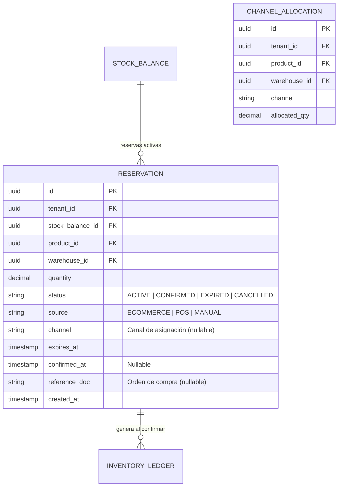

# Módulo 05: Reservas y Gestión de la Demanda

**RF cubiertos:** RF-025 a RF-028  
**Prioridad MVP:** P1 (Segundo Corte)  
**Documento padre:** [DEFINICION_SAAS.md](../00_definicion-solucion_saas/DEFINICION_SAAS.md)

---

## Contexto y Alcance

Este módulo gestiona el **bloqueo temporal y definitivo de stock** para pedidos en proceso. Es el habilitador clave para integraciones con plataformas de e-commerce, evitando el problema de sobreventas (overselling). El stock reservado se descuenta del disponible pero permanece en el físico hasta que se confirma o expira.

---

## Requerimientos Funcionales

### RF-025: Reservas Temporales (Soft Reservations)

- **ID:** RF-025 | **Prioridad:** P1
- **Descripción:** Bloquear stock temporalmente desde un carrito de compras o pedido pendiente. El stock se resta del `available_qty` pero se mantiene en `physical_qty`. Si no se confirma en el tiempo configurado (TTL), se libera automáticamente.
- **Flujo Principal:**
  1. El sistema recibe: `product_id`, `warehouse_id`, `quantity`, `source` (ECOMMERCE, POS, MANUAL), `ttl_minutes` (opcional, usa default del tenant).
  2. Valida que `available_qty >= quantity`.
  3. Crea registro de RESERVATION con estado `ACTIVE` y `expires_at = now + ttl_minutes`.
  4. Actualiza STOCK_BALANCE: `reserved_qty += quantity`, `available_qty -= quantity`.
  5. Retorna `reservation_id` y `expires_at`.
- **Reglas de Negocio:**
  - RN-025-1: Una reserva NO genera registro en el INVENTORY_LEDGER (no es un movimiento real).
  - RN-025-2: El TTL por defecto se toma de la política `reservation_ttl_minutes` del tenant (RF-005).
  - RN-025-3: Múltiples reservas pueden coexistir para el mismo producto/almacén siempre que haya stock disponible.
- **Manejo de Errores:** Stock disponible insuficiente → `409 Conflict`.

### RF-026: Confirmación de Reservas (Hard Commitment)

- **ID:** RF-026 | **Prioridad:** P1
- **Descripción:** Convertir una reserva temporal en una salida real de inventario tras la confirmación de pago. La reserva pasa a estado `CONFIRMED` y se genera la salida en el Motor Transaccional (RF-017).
- **Flujo Principal:**
  1. El sistema recibe: `reservation_id`, `reference_doc` (número de orden/pago).
  2. Valida que la reserva esté en estado `ACTIVE` y no haya expirado.
  3. Cambia estado de la reserva a `CONFIRMED`.
  4. Ejecuta salida de inventario (RF-017): `physical_qty -= quantity`, `reserved_qty -= quantity`. El `available_qty` no cambia (ya estaba descontado).
  5. Registra en INVENTORY_LEDGER con referencia a la reserva.
- **Reglas de Negocio:**
  - RN-026-1: Una reserva expirada NO puede confirmarse. Debe crearse una nueva.
  - RN-026-2: La confirmación es idempotente — confirmar dos veces la misma reserva no duplica la salida.
- **Manejo de Errores:** Reserva expirada → `409 Conflict`. Reserva ya confirmada → `409`. Reserva no encontrada → `404`.

### RF-027: Liberación Automática de Reservas (Auto-Expiration)

- **ID:** RF-027 | **Prioridad:** P1
- **Descripción:** Un servicio en segundo plano debe liberar las reservas que superen su TTL, devolviendo el stock al pool disponible.
- **Flujo Principal:**
  1. Un proceso periódico (cada minuto) consulta reservas con `status = ACTIVE` y `expires_at < now()`.
  2. Para cada reserva expirada: cambia estado a `EXPIRED`, actualiza STOCK_BALANCE: `reserved_qty -= quantity`, `available_qty += quantity`.
  3. Emite evento `reservation.expired`.
- **Reglas de Negocio:**
  - RN-027-1: La liberación es automática — no requiere intervención humana.
  - RN-027-2: Un tenant puede cancelar manualmente una reserva antes de que expire (estado `CANCELLED`).

### RF-028: Reservas por Prioridad de Canal (Inventory Allocation)

- **ID:** RF-028 | **Prioridad:** P2
- **Descripción:** Permitir "apartar" una cantidad de stock para un canal específico (ej: 100 unidades exclusivas para e-commerce), impidiendo que otros canales las consuman.
- **Flujo Principal:**
  1. El administrador define una regla de asignación: `product_id`, `warehouse_id`, `channel` (ECOMMERCE, POS, WHOLESALE), `allocated_qty`.
  2. Al recibir una petición de reserva, el sistema verifica primero la disponibilidad del canal solicitado antes de recurrir al pool general.
- **Reglas de Negocio:**
  - RN-028-1: La suma de asignaciones por canal no puede superar el stock disponible total.
  - RN-028-2: El stock no asignado a ningún canal queda como "pool general" disponible para todos.

---

## Historias de Usuario

### HU-RES-001: Reservar Stock desde E-commerce

- **Narrativa:** Como **plataforma de e-commerce**, quiero reservar 2 unidades de un producto cuando el cliente las agrega al carrito, para evitar que otro comprador las adquiera simultáneamente.
- **Criterios de Aceptación:**
  1. **Dado** que hay 10 unidades disponibles, **Cuando** reservo 2, **Entonces** el disponible baja a 8, el reservado sube a 2, y el físico permanece en 10.
  2. **Dado** que la reserva tiene TTL de 30 minutos, **Cuando** pasan 31 minutos sin confirmar, **Entonces** la reserva se libera y el disponible vuelve a 10.
  3. **Dado** que el cliente paga, **Cuando** confirmo la reserva, **Entonces** el físico baja a 8, el reservado baja a 0 y se genera un registro en el Kardex.

---

## Modelo de Datos del Módulo

## Matriz de Endpoints

| Método | Endpoint | Descripción | Scope |
|--------|----------|-------------|-------|
| `POST` | `/v1/reservations` | Crear reserva temporal | `MANAGE_RESERVATIONS` |
| `POST` | `/v1/reservations/{id}/confirm` | Confirmar reserva (hard commitment) | `MANAGE_RESERVATIONS` |
| `POST` | `/v1/reservations/{id}/cancel` | Cancelar reserva manualmente | `MANAGE_RESERVATIONS` |
| `GET` | `/v1/reservations` | Listar reservas (filtrable por estado, producto) | `READ_INVENTORY` |
| `GET` | `/v1/reservations/{id}` | Detalle de una reserva | `READ_INVENTORY` |
| `POST` | `/v1/allocations` | Definir asignación por canal | `ADMIN` |
| `GET` | `/v1/allocations` | Consultar asignaciones | `READ_INVENTORY` |
