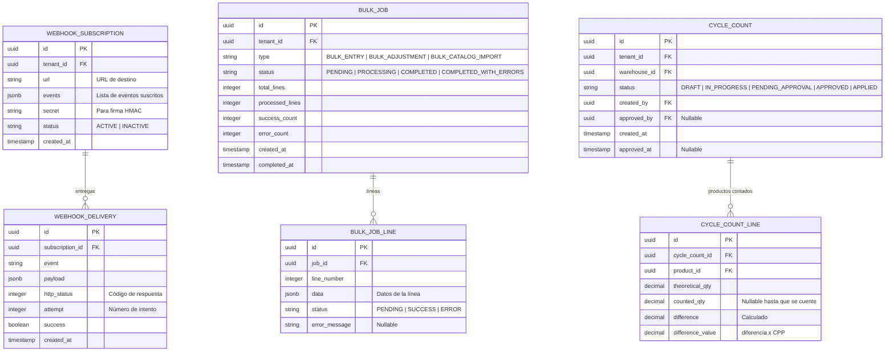

# Módulo 07: Integración y Operaciones Masivas

**RF cubiertos:** RF-033 a RF-035  
**Prioridad MVP:** P2 (Tercer Corte)  
**Documento padre:** [DEFINICION_SAAS.md](../00_definicion-solucion_saas/DEFINICION_SAAS.md)

---

## Contexto y Alcance

Este módulo habilita la **conectividad del sistema con el ecosistema externo** y el procesamiento de operaciones a gran escala. Es el puente entre MicroNuba Inventory y los sistemas del tenant: notificaciones automáticas (webhooks), importación/exportación masiva de datos y reconciliación de inventario.

---

## Requerimientos Funcionales

### RF-033: Sistema de Webhooks (Notificaciones Push)

- **ID:** RF-033 | **Prioridad:** P2
- **Descripción:** Permitir a cada tenant suscribirse a eventos del sistema, recibiendo notificaciones HTTP automáticas en una URL configurada cuando ocurre un evento relevante.
- **Flujo Principal:**
  1. El administrador del tenant registra una suscripción de webhook: URL de destino, eventos de interés, y un secret para firma HMAC.
  2. Cuando ocurre un evento suscrito, el sistema construye el payload, lo firma con HMAC-SHA256 usando el secret, y lo envía como POST a la URL registrada.
  3. Si la entrega falla, el sistema reintenta con backoff exponencial (3 reintentos).
  4. El historial de entregas (exitosas y fallidas) queda disponible para consulta.
- **Reglas de Negocio:**
  - RN-033-1: Eventos disponibles:

    | Evento | Cuándo se dispara |
    |--------|------------------|
    | `stock.updated` | Cualquier cambio en STOCK_BALANCE |
    | `stock.low` | Stock cae por debajo del reorder_point |
    | `reservation.created` | Nueva reserva creada |
    | `reservation.expired` | Reserva expirada automáticamente |
    | `reservation.confirmed` | Reserva confirmada (hard commit) |
    | `bulk.completed` | Operación masiva finalizada |
    | `bulk.failed` | Operación masiva con errores |

  - RN-033-2: Cada entrega incluye header `X-Webhook-Signature` con la firma HMAC para que el receptor verifique autenticidad.
  - RN-033-3: Si 3 entregas consecutivas fallan, la suscripción se marca como `INACTIVE` y se alerta al admin.

### RF-034: Motor de Procesamiento Masivo (Bulk Engine)

- **ID:** RF-034 | **Prioridad:** P2
- **Descripción:** Procesar operaciones en lote de forma asíncrona: inventarios iniciales, ajustes masivos, importación de catálogos. El solicitante sube un archivo o envía un array de operaciones y recibe un Job ID para consultar el progreso.
- **Flujo Principal:**
  1. El sistema recibe un lote de operaciones (JSON array o archivo CSV) con tipo de operación.
  2. Valida el formato y crea un Job con estado `PENDING`.
  3. El motor asíncrono procesa cada operación individual, aplicando las mismas validaciones que la operación unitaria correspondiente.
  4. Actualiza el progreso del Job: `processed / total`, `success_count`, `error_count`.
  5. Al finalizar, marca el Job como `COMPLETED` o `COMPLETED_WITH_ERRORS`.
- **Reglas de Negocio:**
  - RN-034-1: Tipos de operaciones masivas soportadas:

    | Tipo | Descripción |
    |------|-------------|
    | `BULK_ENTRY` | Carga de inventario inicial o recepción masiva |
    | `BULK_ADJUSTMENT` | Ajuste post-conteo físico |
    | `BULK_CATALOG_IMPORT` | Importación de productos desde CSV |

  - RN-034-2: Cada operación individual se ejecuta en su propia transacción. Un error en una línea NO revierte las demás.
  - RN-034-3: El reporte final detalla: línea procesada, resultado (éxito/error) y mensaje de error si aplica.
  - RN-034-4: Máximo 10,000 operaciones por lote.

### RF-035: Inventario Cíclico (Reconciliación)

- **ID:** RF-035 | **Prioridad:** P2
- **Descripción:** Facilitar el proceso de conteo físico programado: generar una hoja de conteo con los saldos teóricos, recibir los conteos reales y generar automáticamente los ajustes necesarios.
- **Flujo Principal:**
  1. El administrador inicia un ciclo de conteo para un almacén (o zona): el sistema genera una "hoja de conteo" con los productos y sus saldos teóricos.
  2. El operario registra los conteos reales (cantidad encontrada físicamente).
  3. El sistema compara teórico vs. real y calcula las diferencias.
  4. El administrador aprueba los ajustes propuestos.
  5. El sistema genera automáticamente movimientos de tipo `ADJUSTMENT` (RF-019) para cada diferencia, con `reason_code = PHYSICAL_COUNT`.
- **Reglas de Negocio:**
  - RN-035-1: Un ciclo de conteo tiene estados: `DRAFT` → `IN_PROGRESS` → `PENDING_APPROVAL` → `APPROVED` → `APPLIED`.
  - RN-035-2: Solo un ciclo de conteo puede estar activo por almacén a la vez.
  - RN-035-3: Los ajustes no se aplican hasta que el administrador los aprueba explícitamente.
  - RN-035-4: El reporte de diferencias muestra: producto, saldo teórico, conteo real, diferencia y valor de la diferencia (diferencia × CPP).

---

## Historias de Usuario

### HU-INT-001: Recibir Notificación de Stock Bajo

- **Narrativa:** Como **sistema ERP**, quiero recibir una notificación automática cuando el stock de un producto cae por debajo del punto de reorden, para generar automáticamente una orden de compra al proveedor.
- **Criterios de Aceptación:**
  1. **Dado** que tengo un webhook suscrito al evento `stock.low`, **Cuando** el stock disponible de un producto cae por debajo de su reorder_point, **Entonces** recibo un POST en mi URL con el payload del evento firmado con HMAC.
  2. **Dado** que mi URL de webhook está caída, **Cuando** el sistema intenta entregar la notificación 3 veces sin éxito, **Entonces** marca mi suscripción como inactiva y me alerta.

### HU-INT-002: Cargar Inventario Inicial Masivo

- **Narrativa:** Como **administrador del tenant**, quiero subir un archivo CSV con 500 productos y sus saldos iniciales, para poblar el sistema al inicio de la operación sin tener que registrar cada producto manualmente.
- **Criterios de Aceptación:**
  1. **Dado** que envío un CSV con 500 líneas de productos, **Cuando** el sistema lo procesa, **Entonces** recibo un Job ID que puedo consultar para ver el progreso.
  2. **Dado** que 10 líneas tienen errores (SKU duplicado, UOM inválida), **Cuando** el Job termina, **Entonces** las 490 líneas válidas se procesaron exitosamente y recibo un reporte detallando los 10 errores.

---

## Modelo de Datos del Módulo

## Matriz de Endpoints

| Método | Endpoint | Descripción | Scope |
|--------|----------|-------------|-------|
| `GET` | `/v1/webhooks` | Listar suscripciones | `ADMIN` |
| `POST` | `/v1/webhooks` | Crear suscripción | `ADMIN` |
| `DELETE` | `/v1/webhooks/{id}` | Eliminar suscripción | `ADMIN` |
| `GET` | `/v1/webhooks/{id}/deliveries` | Historial de entregas | `ADMIN` |
| `POST` | `/v1/bulk/jobs` | Crear Job masivo | `WRITE_INVENTORY` |
| `GET` | `/v1/bulk/jobs/{id}` | Consultar progreso del Job | `READ_INVENTORY` |
| `GET` | `/v1/bulk/jobs/{id}/errors` | Ver errores del Job | `READ_INVENTORY` |
| `POST` | `/v1/cycle-counts` | Iniciar ciclo de conteo | `WRITE_INVENTORY` |
| `GET` | `/v1/cycle-counts/{id}` | Ver hoja de conteo | `READ_INVENTORY` |
| `PATCH` | `/v1/cycle-counts/{id}/lines` | Registrar conteos reales | `WRITE_INVENTORY` |
| `POST` | `/v1/cycle-counts/{id}/approve` | Aprobar y aplicar ajustes | `ADMIN` |
