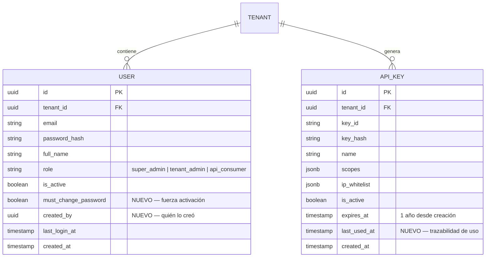

# Módulo 08: Administración Multi-tenant y Gestión de Acceso

**RF cubiertos:** RF-036 a RF-044  
**Prioridad:** P0 (Bloqueante para operación comercial)  
**Sprint:** Sprint 6 — Admin & Onboarding ✅ Completado (2026-04-30)  
**Estado Implementación:** 284 tests pasando, 93% cobertura, 0 ruff/mypy  
**Documento padre:** [DEFINICION_SAAS.md](../00_definicion-solucion_saas/DEFINICION_SAAS.md)  
**Depende de:** Módulo 01 (Gobierno y Seguridad)

---

## Contexto y Alcance

El sistema MVP (Sprints 1–5) fue construido con la infraestructura técnica de multi-tenancy, pero sin ningún mecanismo para incorporar clientes nuevos, gestionar su ciclo de vida ni controlar quién puede acceder a la plataforma. Este módulo cubre la capa de **operación comercial del SaaS**: el proceso por el cual MicroNuba incorpora un cliente, ese cliente activa su cuenta, gestiona su equipo y mantiene sus credenciales de integración activas y seguras.

**Modelo de negocio:** MicroNuba opera como proveedor B2B de backend de inventarios. Los clientes (tenants) son empresas que integran nuestra API en sus propios sistemas. No hay autoservicio de registro — MicroNuba controla quién accede a la plataforma.

### Actores del módulo

| Actor | Descripción | Superficie de acceso |
|-------|-------------|---------------------|
| `super_admin` | Equipo interno MicroNuba | `/admin/*` — completamente separada |
| `tenant_admin` | Administrador designado por el cliente | `/v1/*` — igual que hoy, con nuevos endpoints |
| `api_consumer` | Usuarios del sistema del cliente | `/v1/*` — solo consume, no administra |

### Diagrama de Contexto

```mermaid
graph TD
    subgraph "MicroNuba (nosotros)"
        SA[super_admin]
        ADMIN_AUTH[/admin/auth/*]
        ADMIN_TENANTS[/admin/tenants/*]
    end

    subgraph "Cliente (tenant)"
        TA[tenant_admin]
        USR[api_consumer]
        CLIENT_AUTH[/auth/*]
        CLIENT_USERS[/v1/users/*]
        CLIENT_KEYS[/v1/api-keys/*]
    end

    subgraph "Infraestructura"
        EMAIL[Resend — Email Transaccional]
        REDIS[Redis — Tokens de activación]
        DB[(PostgreSQL RLS)]
        BEAT[Celery Beat — Scheduler]
    end

    SA -->|gestiona| ADMIN_AUTH
    SA -->|crea/suspende/cambia tier| ADMIN_TENANTS
    ADMIN_TENANTS -->|crea usuario inicial| EMAIL
    ADMIN_TENANTS --> DB

    TA -->|activa cuenta| CLIENT_AUTH
    TA -->|gestiona usuarios| CLIENT_USERS
    TA -->|rota API keys| CLIENT_KEYS
    CLIENT_USERS --> EMAIL
    CLIENT_KEYS --> BEAT

    BEAT -->|notificaciones expiración| EMAIL
    EMAIL --> TA
    EMAIL --> USR

    style SA fill:#1b4332,color:#fff
    style TA fill:#1a3a5c,color:#fff
```

---

## Requerimientos Funcionales

### RF-036: Administración de Super Admins (Bootstrap y Acceso Separado)

- **ID:** RF-036
- **Módulo:** Admin Multi-tenant
- **Prioridad:** P0 — Bloqueante
- **Descripción:** El sistema debe proveer una superficie de autenticación completamente separada para el equipo interno de MicroNuba (super_admin). Ningún cliente externo puede autenticarse en esta superficie ni conocer su existencia por observación de respuestas.
- **Pre-condiciones:**
  1. Existe al menos una instancia del sistema ejecutándose.
  2. La variable `ADMIN_BOOTSTRAP_SECRET` está configurada en el entorno.
- **Flujo Principal — Registro del primer super_admin:**
  1. El operador de MicroNuba llama a `POST /admin/auth/register` con el header `X-Bootstrap-Secret`.
  2. El sistema valida que el secret coincida con la variable de entorno.
  3. Crea el usuario con `role=super_admin` vinculado al tenant interno `micronuba-internal`.
  4. Retorna credenciales de acceso.
  5. Una vez creado, el administrador puede desactivar el endpoint borrando `ADMIN_BOOTSTRAP_SECRET` del entorno.
- **Flujo Principal — Login de super_admin:**
  1. El super_admin llama a `POST /admin/auth/login` con email y contraseña.
  2. El sistema valida credenciales y verifica que `role=super_admin`.
  3. Si las credenciales son válidas pero `role ≠ super_admin` → responde con `403` genérico idéntico al de credenciales inválidas (no revela información).
  4. Emite JWT con `scope=full` y refresh token.
- **Post-condiciones:**
  - El super_admin tiene un token JWT válido para operar en `/admin/*`.
  - El login de cliente (`POST /auth/login`) rechaza intentos de super_admin.
- **Reglas de Negocio:**
  - RN-036-1: El endpoint `/admin/auth/register` devuelve `503 Service Unavailable` si `ADMIN_BOOTSTRAP_SECRET` está vacío o no configurado.
  - RN-036-2: El endpoint `/auth/login` (de clientes) rechaza con `403` si el usuario tiene `role=super_admin`.
  - RN-036-3: Los tokens de super_admin no aplican rate limiting (están exentos por rol).
  - RN-036-4: El bypass de RLS se activa mediante el sentinel `__super_admin__` en `app.current_tenant` — nunca mediante configuración de privilegios de base de datos.
- **Manejo de Errores:**
  - Bootstrap secret incorrecto → `403 Forbidden` genérico.
  - `ADMIN_BOOTSTRAP_SECRET` no configurado → `503 Service Unavailable`.
  - Email ya registrado como super_admin → `409 Conflict`.

---

### RF-037: Gestión del Ciclo de Vida de Tenants

- **ID:** RF-037
- **Módulo:** Admin Multi-tenant
- **Prioridad:** P0 — Bloqueante
- **Descripción:** El super_admin puede crear, consultar, modificar y suspender tenants. La creación de un tenant incluye automáticamente el usuario `tenant_admin` inicial. No existe autoregistro de clientes.
- **Pre-condiciones:**
  1. El solicitante tiene `role=super_admin` con token válido.
- **Flujo Principal — Crear tenant:**
  1. El super_admin envía nombre del tenant, tier de suscripción, email y nombre del admin inicial.
  2. El sistema genera el `slug` automáticamente desde el nombre (slugify ASCII, único).
  3. Crea el registro en `tenants` con `is_active=true`.
  4. Crea el usuario `tenant_admin` con `must_change_password=true`.
  5. Genera un `activation_token` y lo almacena en Redis con TTL 48h.
  6. Dispara email de bienvenida al `tenant_admin` con enlace de activación.
  7. Retorna datos del tenant + usuario (sin exponer contraseña ni token).
  8. Registra la acción en audit trail.
- **Flujo Principal — Suspender tenant:**
  1. El super_admin hace `PATCH /admin/tenants/{id}` con `is_active=false`.
  2. El sistema actualiza el registro.
  3. Todos los requests futuros de usuarios de ese tenant reciben `403`.
  4. Se envía email de notificación al `tenant_admin`.
  5. Se registra en audit trail.
- **Post-condiciones:**
  - Tenant creado: usuario admin puede activar su cuenta en las próximas 48h.
  - Tenant suspendido: bloqueo inmediato sin invalidar tokens (el check ocurre en cada request).
- **Reglas de Negocio:**
  - RN-037-1: El `slug` se genera una sola vez y es inmutable.
  - RN-037-2: No se puede eliminar un tenant. Solo suspender (`is_active=false`).
  - RN-037-3: El cambio de `subscription_tier` tiene efecto en el próximo login del usuario (el tier se embebe en el JWT; delay máximo: duración del access token, 30 min).
  - RN-037-4: Al crear el tenant, el sistema aplica la configuración por defecto de `_DEFAULT_CONFIG` del módulo 01.
- **Manejo de Errores:**
  - Slug ya existente (colisión) → el sistema añade sufijo numérico automáticamente (`ferreteria-lopez-2`).
  - Email de admin ya registrado en otro tenant → `409 Conflict`.
  - Tenant no encontrado → `404 Not Found`.

---

### RF-038: Onboarding del Tenant Admin — Activación Segura

- **ID:** RF-038
- **Módulo:** Admin Multi-tenant
- **Prioridad:** P0 — Bloqueante
- **Descripción:** Cuando se crea un tenant o un usuario nuevo, el sistema envía un enlace de activación de un solo uso con TTL de 48 horas. El usuario activa su cuenta estableciendo su contraseña mediante ese enlace, sin que ninguna contraseña sea transmitida por email.
- **Pre-condiciones:**
  1. Existe un usuario con `must_change_password=true`.
  2. Existe un `activation_token` válido en Redis (`activation:{token}` → `user_id`).
- **Flujo Principal:**
  1. El usuario recibe el email con el enlace de activación.
  2. El usuario (o su sistema) llama a `POST /auth/activate` con `{ token, new_password }`.
  3. El sistema valida el token en Redis.
  4. Valida que la contraseña cumpla las reglas de complejidad.
  5. Actualiza el `password_hash` del usuario.
  6. Pone `must_change_password=false`.
  7. Elimina el token de Redis (un solo uso).
  8. Emite `access_token` + `refresh_token` con scope completo.
  9. Envía email de confirmación de activación.
- **Flujo alternativo — Reenvío de enlace:**
  1. El `tenant_admin` llama a `POST /auth/resend-activation/{user_id}`.
  2. El sistema invalida el token anterior (si existe).
  3. Genera nuevo token y reinicia TTL a 48h.
  4. Reenvía el email.
- **Post-condiciones:**
  - El usuario queda activo con contraseña propia.
  - El token de activación queda eliminado de Redis.
  - El usuario tiene una sesión activa inmediatamente tras la activación.
- **Reglas de Negocio:**
  - RN-038-1: El token de activación es de un solo uso. Tras ser consumido se elimina de Redis.
  - RN-038-2: TTL del token: 48 horas. Pasado ese tiempo → `410 Gone`.
  - RN-038-3: El email de activación contiene el token explícito y las instrucciones para llamar a `POST /auth/activate` (API pura, sin frontend acoplado).
  - RN-038-4: El enlace de activación usa `ACTIVATION_BASE_URL` configurable por entorno.
  - RN-038-5: La nueva contraseña debe cumplir: mínimo 8 caracteres, al menos 1 mayúscula, 1 número.
- **Manejo de Errores:**
  - Token inválido o no encontrado en Redis → `401 Unauthorized`.
  - Token expirado (no encontrado por TTL) → `410 Gone` con mensaje `"Enlace expirado. Solicite un nuevo enlace."`.
  - Contraseña no cumple reglas → `422 Unprocessable Entity` con detalle por campo.

---

### RF-039: Gestión de Usuarios por Tenant Admin

- **ID:** RF-039
- **Módulo:** Admin Multi-tenant
- **Prioridad:** P0 — Bloqueante
- **Descripción:** El `tenant_admin` puede crear, listar, activar y suspender usuarios dentro de su propio tenant. Los usuarios creados reciben un email de activación. El `tenant_admin` no puede crear usuarios con privilegios superiores a `api_consumer`.
- **Pre-condiciones:**
  1. El solicitante tiene `role=tenant_admin`.
  2. El tenant está activo.
- **Flujo Principal — Crear usuario:**
  1. El `tenant_admin` envía nombre completo, email y rol (`api_consumer`).
  2. El sistema crea el usuario con `must_change_password=true`, `is_active=true`.
  3. Genera `activation_token` en Redis (TTL 48h).
  4. Dispara email de activación al nuevo usuario.
  5. Retorna datos del usuario (sin contraseña).
- **Post-condiciones:**
  - Usuario creado en el tenant, esperando activación.
  - RLS garantiza que el `tenant_admin` solo ve usuarios de su propio tenant.
- **Reglas de Negocio:**
  - RN-039-1: El `tenant_admin` solo puede asignar `role=api_consumer`. No puede crear `tenant_admin` ni `super_admin`.
  - RN-039-2: El email del usuario debe ser único dentro del tenant (no globalmente).
  - RN-039-3: Suspender un usuario (`is_active=false`) bloquea su acceso en el siguiente request sin invalidar tokens activos.
  - RN-039-4: El `tenant_admin` no puede suspenderse a sí mismo.
- **Manejo de Errores:**
  - Email duplicado en el tenant → `409 Conflict`.
  - Intento de crear rol superior → `403 Forbidden`.
  - Usuario no pertenece al tenant → `404 Not Found` (RLS lo oculta).

---

### RF-040: Cambio Voluntario de Contraseña

- **ID:** RF-040
- **Módulo:** Admin Multi-tenant
- **Prioridad:** P1 — Necesario
- **Descripción:** Cualquier usuario autenticado con sesión completa (`scope=full`) puede cambiar su contraseña proporcionando la contraseña actual y la nueva. Se envía notificación por email al completar el cambio.
- **Pre-condiciones:**
  1. El usuario tiene un JWT válido con `scope=full`.
- **Flujo Principal:**
  1. El usuario llama a `POST /auth/change-password` con `{ current_password, new_password }`.
  2. El sistema verifica que `current_password` coincida con el hash almacenado.
  3. Valida las reglas de complejidad de la nueva contraseña.
  4. Actualiza el `password_hash`.
  5. Envía email de confirmación con fecha, hora e IP del cambio.
- **Reglas de Negocio:**
  - RN-040-1: La nueva contraseña no puede ser idéntica a la actual.
  - RN-040-2: El cambio de contraseña NO invalida los refresh tokens activos (el usuario sigue logueado en otros dispositivos). Esta es una decisión deliberada para B2B donde los sistemas integrados no deben desconectarse.
  - RN-040-3: El email de confirmación se envía siempre, incluso si el usuario no tiene email configurado el sistema registra el intento en audit trail.
- **Manejo de Errores:**
  - Contraseña actual incorrecta → `401 Unauthorized`.
  - Nueva contraseña = actual → `422 Unprocessable Entity`.
  - Nueva contraseña no cumple reglas → `422 Unprocessable Entity`.

---

### RF-041: Ciclo de Vida Completo de API Keys

- **ID:** RF-041
- **Módulo:** Admin Multi-tenant
- **Prioridad:** P0 — Bloqueante
- **Descripción:** Las API Keys tienen una fecha de expiración fija (1 año desde creación). El tenant puede rotarlas en cualquier momento (de forma reactiva o proactiva). La key anterior permanece válida durante un período de gracia configurable por tenant (default 30 días, mín 7, máx 90). El sistema garantiza que no hay dos tenants con fechas de expiración coincidentes para facilitar la operación del equipo de soporte.
- **Pre-condiciones:**
  1. El solicitante tiene `role=tenant_admin`.
- **Flujo Principal — Rotación normal:**
  1. El `tenant_admin` llama a `POST /v1/api-keys/{key_id}/rotate`.
  2. El sistema genera una nueva API Key con `expires_at = now + 365 días` (ajustado por staggering).
  3. La key anterior entra en período de gracia: `is_active=true` por `api_key_rotation_grace_days` días.
  4. Celery Beat programa la revocación de la key anterior al vencer el período de gracia.
  5. Se envía email de confirmación con: nueva `key_id`, fecha de expiración de la key anterior.
- **Flujo Principal — Rotación de emergencia:**
  1. El `tenant_admin` llama a `POST /v1/api-keys/{key_id}/rotate` con `{ "immediate": true }`.
  2. La key anterior se revoca inmediatamente (`is_active=false`).
  3. Se envía email de alerta al `tenant_admin`.
- **Flujo de Staggering:**
  1. Al calcular `expires_at` para la nueva key, el sistema verifica si algún otro tenant tiene una key expirando en la misma fecha.
  2. Si la fecha está ocupada, desplaza +1 día (hasta máximo +14 días).
  3. El desplazamiento no afecta el período de gracia.
- **Reglas de Negocio:**
  - RN-041-1: Toda API Key nueva tiene `expires_at = now + API_KEY_EXPIRY_DAYS (default: 365)`.
  - RN-041-2: El período de gracia es configurable en el JSONB del tenant: `api_key_rotation_grace_days` (default: 30, mín: 7, máx: 90).
  - RN-041-3: No pueden expirar keys de dos tenants distintos el mismo día calendario (staggering).
  - RN-041-4: La revocación de la key antigua por período de gracia es ejecutada por Celery Beat (tarea programada).
  - RN-041-5: El `super_admin` puede revocar cualquier key de cualquier tenant de forma inmediata (sin período de gracia).
- **Manejo de Errores:**
  - Key no pertenece al tenant → `404 Not Found` (RLS).
  - Key ya revocada → `409 Conflict`.

---

### RF-042: Notificaciones de Expiración de API Keys

- **ID:** RF-042
- **Módulo:** Admin Multi-tenant
- **Prioridad:** P1 — Necesario
- **Descripción:** El sistema envía notificaciones automáticas por email al `tenant_admin` cuando una API Key se acerca a su fecha de expiración. Las notificaciones se envían en T-30, T-7 y T-1 días antes del vencimiento, y el día del vencimiento.
- **Pre-condiciones:**
  1. Celery Beat está ejecutándose.
  2. La API Key tiene `expires_at` definido e `is_active=true`.
- **Flujo Principal:**
  1. Celery Beat ejecuta diariamente la tarea `check_expiring_api_keys`.
  2. La tarea consulta las API Keys con `expires_at` en 30, 7 o 1 días.
  3. Para cada key encontrada, dispara la tarea de email correspondiente.
  4. El email incluye: identificador de la key, días restantes, instrucciones para rotar.
  5. El día del vencimiento (`expires_at <= now`): la key se marca `is_active=false` automáticamente y se envía email de key expirada.
- **Reglas de Negocio:**
  - RN-042-1: Los hitos de notificación son fijos: T-30, T-7, T-1, T-0. No son configurables por tenant.
  - RN-042-2: Cada notificación se envía una sola vez por hito (el sistema registra el último hito notificado en el modelo `ApiKey`).
  - RN-042-3: Si el email falla, Celery reintenta 3 veces con backoff exponencial (10s, 30s, 90s). Si sigue fallando, registra en logs sin propagar el error al flujo principal.
  - RN-042-4: Las notificaciones se envían al email del `tenant_admin` activo del tenant dueño de la key.
- **Manejo de Errores:**
  - Tenant sin email configurado → log de advertencia, sin error en el sistema.
  - Proveedor de email no disponible → reintentos Celery, no bloquea el sistema.

---

### RF-043: Sistema de Notificaciones Transaccionales por Email

- **ID:** RF-043
- **Módulo:** Admin Multi-tenant
- **Prioridad:** P1 — Necesario
- **Descripción:** El sistema envía emails transaccionales en respuesta a eventos del ciclo de vida de tenants, usuarios y API Keys. Todos los emails son disparados de forma asíncrona vía Celery para no bloquear los endpoints.
- **Proveedor:** Resend (SDK Python `resend==2.4.0`).
- **Configuración requerida:** `RESEND_API_KEY`, `RESEND_FROM_EMAIL`, `RESEND_FROM_NAME`.
- **Catálogo de eventos y templates:**

  | Evento | Template | Destinatario |
  |--------|----------|-------------|
  | Tenant creado | `tenant_welcome` | tenant_admin |
  | Usuario creado | `user_activation` | nuevo usuario |
  | Cuenta activada | `account_activated` | usuario |
  | Contraseña cambiada | `password_changed` | usuario |
  | API Key próxima a expirar (T-30) | `apikey_expiry_warning` | tenant_admin |
  | API Key próxima a expirar (T-7) | `apikey_expiry_warning` | tenant_admin |
  | API Key próxima a expirar (T-1) | `apikey_expiry_warning` | tenant_admin |
  | API Key expirada | `apikey_expired` | tenant_admin |
  | API Key rotada | `apikey_rotated` | tenant_admin |
  | API Key revocada (emergencia) | `apikey_revoked` | tenant_admin |
  | Tenant suspendido | `tenant_suspended` | tenant_admin |
  | Enlace de activación reenviado | `user_activation` | usuario |

- **Reglas de Negocio:**
  - RN-043-1: Ningún email bloquea el request HTTP que lo origina. Todos son tareas Celery fire-and-forget.
  - RN-043-2: Reintentos: 3 intentos con backoff exponencial (10s, 30s, 90s).
  - RN-043-3: Los templates son texto plano + HTML básico. No requieren motor de plantillas externo en esta fase.
  - RN-043-4: El dominio de envío es configurable vía `RESEND_FROM_EMAIL`. En desarrollo se usa `onboarding@resend.dev`.

---

### RF-044: Admin — Gestión de API Keys entre Tenants

- **ID:** RF-044
- **Módulo:** Admin Multi-tenant
- **Prioridad:** P1 — Necesario
- **Descripción:** El super_admin puede ver y revocar API Keys de cualquier tenant para atender incidentes de seguridad o soporte. No puede ver el `key_secret` (que nunca se almacena en texto plano).
- **Pre-condiciones:**
  1. El solicitante tiene `role=super_admin`.
- **Flujo Principal:**
  1. El super_admin lista las API Keys de un tenant: `GET /admin/tenants/{id}/api-keys`.
  2. Obtiene metadatos: `key_id`, `name`, `is_active`, `expires_at`, `last_used_at`, `created_at`.
  3. Para revocar: `DELETE /admin/tenants/{id}/api-keys/{key_id}`.
  4. La revocación es inmediata (sin período de gracia).
  5. Se envía email de alerta al `tenant_admin` indicando revocación por parte del administrador.
  6. Se registra en audit trail con `performed_by: {type: "user", id: super_admin_id}`.
- **Reglas de Negocio:**
  - RN-044-1: El super_admin nunca puede ver ni recuperar el `key_secret` (no está almacenado).
  - RN-044-2: La revocación por super_admin es inmediata y no respeta el período de gracia del tenant.
  - RN-044-3: El tenant_admin recibe email de notificación cuando una de sus keys es revocada por el admin.
- **Manejo de Errores:**
  - Tenant no encontrado → `404 Not Found`.
  - Key no pertenece al tenant → `404 Not Found`.

---

## Historias de Usuario

### HU-ADM-001: Incorporación de un Nuevo Cliente

- **Narrativa:** Como **super_admin de MicroNuba**, quiero crear un nuevo tenant con su administrador inicial, para que el cliente pueda comenzar a usar el servicio sin necesidad de autoregistro.
- **Criterios de Aceptación:**
  1. **Dado** que envío nombre del tenant, tier y datos del admin, **Cuando** llamo a `POST /admin/tenants`, **Entonces** se crea el tenant con slug auto-generado, se crea el usuario admin y el cliente recibe un email de activación en menos de 30 segundos.
  2. **Dado** que el slug generado ya existe, **Cuando** se crea el tenant, **Entonces** el sistema añade sufijo numérico automáticamente y completa la creación sin error.
  3. **Dado** que el email del admin ya existe en otro tenant, **Cuando** intento crear el tenant, **Entonces** recibo `409 Conflict` con indicación del campo conflictivo.
  4. **Dado** que soy un usuario con `role=tenant_admin`, **Cuando** intento llamar a `POST /admin/tenants`, **Entonces** recibo `403 Forbidden` genérico.

### HU-ADM-002: Suspensión y Reactivación de un Tenant

- **Narrativa:** Como **super_admin**, quiero suspender o reactivar un tenant, para gestionar incumplimientos de pago o incidentes de seguridad sin eliminar los datos del cliente.
- **Criterios de Aceptación:**
  1. **Dado** que suspendo un tenant (`is_active=false`), **Cuando** cualquier usuario de ese tenant hace un request, **Entonces** recibe `403 Forbidden` con el mensaje `"Cuenta suspendida. Contacte soporte."`.
  2. **Dado** que un tenant está suspendido, **Cuando** el usuario intenta renovar su token con `POST /auth/refresh`, **Entonces** recibe `403 Forbidden`.
  3. **Dado** que reactivo un tenant (`is_active=true`), **Cuando** el usuario hace login, **Entonces** puede acceder normalmente.
  4. **Dado** que suspendo un tenant, **Entonces** el `tenant_admin` recibe email de notificación de suspensión.

### HU-ADM-003: Activación de Cuenta por Primer Acceso

- **Narrativa:** Como **nuevo usuario del sistema** (tenant_admin o api_consumer), quiero activar mi cuenta usando el enlace que recibí por email, para establecer mi propia contraseña sin que nadie la conozca.
- **Criterios de Aceptación:**
  1. **Dado** que tengo un token de activación válido (< 48h), **Cuando** llamo a `POST /auth/activate` con el token y una contraseña válida, **Entonces** mi cuenta queda activa y recibo un JWT con sesión completa.
  2. **Dado** que ya usé el enlace de activación, **Cuando** intento usarlo nuevamente, **Entonces** recibo `401 Unauthorized` con mensaje de enlace ya utilizado.
  3. **Dado** que el enlace tiene más de 48 horas, **Cuando** intento activar, **Entonces** recibo `410 Gone` con instrucción de solicitar reenvío.
  4. **Dado** que la contraseña no cumple las reglas (mín 8 chars, 1 mayúscula, 1 número), **Cuando** intento activar, **Entonces** recibo `422` con descripción del error por campo.

### HU-ADM-004: Gestión de Usuarios del Equipo

- **Narrativa:** Como **tenant_admin**, quiero agregar usuarios de mi equipo al sistema, para que puedan integrar sus sistemas con nuestra API de inventarios.
- **Criterios de Aceptación:**
  1. **Dado** que soy `tenant_admin`, **Cuando** creo un usuario con `role=api_consumer`, **Entonces** el usuario es creado y recibe email de activación.
  2. **Dado** que intento crear un usuario con `role=tenant_admin`, **Cuando** envío el request, **Entonces** recibo `403 Forbidden`.
  3. **Dado** que un usuario de mi equipo está activo, **Cuando** lo suspendo (`is_active=false`), **Entonces** sus requests futuros reciben `403 Forbidden`.
  4. **Dado** que consulto `GET /v1/users`, **Entonces** solo veo usuarios de mi propio tenant (RLS verificado).

### HU-ADM-005: Rotación de API Key por Seguridad

- **Narrativa:** Como **tenant_admin**, quiero rotar mi API Key cuando sospecho que fue comprometida o cuando se aproxima su vencimiento, sin interrumpir el servicio durante la transición.
- **Criterios de Aceptación:**
  1. **Dado** que roto una key normalmente, **Cuando** llamo a `POST /v1/api-keys/{key_id}/rotate`, **Entonces** recibo una nueva key y la anterior sigue válida por el período de gracia configurado.
  2. **Dado** que roto con `immediate=true`, **Cuando** la rotación se completa, **Entonces** la key anterior queda revocada inmediatamente y recibo email de alerta.
  3. **Dado** que la nueva key tiene fecha de expiración el mismo día que otro tenant, **Cuando** el sistema calcula la fecha, **Entonces** desplaza automáticamente hasta encontrar un día libre.
  4. **Dado** que la key anterior está en período de gracia, **Cuando** mi sistema integrado la usa, **Entonces** funciona normalmente hasta que expire el período.

### HU-ADM-006: Notificaciones de Expiración de API Key

- **Narrativa:** Como **tenant_admin**, quiero recibir alertas anticipadas cuando mi API Key está próxima a vencer, para rotar las credenciales sin downtime en mis integraciones.
- **Criterios de Aceptación:**
  1. **Dado** que mi API Key expira en 30 días, **Cuando** Celery Beat ejecuta el job diario, **Entonces** recibo un email de advertencia con el identificador de la key y la fecha de vencimiento.
  2. **Dado** que mi API Key expira en 7 días y 1 día, **Cuando** el job se ejecuta, **Entonces** recibo alertas de urgencia creciente.
  3. **Dado** que mi API Key llega a su fecha de expiración, **Cuando** el job del día 0 se ejecuta, **Entonces** la key se revoca automáticamente y recibo email de key expirada.
  4. **Dado** que ya roté mi key antes de la alerta de T-7, **Cuando** el job del día T-7 se ejecuta para la key rotada, **Entonces** no recibo alerta (la key ya no está activa).

---

## Modelo de Datos del Módulo

### Cambios a tablas existentes



### Redis — Tokens de activación

```
Clave:  activation:{token_urlsafe_32}
Valor:  {user_id}
TTL:    48 horas (172800 segundos)
```

### Tenant interno MicroNuba (seed fijo)

```
id:    00000000-0000-0000-0000-000000000001
name:  MicroNuba Internal
slug:  micronuba-internal
tier:  ENTERPRISE
```

---

## Matriz de Endpoints del Módulo

### Superficie Admin (`/admin/*`) — solo super_admin

| Método | Endpoint | RF | Descripción |
|--------|----------|----|-------------|
| `POST` | `/admin/auth/register` | RF-036 | Registrar super_admin (bootstrap) |
| `POST` | `/admin/auth/login` | RF-036 | Login exclusivo super_admin |
| `POST` | `/admin/tenants` | RF-037 | Crear tenant + admin inicial |
| `GET` | `/admin/tenants` | RF-037 | Listar tenants (paginado, filtros) |
| `GET` | `/admin/tenants/{id}` | RF-037 | Detalle de tenant |
| `PATCH` | `/admin/tenants/{id}` | RF-037 | Actualizar tenant (tier, is_active) |
| `GET` | `/admin/tenants/{id}/api-keys` | RF-044 | Listar API Keys del tenant |
| `DELETE` | `/admin/tenants/{id}/api-keys/{key_id}` | RF-044 | Revocar key de emergencia |

### Superficie Cliente (`/auth/*` y `/v1/*`) — tenant_admin / api_consumer

| Método | Endpoint | RF | Descripción |
|--------|----------|----|-------------|
| `POST` | `/auth/activate` | RF-038 | Activar cuenta con token |
| `POST` | `/auth/resend-activation/{user_id}` | RF-038 | Reenviar enlace de activación |
| `POST` | `/auth/change-password` | RF-040 | Cambio voluntario de contraseña |
| `GET` | `/v1/users` | RF-039 | Listar usuarios del tenant |
| `POST` | `/v1/users` | RF-039 | Crear usuario api_consumer |
| `PATCH` | `/v1/users/{user_id}` | RF-039 | Actualizar usuario (is_active) |
| `POST` | `/v1/api-keys/{key_id}/rotate` | RF-041 | Rotar API Key |
