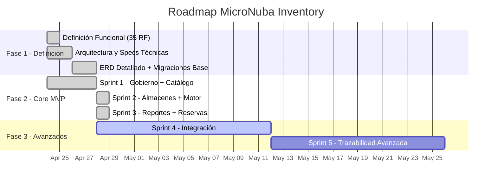

# Plan de Trabajo — MicroNuba Inventory SaaS

> **Versión:** 1.1  
> **Fecha:** 2026-04-28  
> **Metodología:** Scrum adaptado (sprints de 2 semanas)

---

## 1. Visión General del Plan

---

## 2. Secuencia de Ejecución por Fase

### Fase 1: Definición (Completada)

| Paso | Actividad | Responsable | Entregable | Estado |
|------|-----------|-------------|------------|--------|
| 1.1 | Definición Funcional completa (35 RF, 18 HU) | `experto_requerimientos_historias` | `doc/Funcional/mejorado/` (8 archivos) | ✅ Completado |
| 1.2 | Definir arquitectura técnica y stack final | `arquitecto_soluciones` | `doc/Arquitectura/Arquitectura definida/` | ✅ Completado |
| 1.3 | ERD definitivo con migraciones Alembic base | `experto_base_datos_postgres` | Migraciones 001–003 en `alembic/versions/` | ✅ Completado |
| 1.4 | Definiciones técnicas por módulo (contratos API) | `experto_backend_python` | `doc/Definicion-Tecnica/` (7 módulos) | ✅ Completado |

### Fase 2: Desarrollo Core MVP (Sprints 1–3)

Cada sprint sigue el workflow API-First: Modelos → Schemas → Services → Endpoints → Tests → QA Gate (ruff + mypy + pytest ≥80%).

> **Nota:** UX/UI y Frontend se omiten en el MVP API-First.

| Sprint | Período | Objetivo | RF Incluidos | Estado | Resultado |
|--------|---------|----------|-------------|--------|-----------|
| Sprint 1 | 2026-04-24 → 2026-04-28 | Base segura + catálogo operativo | RF-001 a RF-008 | ✅ Completado | 48 tests, 90% cov, 0 ruff/mypy |
| Sprint 2 | 2026-04-28 → 2026-04-28 | Motor transaccional funcionando | RF-013, RF-016 a RF-020, RF-022 | ✅ Completado | 84 tests, 93% cov, 0 ruff/mypy |
| Sprint 3 | 2026-04-28 → 2026-04-28 | Reportes + reservas + docs API | RF-025 a RF-027, RF-029 a RF-032, DOC-001 | ✅ Completado | 111 tests, 92% cov, 0 ruff/mypy |

### Fase 3: Módulos Avanzados (Sprints 4–5)

| Sprint | Duración | Objetivo | RF Incluidos | Módulos |
|--------|----------|----------|-------------|---------|
| Sprint 4 | 2026-04-28 → 2026-04-28 | Conectividad con ecosistema externo | RF-033 a RF-035 | ✅ Completado | 154 tests, 91% cov, 0 ruff/mypy |
| Sprint 5 | 2 semanas | Trazabilidad y funciones avanzadas | RF-009 a RF-012, RF-014, RF-015, RF-021, RF-023, RF-024, RF-028 | Catálogo+, Sedes+, Motor+ |

---

## 3. Criterios de Éxito por Sprint

Cada sprint DEBE cumplir antes de avanzar al siguiente:

| Criterio | Umbral | Verificación |
|----------|--------|-------------|
| Tests unitarios | ≥ 80% cobertura | `pytest --cov --cov-fail-under=80` |
| Tests Auth/RLS | 100% cobertura | Reporte de cobertura en módulos `auth/` y `core/` |
| Tipado estático | 0 errores | `mypy app/ --ignore-missing-imports` |
| Linting | 0 errores | `ruff check app/` |
| Verificador de Calidad | Veredicto `APROBADO` | `verificador_calidad` ejecutado |
| Criterios Gherkin | 100% cubiertos | Matriz RF → Test Case en `doc/Planeacion/Sprints/` |

---

## 4. Riesgos Identificados

| # | Riesgo | Probabilidad | Impacto | Mitigación |
|---|--------|-------------|---------|------------|
| R1 | Complejidad del motor transaccional atómico (ACID + CPP) | Alta | Alto | Spike técnico antes de Sprint 2. Tests exhaustivos |
| R2 | Performance de RLS en queries con muchos tenants | Media | Alto | Indexar `tenant_id` en todas las tablas. Benchmark temprano |
| R3 | Concurrencia en reservas (race conditions) | Media | Alto | Optimistic locking (`version` en STOCK_BALANCE) |
| R4 | Volumen de datos en Kardex histórico | Media | Medio | Paginación obligatoria. Particionamiento si crece |
| R5 | Complejidad de transferencias de dos fases | Media | Medio | Estado `IN_TRANSIT` bien definido. Tests de borde |

---

## 5. Dependencias Externas

| Dependencia | Tipo | Impacto si Falla |
|-------------|------|-----------------|
| PostgreSQL 15+ (con RLS) | Infraestructura | Bloqueante total |
| Redis (rate limiting, caché, worker) | Infraestructura | Degrada rate limiting y workers |
| Docker + Traefik | DevOps | Bloquea entorno de desarrollo |
| Celery (procesamiento asíncrono) | Framework | Bloquea bulk engine y auto-expiration |
