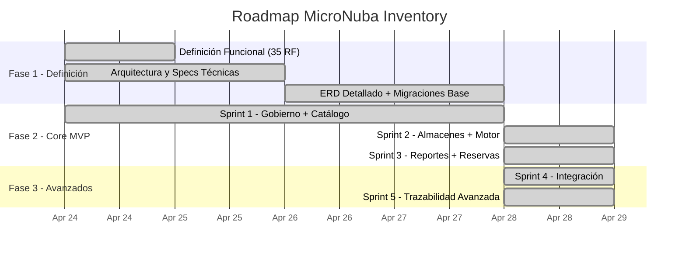

# Plan de Trabajo — MicroNuba Inventory SaaS

> **Versión:** 1.1  
> **Fecha:** 2026-04-28  
> **Metodología:** Scrum adaptado (sprints de 2 semanas)

---

## 1. Visión General del Plan

---

## 2. Secuencia de Ejecución por Fase

### Fase 1: Definición (Completada)

| Paso | Actividad | Responsable | Entregable | Estado |
|------|-----------|-------------|------------|--------|
| 1.1 | Definición Funcional completa (35 RF, 18 HU) | `experto_requerimientos_historias` | `doc/Funcional/mejorado/` (8 archivos) | ✅ Completado |
| 1.2 | Definir arquitectura técnica y stack final | `arquitecto_soluciones` | `doc/Arquitectura/Arquitectura definida/` | ✅ Completado |
| 1.3 | ERD definitivo con migraciones Alembic base | `experto_base_datos_postgres` | Migraciones 001–003 en `alembic/versions/` | ✅ Completado |
| 1.4 | Definiciones técnicas por módulo (contratos API) | `experto_backend_python` | `doc/Definicion-Tecnica/` (7 módulos) | ✅ Completado |

### Fase 2: Desarrollo Core MVP (Sprints 1–3)

Cada sprint sigue el workflow API-First: Modelos → Schemas → Services → Endpoints → Tests → QA Gate (ruff + mypy + pytest ≥80%).

> **Nota:** UX/UI y Frontend se omiten en el MVP API-First.

| Sprint | Período | Objetivo | RF Incluidos | Estado | Resultado |
|--------|---------|----------|-------------|--------|-----------|
| Sprint 1 | 2026-04-24 → 2026-04-28 | Base segura + catálogo operativo | RF-001 a RF-008 | ✅ Completado | 48 tests, 90% cov, 0 ruff/mypy |
| Sprint 2 | 2026-04-28 → 2026-04-28 | Motor transaccional funcionando | RF-013, RF-016 a RF-020, RF-022 | ✅ Completado | 84 tests, 93% cov, 0 ruff/mypy |
| Sprint 3 | 2026-04-28 → 2026-04-28 | Reportes + reservas + docs API | RF-025 a RF-027, RF-029 a RF-032, DOC-001 | ✅ Completado | 111 tests, 92% cov, 0 ruff/mypy |

### Fase 3: Módulos Avanzados (Sprints 4–5)

| Sprint | Período | Objetivo | RF Incluidos | Estado | Resultado |
|--------|---------|----------|-------------|--------|-----------|
| Sprint 4 | 2026-04-28 → 2026-04-28 | Conectividad con ecosistema externo | RF-033 a RF-035 | ✅ Completado | 154 tests, 91% cov, 0 ruff/mypy |
| Sprint 5 | 2026-04-28 → 2026-04-28 | Trazabilidad y funciones avanzadas | RF-009 a RF-012, RF-014, RF-015, RF-021, RF-023, RF-024, RF-028 | ✅ Completado | 208 tests, 92% cov, 0 ruff/mypy |

### Fase 4: Operación Comercial (Sprint 6)

| Sprint | Período | Objetivo | RF Incluidos | Estado | Resultado |
|--------|---------|----------|-------------|--------|-----------|
| Sprint 6 | 2026-04-29 → 2026-04-30 | Admin multi-tenant, onboarding y notificaciones | RF-036 a RF-044 | ✅ Completado | 284 tests, 93% cobertura, 0 ruff/mypy — todos los RFs completados |

**Entregables Sprint 6:**
- Superficie de administración separada (`/admin/*`) exclusiva para equipo MicroNuba
- Flujo completo de incorporación de clientes sin autoregistro
- Activación segura de cuentas vía token Redis (sin contraseñas en email)
- Gestión de usuarios por tenant_admin con aislamiento RLS verificado
- Ciclo de vida completo de API Keys con rotación reactiva y período de gracia configurable
- Staggering de fechas de expiración entre tenants
- Sistema de notificaciones transaccionales vía Resend (9 templates de email)
- Celery tasks activas: check_expiring_keys, revoke_grace_period_key, send_email
- `app/tasks.py` implementado (resuelve crash de inv-worker e inv-beat de Sprint 5)

---

## 3. Criterios de Éxito por Sprint

Cada sprint DEBE cumplir antes de avanzar al siguiente:

| Criterio | Umbral | Verificación |
|----------|--------|-------------|
| Tests unitarios | ≥ 80% cobertura | `pytest --cov --cov-fail-under=80` |
| Tests Auth/RLS | 100% cobertura | Reporte de cobertura en módulos `auth/` y `core/` |
| Tipado estático | 0 errores | `mypy app/ --ignore-missing-imports` |
| Linting | 0 errores | `ruff check app/` |
| Verificador de Calidad | Veredicto `APROBADO` | `verificador_calidad` ejecutado |
| Criterios Gherkin | 100% cubiertos | Matriz RF → Test Case en `doc/Planeacion/Sprints/` |

---

## 4. Riesgos Identificados

| # | Riesgo | Probabilidad | Impacto | Mitigación |
|---|--------|-------------|---------|------------|
| R1 | Complejidad del motor transaccional atómico (ACID + CPP) | Alta | Alto | Spike técnico antes de Sprint 2. Tests exhaustivos |
| R2 | Performance de RLS en queries con muchos tenants | Media | Alto | Indexar `tenant_id` en todas las tablas. Benchmark temprano |
| R3 | Concurrencia en reservas (race conditions) | Media | Alto | Optimistic locking (`version` en STOCK_BALANCE) |
| R4 | Volumen de datos en Kardex histórico | Media | Medio | Paginación obligatoria. Particionamiento si crece |
| R5 | Complejidad de transferencias de dos fases | Media | Medio | Estado `IN_TRANSIT` bien definido. Tests de borde |

---

## 5. Dependencias Externas

| Dependencia | Tipo | Impacto si Falla |
|-------------|------|-----------------|
| PostgreSQL 15+ (con RLS) | Infraestructura | Bloqueante total |
| Redis (rate limiting, caché, worker) | Infraestructura | Degrada rate limiting y workers |
| Docker + Traefik | DevOps | Bloquea entorno de desarrollo |
| Celery (procesamiento asíncrono) | Framework | Bloquea bulk engine y auto-expiration |

---

## 6. Estado Final del MVP — 2026-04-30

> **El MVP API-First completo está 100% implementado.** Los 45 RF del backlog (36 técnicos Sprints 1-5 + 9 admin Sprint 6) fueron implementados y verificados en 6 sprints.

### Métricas Globales

| Métrica | Valor Final |
|---------|------------|
| Requerimientos Funcionales | **45 / 45** ✅ |
| Tests automatizados | **284** |
| Cobertura de código | **93%** |
| Errores ruff (linting) | **0** |
| Errores mypy (tipado) | **0** |
| Endpoints REST | **~92** |
| Migraciones Alembic | **012** |
| Archivos fuente Python | **109** |
| Tareas Celery activas | **3** (send_email, check_expiring_api_keys, revoke_grace_period_key) |
| Contenedores Docker | **5** (api, worker, beat, postgres, redis) — todos healthy |

### Resumen por Sprint

| Sprint | Tests | Cov | RF |
|--------|-------|-----|----|
| Sprint 1 — Gobierno + Catálogo | 48 | 90% | RF-001..RF-008 |
| Sprint 2 — Almacenes + Motor | 84 | 93% | RF-013, RF-016..RF-022 |
| Sprint 3 — Reportes + Reservas | 111 | 92% | RF-025..RF-027, RF-029..RF-032, DOC-001 |
| Sprint 4 — Integración | 154 | 91% | RF-033..RF-035 |
| Sprint 5 — Trazabilidad Avanzada | **208** | **92%** | RF-009..RF-012, RF-014, RF-015, RF-021, RF-023, RF-024, RF-028 |

### Áreas Post-MVP (fuera del alcance original)

| Área | Descripción |
|------|-------------|
| Despliegue | Docker Compose producción, variables de entorno, Traefik / Nginx |
| Frontend | Portal web para gestión de inventario (omitido del MVP API-First) |
| Autenticación de usuarios | Login/sesión para portal web; actualmente solo API Keys |
| Workers de producción | Configuración real de Celery + Redis para auto-expiration y bulk |
| Monitoreo | Logs estructurados, métricas Prometheus/Grafana, alertas |
| Portal multi-tenant | Registro self-service, planes de suscripción, billing |
